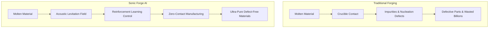
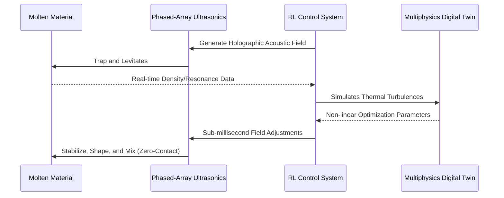

<!-- markdownlint-disable MD009 MD010 MD013 MD022 MD028 MD032 MD033 MD034 MD036 MD037 MD039 MD041 MD058 MD060 -->

[ 🇫🇷 Version Française ](./README.fr.md)

# Sonic Forge AI

> **Executive Summary:** An AI-controlled acoustic levitation forge that manipulates molten materials in mid-air using phased-array ultrasonics, enabling defect-free, microgravity-like manufacturing on Earth.

---

## 1. Visual Overview & Wow Effect

## 2. Contrarian Thesis (Peter Thiel Style)

**Popular Belief:** To manufacture advanced, ultra-pure materials that require zero contact or microgravity, we must build expensive orbital factories in space.

**Hidden Truth:** By mastering dynamic acoustic fields with sub-millisecond AI control, we can simulate microgravity and achieve zero-contact manipulation of dense molten materials directly on Earth, at a fraction of the cost.

## 3. Problem & Target Market

**Business Model:** B2B

**Target Audience:** Aerospace industry (SpaceX, Airbus), semiconductor manufacturers (TSMC, ASML), and pharmaceutical companies (protein crystallization).

**Urgent Pain Point:** Physical contact with crucible walls during the melting and forming of advanced materials (space alloys, pure optics, pharmaceutical crystals) introduces impurities and nucleation defects. These microscopic imperfections destroy yields, limit purity, and cost billions in discarded defective parts.

## 4. Technical Architecture & Infrastructure

## 5. Business Model & Financial Viability

| Metric                 | Value                                                |
| :--------------------- | :--------------------------------------------------- |
| Pricing Structure      | Hardware Lease + AI Control Subscription (SaaS/HaaS) |
| 12-Month Target        | 2 enterprise pilots (e.g., aerospace, pharma)        |
| Revenue Formula        | 2 pilots \* €50,000/month = €100k ARR                |
| Estimated Gross Margin | 85% (on software/AI control after R&D payback)       |

## 6. Distribution Engine & Moat

**Acquisition Strategy:** Direct B2B enterprise sales targeting R&D labs of Fortune 500 aerospace, semiconductor, and pharma companies. Prove value through pilot projects and joint development agreements.

**Moat (Defensibility):** The complexity of closing the loop between a high-temperature phased-array hardware system and a non-linear Reinforcement Learning control system in sub-milliseconds. Native LLMs or standard SCADA software cannot replicate the physical digital twin and real-time acoustic holography required for dense material manipulation.

## 7. Detailed Evaluation Grid

| Criterion                   | VC Score (/100) | Market Score (/100) |
| :-------------------------- | :-------------- | :------------------ |
| Thesis & Monopoly / Urgency | 25 / 25         | -- / 25             |
| Moat / LLM Immunity         | 24 / 25         | -- / 25             |
| Scalability / UX Friction   | 23 / 25         | -- / 25             |
| Unit Economics / ROI        | 21 / 25         | -- / 25             |
| **TOTAL**                   | **93 / 100**    | **-- / 100**        |

> **VC Verdict:** Containerless processing is a radical leap for advanced materials. Using acoustic levitation avoids contamination and unlocks novel alloys. The moat is purely based on mastering the complex physics, establishing a strong hardware monopoly.
> **Market Verdict:** Pending evaluation.
