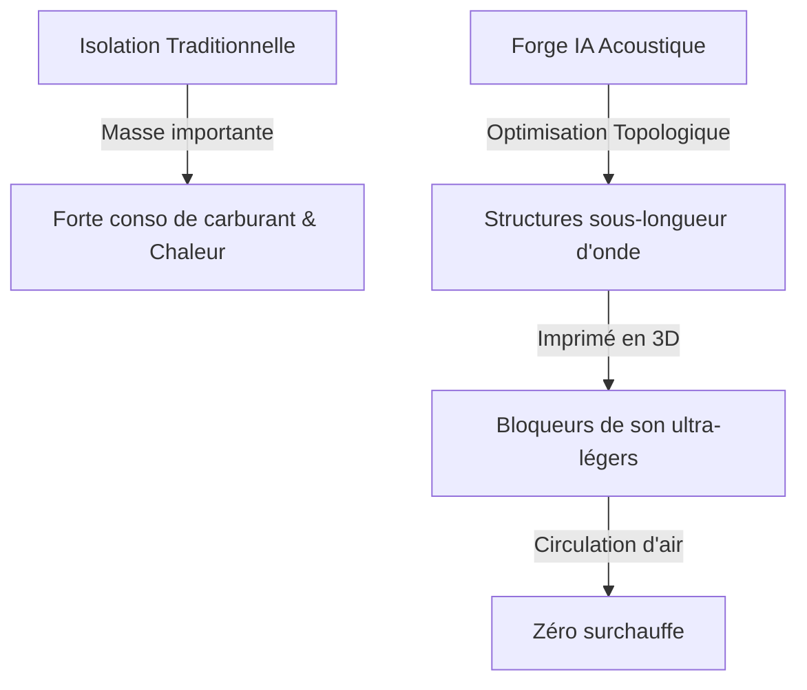
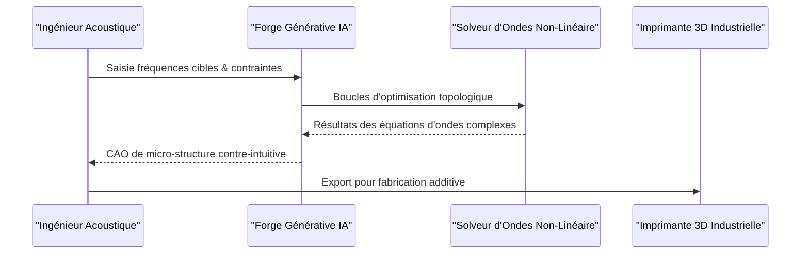

<!-- markdownlint-disable MD009 MD010 MD013 MD022 MD028 MD032 MD033 MD034 MD036 MD037 MD039 MD041 MD060 -->

[ 🇬🇧 English Version ](./README.md)

# Acoustic Metamaterial Forge

> **Résumé exécutif :** Une plateforme de conception générative IA qui découvre et optimise des métamatériaux acoustiques pour l'impression 3D industrielle, remplaçant l'isolation sonore lourde traditionnelle par des micro-structures ultra-légères laissant passer l'air.

---

## 1. Aperçu visuel & Effet Wahou

## 2. La thèse contrariante (Peter Thiel Style)

- **La croyance populaire :** L'isolation sonore nécessite inévitablement de la masse et de la densité (comme de la mousse épaisse ou du plomb) pour bloquer efficacement les ondes sonores.
- **La vérité cachée :** Les ondes sonores peuvent être parfaitement annulées ou redirigées par des structures géométriques sous-longueur d'onde composées majoritairement d'air, économisant une masse considérable et permettant la dissipation thermique.

## 3. Le problème & La cible

- **Modèle économique :** B2B
- **Cible précise :** Industrie aérospatiale (constructeurs d'avions), industrie automobile (VE), fabricants de sous-marins, ingénierie de datacenters.
- **La douleur urgente :** L'isolation sonore classique repose sur la masse (matériaux lourds), ce qui pénalise fortement l'autonomie des véhicules électriques, la charge utile des avions et pose des problèmes de dissipation thermique dans l'électronique de pointe.

## 4. Architecture technique & Plomberie

## 5. Modèle économique & Viabilité financière

| Métrique                        | Valeur                                                   |
| ------------------------------- | -------------------------------------------------------- |
| **Structure de prix**           | Abonnement + Utilisation de calcul (SaaS pour Matériaux) |
| **Objectif 12 mois**            | 2 à 3 licences pilotes R&D auprès de grands OEM          |
| **Calcul du CA (Target 100k€)** | 3 licences \* 35k€/an                                    |
| **Marge brute estimée**         | ~85%                                                     |

## 6. Moteur de distribution & Fossé défensif (Moat)

- **Stratégie d'acquisition :** Ventes directes B2B ciblant les Directeurs de l'Ingénierie et VP R&D chez les équipementiers automobiles et aérospatiaux de rang 1 ; publication de validations évaluées par des pairs.
- **Moat (Barrière à l'entrée) :** L'optimisation topologique de métamatériaux nécessite la résolution d'équations d'ondes complexes couplées aux contraintes de fabrication. Un outil CAO standard ou un LLM générique ne peut pas inventer des micro-structures aux propriétés acoustiques contre-intuitives.

## 7. Grille d'évaluation détaillée

| Critère                           | Score VC (/100) | Score Terrain (/100) |
| --------------------------------- | --------------- | -------------------- |
| Thèse & Monopole / Urgence        | -- / 25         | 23 / 25              |
| Moat / Résistance aux LLM natifs  | -- / 25         | 24 / 25              |
| Scalabilité / Friction d'adoption | -- / 25         | 14 / 25              |
| Unit Economics / ROI direct       | -- / 25         | 20 / 25              |
| **TOTAL**                         | **-- / 100**    | **81 / 100**         |

> **Verdict VC :** En attente d'évaluation.

> **Verdict Terrain :** La proposition de valeur est extrêmement forte pour l'aéronautique et les VE grâce au ROI direct lié au gain de poids. Bien que l'adoption exige un changement de paradigme industriel vers l'impression 3D, l'immunité face à l'IA générique et la clarté de la monétisation en font un projet très viable.
