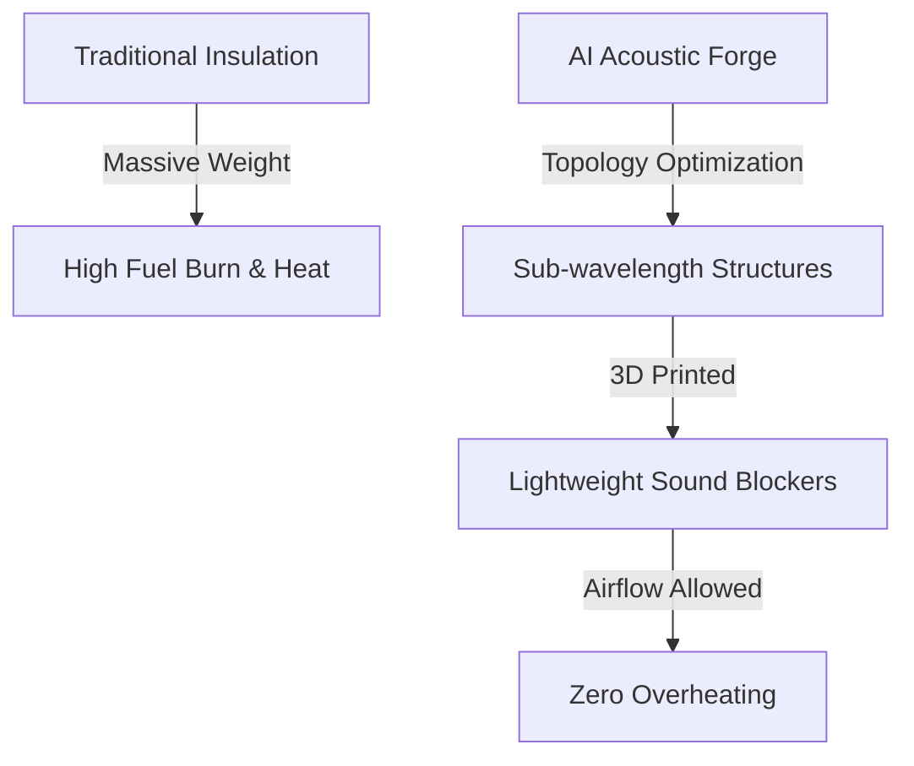
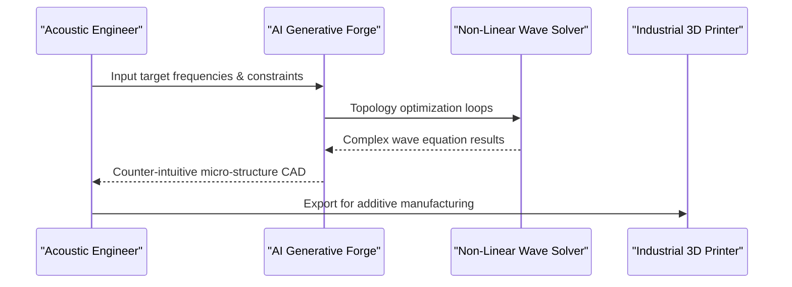

<!-- markdownlint-disable MD009 MD010 MD013 MD022 MD028 MD032 MD033 MD034 MD036 MD037 MD039 MD041 MD060 -->

[ 🇫🇷 Version Française ](./README.fr.md)

# Acoustic Metamaterial Forge

> **Executive Summary:** An AI generative design platform that discovers and optimizes acoustic metamaterials for industrial 3D printing, replacing heavy traditional sound insulation with lightweight, airflow-friendly micro-structures.

---

## 1. Visual Overview & Wow Effect

## 2. Contrarian Thesis (Peter Thiel Style)

- **Popular Belief:** Sound insulation inherently requires mass and density (like thick foam or lead) to block acoustic waves effectively.
- **Hidden Truth:** Sound waves can be perfectly cancelled or redirected by sub-wavelength geometric structures that consist mostly of air, saving massive weight and allowing thermal dissipation.

## 3. Problem & Target Market

- **Business Model:** B2B
- **Target Audience:** Aerospace manufacturers (aircraft makers), EV automakers, submarine builders, and hyperscale datacenter engineering teams.
- **Urgent Pain Point:** Heavy acoustic insulation significantly degrades the payload capacity of aircraft and the range of electric vehicles, while trapping heat and causing severe thermal management issues in modern electronics.

## 4. Technical Architecture & Infrastructure

## 5. Business Model & Financial Viability

| Metric                     | Value                                                              |
| -------------------------- | ------------------------------------------------------------------ |
| **Pricing Structure**      | Subscription + Compute usage (Software-as-a-Service for Materials) |
| **12-Month Target**        | 2-3 major OEM R&D pilot licenses                                   |
| **Revenue Formula**        | 3 licenses \* 35k€/year                                            |
| **Estimated Gross Margin** | ~85%                                                               |

## 6. Distribution Engine & Moat

- **Acquisition Strategy:** Direct enterprise sales targeting Chief Engineers and VP R&D at Tier 1 aerospace and automotive suppliers; publishing peer-reviewed validations.
- **Moat (Defensibility):** The platform requires deep integration of non-linear acoustic solvers with additive manufacturing constraints. A standard LLM or CAD tool cannot invent mathematically complex, manufacturable sub-wavelength acoustic geometries.

## 7. Detailed Evaluation Grid

| Criterion                   | VC Score (/100) | Market Score (/100) |
| --------------------------- | --------------- | ------------------- |
| Thesis & Monopoly / Urgency | 23 / 25         | 23 / 25             |
| Moat / LLM Immunity         | 23 / 25         | 24 / 25             |
| Scalability / UX Friction   | 24 / 25         | 14 / 25             |
| Unit Economics / ROI        | 22 / 25         | 20 / 25             |
| **TOTAL**                   | **92 / 100**    | **81 / 100**        |

> **VC Verdict:** Controlling sound at the structural level is a blue-ocean market. The generative AI for metamaterial topology is a massive technical barrier. Broad applicability across aerospace, automotive, and urban design ensures a massive TAM.

> **Market Verdict:** Moderate urgency but strong long-term strategic value. LLM immunity is good, relying on specialized models. Adoption presents notable friction that could slow initial monetization.
