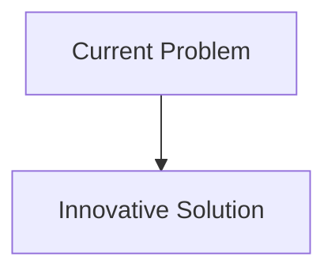
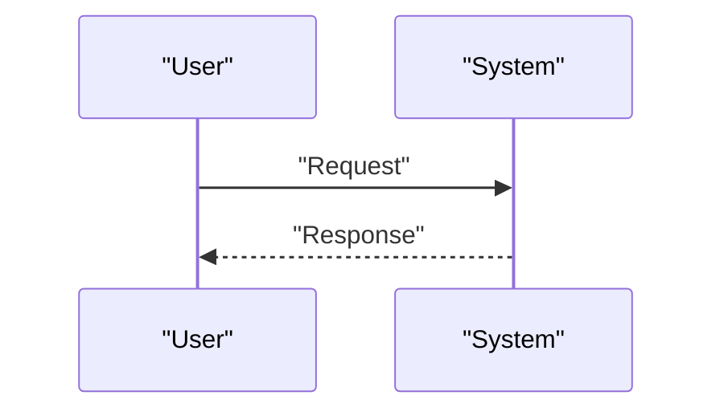

<!-- markdownlint-disable MD009 MD010 MD013 MD022 MD028 MD032 MD033 MD034 MD036 MD037 MD039 MD041 MD058 MD060 -->

[ 🇫🇷 Version Française ](./README.fr.md)

# Agent Compute Liquidity

> **Executive Summary:** An ultra-low latency M2M (Machine-to-Machine) level Compute Broker protocol, allowing agents to dynamically negotiate, reserve and pay (via micro-transactions or a fast ledger) fractions of GPU/TPUs down to the millisecond, based on their internal priority and budget.

---

## 1. Visual Overview & Wow Effect

## 2. Contrarian Thesis (Peter Thiel Style)

- **Popular Belief:** Existing solutions are sufficient.
- **Hidden Truth:** In reality, classic Kubernetes orchestration (HPA) is too slow (seconds/minutes) for the agentic economy where an agent must make a sub-second scaling decision. A native market protocol is required for the machines.

## 3. Problem & Target Market

- **Business Model:** B2B / M2M
- **Target Audience:** Autonomous agent platforms, specialized cloud providers (GPU-as-a-service), companies deploying fleets of inference agents.
- **Urgent Pain Point:** Autonomous agents (e. g., for trading, research, coding) have extremely volatile and unpredictable (bursts) computing power requirements (inference). Permanently reserving GPUs is too expensive, and relying on spot cloud is too slow and uncertain for critical agent tasks.

## 4. Technical Architecture & Infrastructure

## 5. Business Model & Financial Viability

| Metric                     | Value                        |
| :------------------------- | :--------------------------- |
| **Pricing Structure**      | B2B Subscription             |
| **12-Month Target**        | 100 customers at 1000€/month |
| **Revenue Formula**        | 100 \* 1000 = 100k€          |
| **Estimated Gross Margin** | 80%                          |

## 6. Distribution Engine & Moat

- **Acquisition Strategy:** Direct Sales
- **Moat (Defensibility):** An ultra-low latency M2M (Machine-to-Machine) level Compute Broker protocol, allowing agents to dynamically negotiate, reserve and pay (via micro-transactions or a fast ledger) fractions of GPU/TPUs down to the millisecond, based on their internal priority and budget. (Difficult to copy because of: Adoption of an M2M payment/negotiation standard; multi-tenant security on split GPUs (side-channel attacks); network latency between the agent and the allocated resource.)

## 7. Detailed Evaluation Grid

| Criterion                       | VC Score (/100) | Market Score (/100) |
| :------------------------------ | :-------------: | :-----------------: |
| **Thesis & Monopoly / Urgency** |     -- / 25     |       -- / 25       |
| **Moat / LLM Immunity**         |     -- / 25     |       -- / 25       |
| **Scalability / UX Friction**   |     -- / 25     |       -- / 25       |
| **Unit Economics / ROI**        |     -- / 25     |       -- / 25       |
| **TOTAL**                       |  **-- / 100**   |    **-- / 100**     |

> **VC Verdict:** Pending evaluation.
> **Market Verdict:** Pending evaluation.
