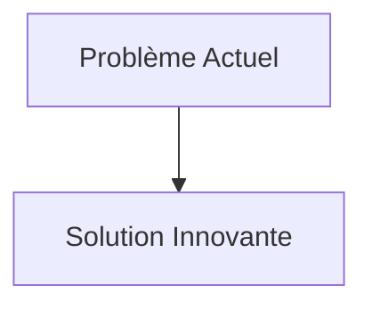
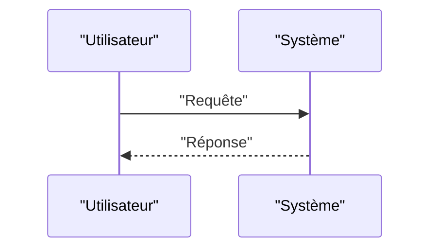

<!-- markdownlint-disable MD009 MD010 MD013 MD022 MD028 MD032 MD033 MD034 MD036 MD037 MD039 MD041 MD058 MD060 -->

[ 🇬🇧 English Version ](./README.md)

# Agentic ASIC Router

> **Résumé exécutif :** Un écosystème d'agents autonomes d'ingénierie utilisant des réseaux de neurones graphiques (GNN) et de l'apprentissage par renforcement (RL) pour explorer l'espace de conception massivement en parallèle. Les agents négocient entre eux les ressources spatiales et temporelles du silicium pour accomplir un "place and route" en quelques jours au lieu de plusieurs mois, produisant des configurations non intuitives mais physiquement supérieures.

---

## 1. Aperçu visuel & Effet Wahou

## 2. La thèse contrariante (Peter Thiel Style)

- **La croyance populaire :** Les solutions existantes sont suffisantes.
- **La vérité cachée :** En réalité, L'EDA est un monopole logiciel complexe avec une forte adhérence (vendor lock-in) et s'appuie sur des heuristiques traditionnelles. Un LLM textuel ne peut pas comprendre les contraintes de conception de géométrie spatiale 3D, les règles de conception (DRC) des fonderies et l'électromagnétisme.

## 3. Le problème & La cible

- **Modèle économique :** B2B
- **Cible précise :** Fabricants de puces fabless, concepteurs de semi-conducteurs spécialisés (AI accelerators, IoT, edge computing), fonderies (TSMC, Samsung).
- **La douleur urgente :** Le processus de "place and route" (P&R) pour la conception de puces (ASIC) est devenu un goulet d'étranglement majeur. Les logiciels d'Electronic Design Automation (EDA) traditionnels demandent des mois de travail itératif humain pour optimiser l'agencement spatial des milliards de transistors afin de réduire la consommation d'énergie (PPA: Power, Performance, Area). Le coût de développement d'une puce explose et retarde le time-to-market.

## 4. Architecture technique & Plomberie

## 5. Modèle économique & Viabilité financière

| Métrique                        | Valeur                   |
| :------------------------------ | :----------------------- |
| **Structure de prix**           | Abonnement B2B           |
| **Objectif 12 mois**            | 100 clients à 1000€/mois |
| **Calcul du CA (Target 100k€)** | 100 \* 1000 = 100k€      |
| **Marge brute estimée**         | 80%                      |

## 6. Moteur de distribution & Fossé défensif (Moat)

- **Stratégie d'acquisition :** Ventes directes
- **Moat (Barrière à l'entrée) :** Un écosystème d'agents autonomes d'ingénierie utilisant des réseaux de neurones graphiques (GNN) et de l'apprentissage par renforcement (RL) pour explorer l'espace de conception massivement en parallèle. Les agents négocient entre eux les ressources spatiales et temporelles du silicium pour accomplir un "place and route" en quelques jours au lieu de plusieurs mois, produisant des configurations non intuitives mais physiquement supérieures. (Difficile à copier à cause de : Besoin d'accéder aux données d'entraînement propriétaires des processus de fonderie (PDK - Process Design Kits) ultra-secrets ; résistance de l'écosystème EDA existant ; vérification formelle absolue (une erreur coûte des millions en masques de gravure).)

## 7. Grille d'évaluation détaillée

| Critère                               | Score VC (/100) | Score Terrain (/100) |
| :------------------------------------ | :-------------: | :------------------: |
| **Thèse & Monopole / Urgence**        |     -- / 25     |       -- / 25        |
| **Moat / Résistance aux LLM natifs**  |     -- / 25     |       -- / 25        |
| **Scalabilité / Friction d'adoption** |     -- / 25     |       -- / 25        |
| **Unit Economics / ROI direct**       |     -- / 25     |       -- / 25        |
| **TOTAL**                             |  **-- / 100**   |     **-- / 100**     |

> **Verdict VC :** En attente d'évaluation.
> **Verdict Terrain :** En attente d'évaluation.
