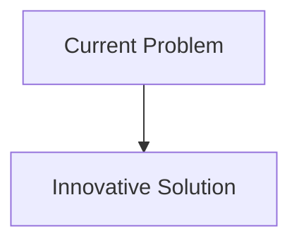
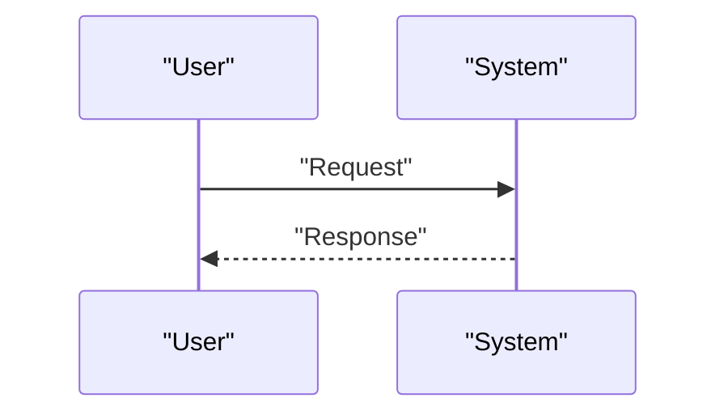

<!-- markdownlint-disable MD009 MD010 MD013 MD022 MD028 MD032 MD033 MD034 MD036 MD037 MD039 MD041 MD058 MD060 -->

[ 🇫🇷 Version Française ](./README.fr.md)

# Agentic ASIC Router

> **Executive Summary:** An ecosystem of autonomous engineering agents using graph neural networks (GNN) and reinforcement learning (RL) to explore the design space massively in parallel. Agents negotiate silicon spatial and temporal resources among themselves to accomplish a “place and route” in days instead of months, producing non-intuitive but physically superior configurations.

---

## 1. Visual Overview & Wow Effect

## 2. Contrarian Thesis (Peter Thiel Style)

- **Popular Belief:** Existing solutions are sufficient.
- **Hidden Truth:** In reality, EDA is a complex software monopoly with strong vendor lock-in and relies on traditional heuristics. A textual LLM cannot understand 3D spatial geometry design constraints, foundry design rules (DRCs), and electromagnetism.

## 3. Problem & Target Market

- **Business Model:** B2B
- **Target Audience:** Manufacturers of fabless chips, designers of specialized semiconductors (AI accelerators, IoT, edge computing), foundries (TSMC, Samsung).
- **Urgent Pain Point:** The place and route (P&R) process for (ASIC) chip design has become a major bottleneck. Traditional Electronic Design Automation (EDA) software requires months of human iterative work to optimize the spatial arrangement of billions of transistors to reduce power consumption (PPA: Power, Performance, Area). The cost of developing a chip is exploding and delaying time-to-market.

## 4. Technical Architecture & Infrastructure

## 5. Business Model & Financial Viability

| Metric                     | Value                        |
| :------------------------- | :--------------------------- |
| **Pricing Structure**      | B2B Subscription             |
| **12-Month Target**        | 100 customers at 1000€/month |
| **Revenue Formula**        | 100 \* 1000 = 100k€          |
| **Estimated Gross Margin** | 80%                          |

## 6. Distribution Engine & Moat

- **Acquisition Strategy:** Direct Sales
- **Moat (Defensibility):** An ecosystem of autonomous engineering agents using graph neural networks (GNN) and reinforcement learning (RL) to explore the design space massively in parallel. Agents negotiate silicon spatial and temporal resources among themselves to accomplish a “place and route” in days instead of months, producing non-intuitive but physically superior configurations. (Difficult to copy due to: Need to access top-secret proprietary foundry process training data (PDKs); strength of existing EDA ecosystem; absolute formal verification (one mistake costs millions in burn masks).)

## 7. Detailed Evaluation Grid

| Criterion                       | VC Score (/100) | Market Score (/100) |
| :------------------------------ | :-------------: | :-----------------: |
| **Thesis & Monopoly / Urgency** |     -- / 25     |       -- / 25       |
| **Moat / LLM Immunity**         |     -- / 25     |       -- / 25       |
| **Scalability / UX Friction**   |     -- / 25     |       -- / 25       |
| **Unit Economics / ROI**        |     -- / 25     |       -- / 25       |
| **TOTAL**                       |  **-- / 100**   |    **-- / 100**     |

> **VC Verdict:** Pending evaluation.
> **Market Verdict:** Pending evaluation.
