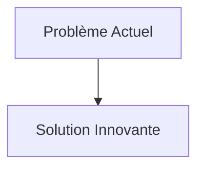
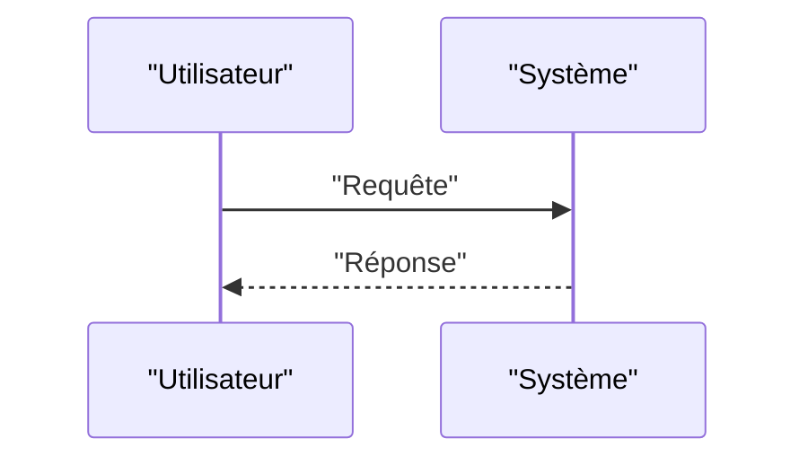

<!-- markdownlint-disable MD009 MD010 MD013 MD022 MD028 MD032 MD033 MD034 MD036 MD037 MD039 MD041 MD058 MD060 -->

[ 🇬🇧 English Version ](./README.md)

# Airgapped Update Bridge

> **Résumé exécutif :** Une passerelle matérielle unidirectionnelle (Data Diode / FPGA) couplée à un bac à sable (sandbox) de jumeau numérique OT. Les mises à jour logicielles sont reçues via le réseau IT, testées de manière automatisée sur la réplique exacte du système industriel dans un environnement émulé (pour s'assurer qu'elles ne cassent pas le processus physique), puis transmises de manière unidirectionnelle physique via laser/optique vers le réseau OT pour un déploiement zéro-downtime sécurisé.

---

## 1. Aperçu visuel & Effet Wahou

## 2. La thèse contrariante (Peter Thiel Style)

- **La croyance populaire :** Les solutions existantes sont suffisantes.
- **La vérité cachée :** En réalité, Aucun logiciel Cloud (AWS, Azure) ne peut traverser un vrai air-gap physique. Une diode de données classique ne fait que passer l'information, elle ne certifie pas que le patch de l'automate (PLC) ne va pas provoquer l'arrêt d'une turbine. Il faut la combinaison d'une isolation matérielle stricte (hardware) et d'un jumeau numérique spécifique aux protocoles industriels (Modbus, DNP3, PROFINET).

## 3. Le problème & La cible

- **Modèle économique :** B2B
- **Cible précise :** Opérateurs d'infrastructures d'importance vitale (OIV) : centrales nucléaires, réseaux électriques, usines de traitement de l'eau, lignes de production manufacturière critique.
- **La douleur urgente :** Les systèmes industriels (OT - Operational Technology) sont maintenus isolés d'Internet (air-gapped) pour des raisons de sécurité évidentes. Cependant, l'impossibilité de déployer des correctifs de sécurité (patchs virtuels) de manière continue les laisse vulnérables à des attaques de type Stuxnet (via clé USB). Les processus de mise à jour manuels actuels prennent des mois.

## 4. Architecture technique & Plomberie

## 5. Modèle économique & Viabilité financière

| Métrique                        | Valeur                   |
| :------------------------------ | :----------------------- |
| **Structure de prix**           | Abonnement B2B           |
| **Objectif 12 mois**            | 100 clients à 1000€/mois |
| **Calcul du CA (Target 100k€)** | 100 \* 1000 = 100k€      |
| **Marge brute estimée**         | 80%                      |

## 6. Moteur de distribution & Fossé défensif (Moat)

- **Stratégie d'acquisition :** Ventes directes
- **Moat (Barrière à l'entrée) :** Une passerelle matérielle unidirectionnelle (Data Diode / FPGA) couplée à un bac à sable (sandbox) de jumeau numérique OT. Les mises à jour logicielles sont reçues via le réseau IT, testées de manière automatisée sur la réplique exacte du système industriel dans un environnement émulé (pour s'assurer qu'elles ne cassent pas le processus physique), puis transmises de manière unidirectionnelle physique via laser/optique vers le réseau OT pour un déploiement zéro-downtime sécurisé. (Difficile à copier à cause de : ANSSI, CISA) ; difficulté de construire des jumeaux numériques 100% fidèles des anciens automates (Legacy PLCs) ; résistance culturelle des opérateurs OT face à l'automatisation des mises à jour.)

## 7. Grille d'évaluation détaillée

| Critère                               | Score VC (/100) | Score Terrain (/100) |
| :------------------------------------ | :-------------: | :------------------: |
| **Thèse & Monopole / Urgence**        |     -- / 25     |       -- / 25        |
| **Moat / Résistance aux LLM natifs**  |     -- / 25     |       -- / 25        |
| **Scalabilité / Friction d'adoption** |     -- / 25     |       -- / 25        |
| **Unit Economics / ROI direct**       |     -- / 25     |       -- / 25        |
| **TOTAL**                             |  **-- / 100**   |     **-- / 100**     |

> **Verdict VC :** En attente d'évaluation.
> **Verdict Terrain :** En attente d'évaluation.
