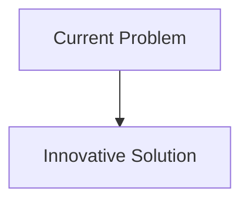
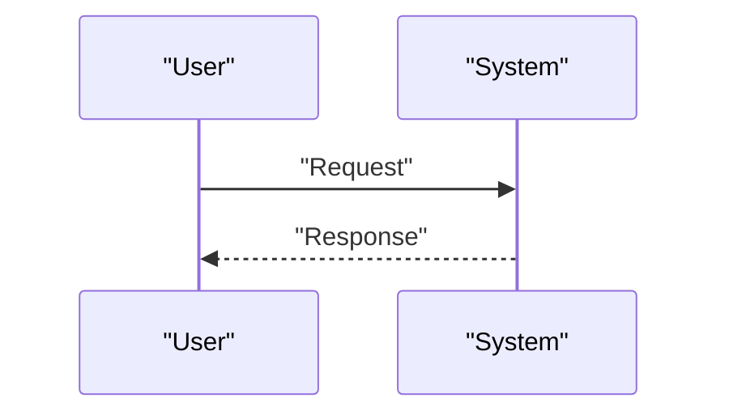

<!-- markdownlint-disable MD009 MD010 MD013 MD022 MD028 MD032 MD033 MD034 MD036 MD037 MD039 MD041 MD058 MD060 -->

[ 🇫🇷 Version Française ](./README.fr.md)

# Airgapped Update Bridge

> **Executive Summary:** A unidirectional hardware gateway (Data Diode / FPGA) coupled with an OT digital twin sandbox. Software updates are received via the IT network, tested in an automated manner on the exact replica of the industrial system in an emulated environment (to ensure they do not break the physical process), then transmitted in a physical unidirectional manner via laser/optical to the OT network for secure zero-downtime deployment.

---

## 1. Visual Overview & Wow Effect

## 2. Contrarian Thesis (Peter Thiel Style)

- **Popular Belief:** Existing solutions are sufficient.
- **Hidden Truth:** In reality, No Cloud software (AWS, Azure) can cross a real physical air gap. A classic data diode only passes information, it does not certify that the PLC patch will not cause a turbine to stop. It requires the combination of strict hardware isolation (hardware) and a digital twin specific to industrial protocols (Modbus, DNP3, PROFINET).

## 3. Problem & Target Market

- **Business Model:** B2B
- **Target Audience:** Critical Infrastructure Operators (VIO): nuclear power plants, power grids, water treatment plants, critical manufacturing production lines.
- **Urgent Pain Point:** Industrial systems (OT - Operational Technology) are kept isolated from the Internet (air-gapped) for obvious security reasons. However, the inability to continuously deploy security patches (virtual patches) leaves them vulnerable to Stuxnet-type attacks (via USB key). Current manual update processes take months.

## 4. Technical Architecture & Infrastructure

## 5. Business Model & Financial Viability

| Metric                     | Value                        |
| :------------------------- | :--------------------------- |
| **Pricing Structure**      | B2B Subscription             |
| **12-Month Target**        | 100 customers at 1000€/month |
| **Revenue Formula**        | 100 \* 1000 = 100k€          |
| **Estimated Gross Margin** | 80%                          |

## 6. Distribution Engine & Moat

- **Acquisition Strategy:** Direct Sales
- **Moat (Defensibility):** A unidirectional hardware gateway (Data Diode / FPGA) coupled with an OT digital twin sandbox. Software updates are received via the IT network, tested in an automated manner on the exact replica of the industrial system in an emulated environment (to ensure they do not break the physical process), then transmitted in a physical unidirectional manner via laser/optical to the OT network for secure zero-downtime deployment. (Difficult to copy because of: ANSSI, CISA); difficulty of building 100% faithful digital twins of old PLCs (Legacy PLCs);cultural resistance of OT operators to the automation of updates.)

## 7. Detailed Evaluation Grid

| Criterion                       | VC Score (/100) | Market Score (/100) |
| :------------------------------ | :-------------: | :-----------------: |
| **Thesis & Monopoly / Urgency** |     -- / 25     |       -- / 25       |
| **Moat / LLM Immunity**         |     -- / 25     |       -- / 25       |
| **Scalability / UX Friction**   |     -- / 25     |       -- / 25       |
| **Unit Economics / ROI**        |     -- / 25     |       -- / 25       |
| **TOTAL**                       |  **-- / 100**   |    **-- / 100**     |

> **VC Verdict:** Pending evaluation.
> **Market Verdict:** Pending evaluation.
