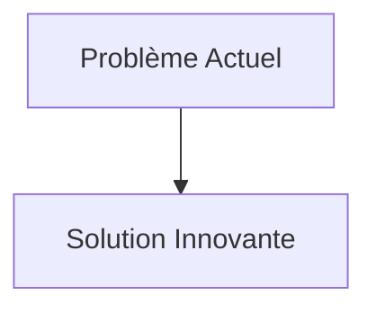
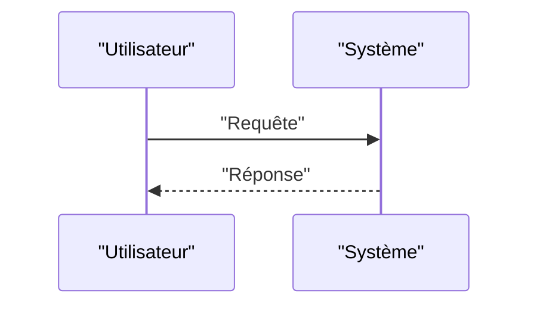

<!-- markdownlint-disable MD009 MD010 MD013 MD022 MD028 MD032 MD033 MD034 MD036 MD037 MD039 MD041 MD058 MD060 -->

[ 🇬🇧 English Version ](./README.md)

# Asteroid Mining Autonomy Engine

> **Résumé exécutif :** Moteur de perception spatiale temps réel et de contrôle moteur embarqué, résistant aux radiations (rad-hard compute). Utilisation de réseaux de neurones pour le SLAM en microgravité et la manipulation d'outils d'excavation, avec des modèles physiques de contact pour s'ancrer et forer sur des surfaces à très faible gravité et de composition inconnue.

---

## 1. Aperçu visuel & Effet Wahou

## 2. La thèse contrariante (Peter Thiel Style)

- **La croyance populaire :** Les solutions existantes sont suffisantes.
- **La vérité cachée :** En réalité, Un modèle d'IA cloud classique ne fonctionne pas sans connexion internet permanente et à faible latence. Le système doit tourner en Edge strict sur des puces tolérantes aux radiations (FPGA/ASIC spécialisés) avec des contraintes d'énergie drastiques, nécessitant une compréhension profonde de la physique des corps célestes.

## 3. Le problème & La cible

- **Modèle économique :** B2B
- **Cible précise :** Agences spatiales (NASA, ESA) et entreprises privées d'exploitation spatiale (AstroForge, Karman+), constructeurs de sondes spatiales.
- **La douleur urgente :** L'extraction de ressources sur des astéroïdes (eau, platine, terres rares) implique des opérations robotiques complexes à plusieurs millions de kilomètres de la Terre. La latence des communications (plusieurs minutes à dizaines de minutes) rend le téléguidage humain impossible. Les robots doivent être capables de percevoir, d'analyser la surface, de forer et de réagir aux anomalies physiques en totale autonomie spatiale.

## 4. Architecture technique & Plomberie

## 5. Modèle économique & Viabilité financière

| Métrique                        | Valeur                   |
| :------------------------------ | :----------------------- |
| **Structure de prix**           | Abonnement B2B           |
| **Objectif 12 mois**            | 100 clients à 1000€/mois |
| **Calcul du CA (Target 100k€)** | 100 \* 1000 = 100k€      |
| **Marge brute estimée**         | 80%                      |

## 6. Moteur de distribution & Fossé défensif (Moat)

- **Stratégie d'acquisition :** Ventes directes
- **Moat (Barrière à l'entrée) :** Moteur de perception spatiale temps réel et de contrôle moteur embarqué, résistant aux radiations (rad-hard compute). Utilisation de réseaux de neurones pour le SLAM en microgravité et la manipulation d'outils d'excavation, avec des modèles physiques de contact pour s'ancrer et forer sur des surfaces à très faible gravité et de composition inconnue. (Difficile à copier à cause de : Coûts de R&D prohibitifs pour la validation spatiale, accès au hardware spatial pour les tests, lenteur des missions spatiales pour valider en condition réelle, traité de l'espace sur l'exploitation des ressources.)

## 7. Grille d'évaluation détaillée

| Critère                               | Score VC (/100) | Score Terrain (/100) |
| :------------------------------------ | :-------------: | :------------------: |
| **Thèse & Monopole / Urgence**        |     -- / 25     |       -- / 25        |
| **Moat / Résistance aux LLM natifs**  |     -- / 25     |       -- / 25        |
| **Scalabilité / Friction d'adoption** |     -- / 25     |       -- / 25        |
| **Unit Economics / ROI direct**       |     -- / 25     |       -- / 25        |
| **TOTAL**                             |  **-- / 100**   |     **-- / 100**     |

> **Verdict VC :** En attente d'évaluation.
> **Verdict Terrain :** En attente d'évaluation.
