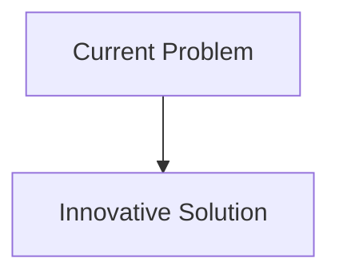
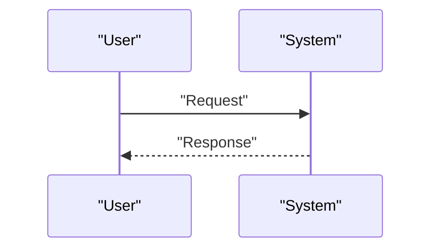

<!-- markdownlint-disable MD009 MD010 MD013 MD022 MD028 MD032 MD033 MD034 MD036 MD037 MD039 MD041 MD058 MD060 -->

[ 🇫🇷 Version Française ](./README.fr.md)

# Asteroid Mining Autonomy Engine

> **Executive Summary:** Real-time spatial perception and on-board motor control engine, resistant to radiation (rad-hard compute). Using neural networks for microgravity SLAM and excavation tool manipulation, with physical contact models to anchor and drill on very low gravity surfaces of unknown composition.

---

## 1. Visual Overview & Wow Effect

## 2. Contrarian Thesis (Peter Thiel Style)

- **Popular Belief:** Existing solutions are sufficient.
- **Hidden Truth:** In reality, A classic cloud AI model does not work without a constant, low-latency internet connection. The system must run in strict Edge on radiation-tolerant chips (specialized FPGA/ASIC) with drastic energy constraints, requiring a deep understanding of the physics of celestial bodies.

## 3. Problem & Target Market

- **Business Model:** B2B
- **Target Audience:** Space agencies (NASA, ESA) and private space operating companies (AstroForge, Karman+), manufacturers of space probes.
- **Urgent Pain Point:** The extraction of resources on asteroids (water, platinum, rare earths) involves complex robotic operations several million kilometers from Earth. The latency of communications (several minutes to tens of minutes) makes human remote control impossible. Robots must be able to perceive, analyze the surface, drill and react to physical anomalies with complete spatial autonomy.

## 4. Technical Architecture & Infrastructure

## 5. Business Model & Financial Viability

| Metric                     | Value                        |
| :------------------------- | :--------------------------- |
| **Pricing Structure**      | B2B Subscription             |
| **12-Month Target**        | 100 customers at 1000€/month |
| **Revenue Formula**        | 100 \* 1000 = 100k€          |
| **Estimated Gross Margin** | 80%                          |

## 6. Distribution Engine & Moat

- **Acquisition Strategy:** Direct Sales
- **Moat (Defensibility):** Real-time spatial perception and on-board motor control engine, resistant to radiation (rad-hard compute). Using neural networks for microgravity SLAM and excavation tool manipulation, with physical contact models to anchor and drill on very low gravity surfaces of unknown composition.(Difficult to copy because of: Prohibitive R&D costs for space validation, access to space hardware for tests, slowness of space missions to validate in real conditions, space treaty on the exploitation of resources.)

## 7. Detailed Evaluation Grid

| Criterion                       | VC Score (/100) | Market Score (/100) |
| :------------------------------ | :-------------: | :-----------------: |
| **Thesis & Monopoly / Urgency** |     -- / 25     |       -- / 25       |
| **Moat / LLM Immunity**         |     -- / 25     |       -- / 25       |
| **Scalability / UX Friction**   |     -- / 25     |       -- / 25       |
| **Unit Economics / ROI**        |     -- / 25     |       -- / 25       |
| **TOTAL**                       |  **-- / 100**   |    **-- / 100**     |

> **VC Verdict:** Pending evaluation.
> **Market Verdict:** Pending evaluation.
