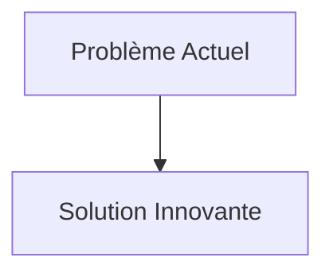
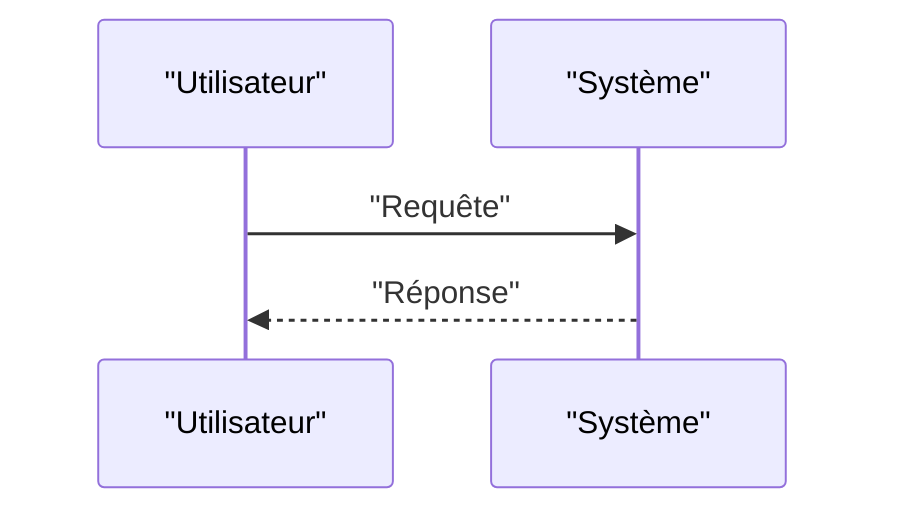

<!-- markdownlint-disable MD009 MD010 MD013 MD022 MD028 MD032 MD033 MD034 MD036 MD037 MD039 MD041 MD058 MD060 -->

[ 🇬🇧 English Version ](./README.md)

# Atmospheric Dispersal Twin

> **Résumé exécutif :** Un moteur de physique neuronale (Neural Physics Engine) ingérant en temps réel les données de capteurs IoT locaux, la télémétrie lidar et les flux météorologiques pour simuler la dynamique des fluides computationnelle (CFD) à l'échelle d'une ville ou d'un site. Il génère un jumeau numérique immersif prédictif de l'atmosphère locale avec une latence sub-seconde.

---

## 1. Aperçu visuel & Effet Wahou

## 2. La thèse contrariante (Peter Thiel Style)

- **La croyance populaire :** Les solutions existantes sont suffisantes.
- **La vérité cachée :** En réalité, La simulation de la dynamique des fluides (Navier-Stokes) par des logiciels classiques demande des heures de calcul sur des clusters HPC. Un simple LLM ou un SaaS d'alerte ne possède pas de compréhension spatio-temporelle physique continue requise pour anticiper le chaos d'une turbulence atmosphérique en zone urbaine.

## 3. Le problème & La cible

- **Modèle économique :** B2B / B2G
- **Cible précise :** Opérateurs de sites industriels critiques (chimie, nucléaire, sites SEVESO), agences gouvernementales de protection civile, services d'urgence de premier recours.
- **La douleur urgente :** En cas de fuite chimique, radiologique ou d'incendie majeur, la prédiction de la dispersion des panaches toxiques repose sur des modèles gaussiens statiques et lents, ne prenant pas en compte la micro-météorologie dynamique ni la topographie urbaine 3D en temps réel. Cela conduit à des évacuations inadéquates, mettant des vies en danger et exposant les industriels à des responsabilités pénales et financières massives.

## 4. Architecture technique & Plomberie

## 5. Modèle économique & Viabilité financière

| Métrique                        | Valeur                   |
| :------------------------------ | :----------------------- |
| **Structure de prix**           | Abonnement B2B           |
| **Objectif 12 mois**            | 100 clients à 1000€/mois |
| **Calcul du CA (Target 100k€)** | 100 \* 1000 = 100k€      |
| **Marge brute estimée**         | 80%                      |

## 6. Moteur de distribution & Fossé défensif (Moat)

- **Stratégie d'acquisition :** Ventes directes
- **Moat (Barrière à l'entrée) :** Un moteur de physique neuronale (Neural Physics Engine) ingérant en temps réel les données de capteurs IoT locaux, la télémétrie lidar et les flux météorologiques pour simuler la dynamique des fluides computationnelle (CFD) à l'échelle d'une ville ou d'un site. Il génère un jumeau numérique immersif prédictif de l'atmosphère locale avec une latence sub-seconde. (Difficile à copier à cause de : Qualité et densité des capteurs IoT sur le terrain (garbage in, garbage out), validation par les autorités réglementaires pour être utilisé comme outil de décision de crise, coût d'entraînement continu des modèles de base physiques.)

## 7. Grille d'évaluation détaillée

| Critère                               | Score VC (/100) | Score Terrain (/100) |
| :------------------------------------ | :-------------: | :------------------: |
| **Thèse & Monopole / Urgence**        |     -- / 25     |       -- / 25        |
| **Moat / Résistance aux LLM natifs**  |     -- / 25     |       -- / 25        |
| **Scalabilité / Friction d'adoption** |     -- / 25     |       -- / 25        |
| **Unit Economics / ROI direct**       |     -- / 25     |       -- / 25        |
| **TOTAL**                             |  **-- / 100**   |     **-- / 100**     |

> **Verdict VC :** En attente d'évaluation.
> **Verdict Terrain :** En attente d'évaluation.
