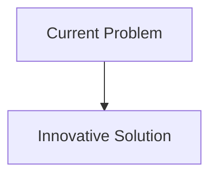
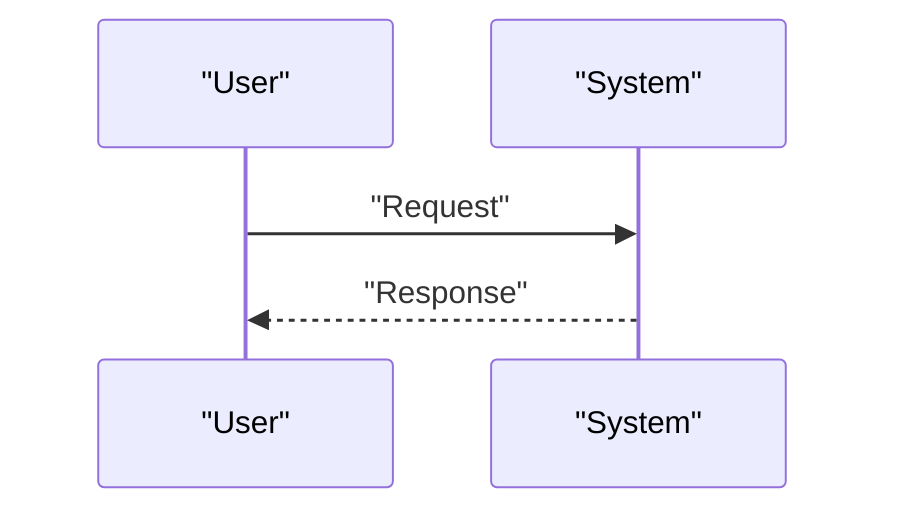

<!-- markdownlint-disable MD009 MD010 MD013 MD022 MD028 MD032 MD033 MD034 MD036 MD037 MD039 MD041 MD058 MD060 -->

[ 🇫🇷 Version Française ](./README.fr.md)

# Atmospheric Dispersal Twin

> **Executive Summary:** A Neural Physics Engine ingesting real-time data from local IoT sensors, lidar telemetry and weather feeds to simulate computational fluid dynamics (CFD) at the scale of a city or site. It generates an immersive digital twin predictive of the local atmosphere with sub-second latency.

---

## 1. Visual Overview & Wow Effect

## 2. Contrarian Thesis (Peter Thiel Style)

- **Popular Belief:** Existing solutions are sufficient.
- **Hidden Truth:** In reality, the simulation of fluid dynamics (Navier-Stokes) using traditional software requires hours of calculation on HPC clusters. A simple LLM or warning SaaS does not have the continuous physical spatio-temporal understanding required to anticipate the chaos of atmospheric turbulence in an urban area.

## 3. Problem & Target Market

- **Business Model:** B2B / B2G
- **Target Audience:** Operators of critical industrial sites (chemical, nuclear, SEVESO sites), government civil protection agencies, first-response emergency services.
- **Urgent Pain Point:** In the event of a chemical, radiological leak or major fire, the prediction of the dispersion of toxic plumes is based on static and slow Gaussian models, not taking into account dynamic micro-meteorology or 3D urban topography in real time. This leads to inadequate evacuations, putting lives at risk and exposing manufacturers to massive criminal and financial liabilities.

## 4. Technical Architecture & Infrastructure

## 5. Business Model & Financial Viability

| Metric                     | Value                        |
| :------------------------- | :--------------------------- |
| **Pricing Structure**      | B2B Subscription             |
| **12-Month Target**        | 100 customers at 1000€/month |
| **Revenue Formula**        | 100 \* 1000 = 100k€          |
| **Estimated Gross Margin** | 80%                          |

## 6. Distribution Engine & Moat

- **Acquisition Strategy:** Direct Sales
- **Moat (Defensibility):** A Neural Physics Engine ingesting real-time data from local IoT sensors, lidar telemetry and weather feeds to simulate computational fluid dynamics (CFD) at the scale of a city or site. It generates an immersive digital twin predictive of the local atmosphere with sub-second latency.(Difficult to copy because of: Quality and density of IoT sensors in the field (garbage in, garbage out), validation by regulatory authorities for use as a crisis decision tool, cost of continuous training of physical base models.)

## 7. Detailed Evaluation Grid

| Criterion                       | VC Score (/100) | Market Score (/100) |
| :------------------------------ | :-------------: | :-----------------: |
| **Thesis & Monopoly / Urgency** |     -- / 25     |       -- / 25       |
| **Moat / LLM Immunity**         |     -- / 25     |       -- / 25       |
| **Scalability / UX Friction**   |     -- / 25     |       -- / 25       |
| **Unit Economics / ROI**        |     -- / 25     |       -- / 25       |
| **TOTAL**                       |  **-- / 100**   |    **-- / 100**     |

> **VC Verdict:** Pending evaluation.
> **Market Verdict:** Pending evaluation.
