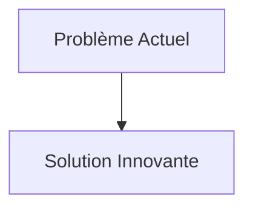
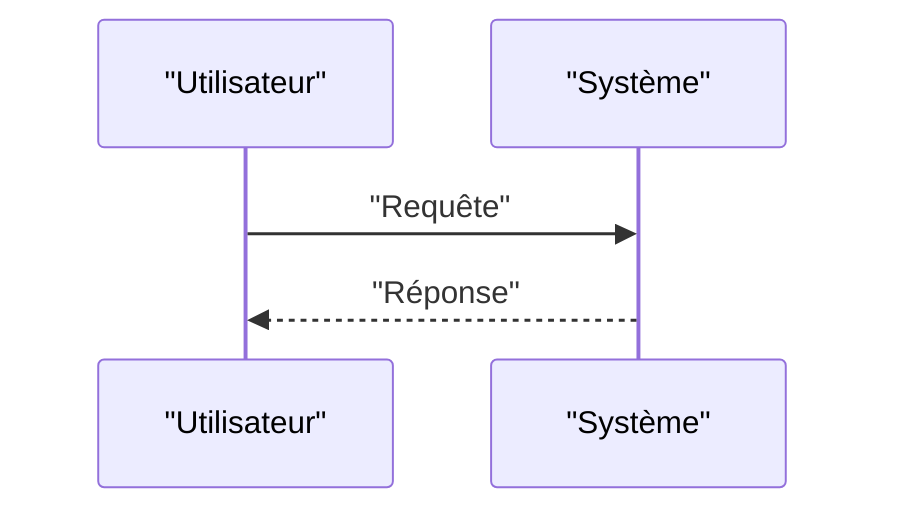

<!-- markdownlint-disable MD009 MD010 MD013 MD022 MD028 MD032 MD033 MD034 MD036 MD037 MD039 MD041 MD058 MD060 -->

[ 🇬🇧 English Version ](./README.md)

# Atmospheric Methane Cracking Infrastructure

> **Résumé exécutif :** Développement d'infrastructures de "craquage" photo-catalytique du méthane. Utilisation de nouveaux métamatériaux (MOFs - Metal-Organic Frameworks) dopés aux nanoparticules activées par la lumière solaire (ou UV artificiels) pour dégrader le méthane dilué directement en vapeur d'eau et CO2 (beaucoup moins réchauffant), à l'échelle du site d'émission.

---

## 1. Aperçu visuel & Effet Wahou

## 2. La thèse contrariante (Peter Thiel Style)

- **La croyance populaire :** Les solutions existantes sont suffisantes.
- **La vérité cachée :** En réalité, C'est un défi de chimie des matériaux avancée et d'ingénierie des procédés. Un SaaS de comptabilité carbone ne résout pas la physique de l'élimination du méthane. Il faut concevoir, synthétiser et industrialiser des matériaux catalytiques inédits avec une cinétique de réaction rapide.

## 3. Le problème & La cible

- **Modèle économique :** B2B
- **Cible précise :** Industries pétrolières et gazières, exploitations agricoles intensives (élevage), opérateurs de décharges, et marchés de crédits carbone.
- **La douleur urgente :** Le méthane (CH4) a un pouvoir de réchauffement global plus de 80 fois supérieur au CO2 sur 20 ans. Les fuites fugitives des infrastructures fossiles et de l'agriculture sont massives. La capture directe dans l'air (DAC) se concentre sur le CO2 ; capturer le méthane très dilué dans l'atmosphère est un problème physique et chimique non résolu à l'échelle industrielle.

## 4. Architecture technique & Plomberie

## 5. Modèle économique & Viabilité financière

| Métrique                        | Valeur                   |
| :------------------------------ | :----------------------- |
| **Structure de prix**           | Abonnement B2B           |
| **Objectif 12 mois**            | 100 clients à 1000€/mois |
| **Calcul du CA (Target 100k€)** | 100 \* 1000 = 100k€      |
| **Marge brute estimée**         | 80%                      |

## 6. Moteur de distribution & Fossé défensif (Moat)

- **Stratégie d'acquisition :** Ventes directes
- **Moat (Barrière à l'entrée) :** Développement d'infrastructures de "craquage" photo-catalytique du méthane. Utilisation de nouveaux métamatériaux (MOFs - Metal-Organic Frameworks) dopés aux nanoparticules activées par la lumière solaire (ou UV artificiels) pour dégrader le méthane dilué directement en vapeur d'eau et CO2 (beaucoup moins réchauffant), à l'échelle du site d'émission. (Difficile à copier à cause de : Passage à l'échelle industrielle des MOFs très complexe, coût énergétique de la ventilation d'air si l'air n'est pas brassé naturellement, marché dépendant de la réglementation et du prix des crédits carbone sur le méthane.)

## 7. Grille d'évaluation détaillée

| Critère                               | Score VC (/100) | Score Terrain (/100) |
| :------------------------------------ | :-------------: | :------------------: |
| **Thèse & Monopole / Urgence**        |     -- / 25     |       -- / 25        |
| **Moat / Résistance aux LLM natifs**  |     -- / 25     |       -- / 25        |
| **Scalabilité / Friction d'adoption** |     -- / 25     |       -- / 25        |
| **Unit Economics / ROI direct**       |     -- / 25     |       -- / 25        |
| **TOTAL**                             |  **-- / 100**   |     **-- / 100**     |

> **Verdict VC :** En attente d'évaluation.
> **Verdict Terrain :** En attente d'évaluation.
