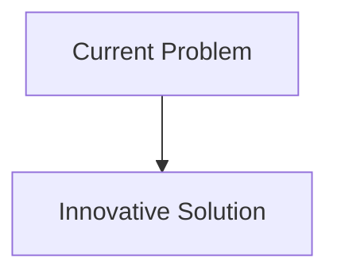
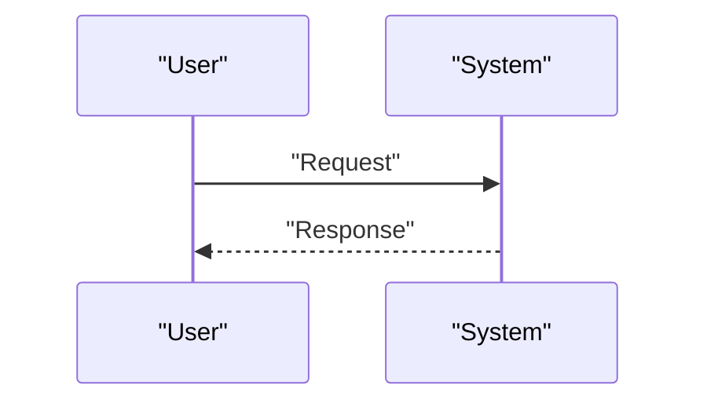

<!-- markdownlint-disable MD009 MD010 MD013 MD022 MD028 MD032 MD033 MD034 MD036 MD037 MD039 MD041 MD058 MD060 -->

[ 🇫🇷 Version Française ](./README.fr.md)

# Atmospheric Methane Cracking Infrastructure

> **Executive Summary:** Development of photo-catalytic methane “cracking” infrastructures. Use of new metamaterials (MOFs - Metal-Organic Frameworks) doped with nanoparticles activated by solar light (or artificial UV) to degrade methane diluted directly into water vapor and CO2 (much less warming), at the scale of the emission site.

---

## 1. Visual Overview & Wow Effect

## 2. Contrarian Thesis (Peter Thiel Style)

- **Popular Belief:** Existing solutions are sufficient.
- **Hidden Truth:** In reality, it is a challenge of advanced materials chemistry and process engineering. A carbon accounting SaaS does not solve the physics of methane removal. It is necessary to design, synthesize and industrialize new catalytic materials with rapid reaction kinetics.

## 3. Problem & Target Market

- **Business Model:** B2B
- **Target Audience:** Oil and gas industries, intensive agricultural operations (livestock farming), landfill operators, and carbon credit markets.
- **Urgent Pain Point:** Methane (CH4) has a global warming power more than 80 times greater than CO2 over 20 years. Fugitive leaks from fossil fuel infrastructure and agriculture are massive. Direct air capture (DAC) focuses on CO2;capturing very diluted methane in the atmosphere is an unresolved physical and chemical problem on an industrial scale.

## 4. Technical Architecture & Infrastructure

## 5. Business Model & Financial Viability

| Metric                     | Value                        |
| :------------------------- | :--------------------------- |
| **Pricing Structure**      | B2B Subscription             |
| **12-Month Target**        | 100 customers at 1000€/month |
| **Revenue Formula**        | 100 \* 1000 = 100k€          |
| **Estimated Gross Margin** | 80%                          |

## 6. Distribution Engine & Moat

- **Acquisition Strategy:** Direct Sales
- **Moat (Defensibility):** Development of photo-catalytic methane “cracking” infrastructures. Use of new metamaterials (MOFs - Metal-Organic Frameworks) doped with nanoparticles activated by solar light (or artificial UV) to degrade methane diluted directly into water vapor and CO2 (much less warming), at the scale of the emission site.(Difficult to copy because of: Very complex transition to industrial scale of MOFs, energy cost of air ventilation if the air is not mixed naturally, market dependent on regulations and the price of carbon credits on methane.)

## 7. Detailed Evaluation Grid

| Criterion                       | VC Score (/100) | Market Score (/100) |
| :------------------------------ | :-------------: | :-----------------: |
| **Thesis & Monopoly / Urgency** |     -- / 25     |       -- / 25       |
| **Moat / LLM Immunity**         |     -- / 25     |       -- / 25       |
| **Scalability / UX Friction**   |     -- / 25     |       -- / 25       |
| **Unit Economics / ROI**        |     -- / 25     |       -- / 25       |
| **TOTAL**                       |  **-- / 100**   |    **-- / 100**     |

> **VC Verdict:** Pending evaluation.
> **Market Verdict:** Pending evaluation.
