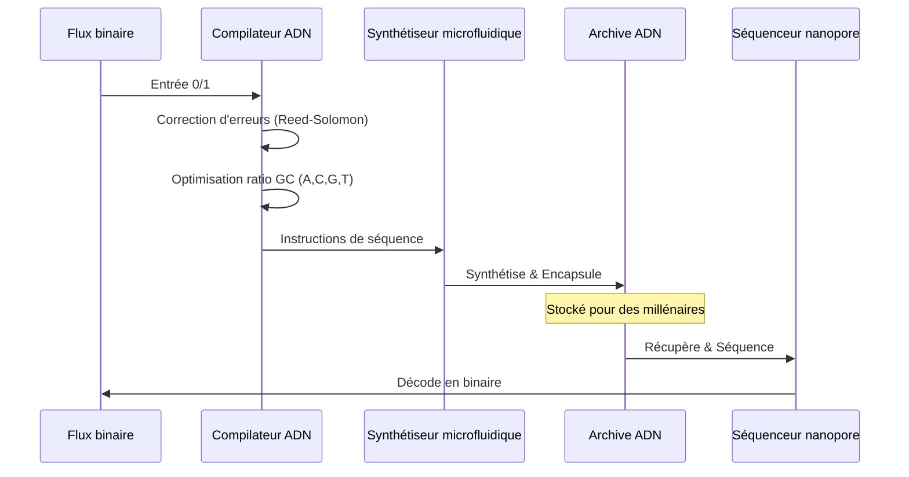

<!-- markdownlint-disable MD009 MD010 MD013 MD022 MD028 MD032 MD033 MD034 MD036 MD037 MD039 MD041 MD058 MD060 -->

[ 🇬🇧 English Version ](./README.md)

# DNA Vault Encoder

> **Résumé exécutif :** Un compilateur bio-informatique qui traduit des données binaires en séquences d'ADN avec correction d'erreurs avancée, orchestrant la synthèse microfluidique pour un stockage à froid ultra-dense et millénaire.

---

## 1. Aperçu visuel & Effet Wahou

```mermaid
graph TD
    %% Schéma comparatif Problème vs Solution ou Flux d'architecture
    subgraph Stockage_Froid_Traditionnel ["Stockage Froid Traditionnel (LTO/HDD)"]
        A[Données Massives] --> B[Centres de données]
        B --> C[Coût énergétique & spatial élevé]
        C --> D[Dégradation 10-30 ans]
        D --> E[Migration constante et coûteuse]
    end
    subgraph DNA_Vault_Encoder ["DNA Vault Encoder"]
        F[Données Massives] --> G[Compilateur Binaire vers ADN]
        G --> H[Synthèse ADN Microfluidique]
        H --> I[Encapsulation Polymère]
        I --> J[Durée de vie millénaire, Zéro coût énergétique]
    end
```

## 2. La thèse contrariante (Peter Thiel Style)

**La croyance populaire :** Pour gérer la croissance explosive des données d'archives à long terme, nous devons construire des centres de données hyperscale de plus en plus massifs en utilisant des bandes magnétiques ou du stockage sur verre légèrement plus denses.

**La vérité cachée :** Le support de stockage ultime existe déjà dans la nature. En traduisant le binaire en biologie, nous pouvons stocker les données du monde entier dans le volume d'une boîte à chaussures, sans aucune électricité pour la maintenance, et avec une durée de conservation de milliers d'années sans dégradation.

## 3. Le problème & La cible

**Modèle économique :** B2B

**Cible précise :** Fournisseurs de Cloud (AWS, Azure, Google), centres d'archives nationales, institutions financières, et l'industrie du cinéma (conservation des masters 8K).

**La douleur urgente :** L'explosion des données mondiales entraîne une crise des supports de stockage "froids" (archives à long terme). Les bandes magnétiques (LTO) ou disques durs actuels ont une durée de vie limitée (10-30 ans), nécessitent une migration constante, occupent des entrepôts gigantesques et consomment énormément d'électricité. L'empreinte écologique et le coût de l'archivage profond deviennent insoutenables pour les très grands acteurs.

## 4. Architecture technique & Plomberie

## 5. Modèle économique & Viabilité financière

| Métrique                    | Valeur                                                                  |
| :-------------------------- | :---------------------------------------------------------------------- |
| Structure de prix           | Tarification par pétaoctet stocké + Frais d'encodage/décodage           |
| Objectif 12 mois            | 2 clients majeurs (archives institutionnelles ou cloud)                 |
| Calcul du CA (Target 100k€) | 2 clients \* 50 000 € contrat d'archivage profond = 100k€ ARR           |
| Marge brute estimée         | 60% (s'améliorant à mesure que les coûts de synthèse de l'ADN baissent) |

## 6. Moteur de distribution & Fossé défensif (Moat)

**Stratégie d'acquisition :** Partenariats stratégiques avec des fournisseurs de cloud hyperscale cherchant à proposer un niveau de stockage "ultra-froid", et ventes directes aux institutions ayant des obligations légales de conservation infinie des données.

**Moat (Barrière à l'entrée) :** L'encodage de données dans l'ADN n'est pas une simple compression de fichiers ; c'est une interface complexe entre la théorie de l'information (mathématiques) et la biologie synthétique (chimie). Les algorithmes doivent éviter les contraintes biochimiques (comme les longues répétitions de "A" ou un ratio GC sous-optimal pour la stabilité thermodynamique), ce que les algorithmes de compression standards ignorent totalement.

## 7. Grille d'évaluation détaillée

| Critère                           | Score VC (/100) | Score Terrain (/100) |
| :-------------------------------- | :-------------- | :------------------- |
| Thèse & Monopole / Urgence        | -- / 25         | -- / 25              |
| Moat / Résistance aux LLM natifs  | -- / 25         | -- / 25              |
| Scalabilité / Friction d'adoption | -- / 25         | -- / 25              |
| Unit Economics / ROI direct       | -- / 25         | -- / 25              |
| **TOTAL**                         | **-- / 100**    | **-- / 100**         |

> **Verdict VC :** En attente d'évaluation.
> **Verdict Terrain :** En attente d'évaluation.
