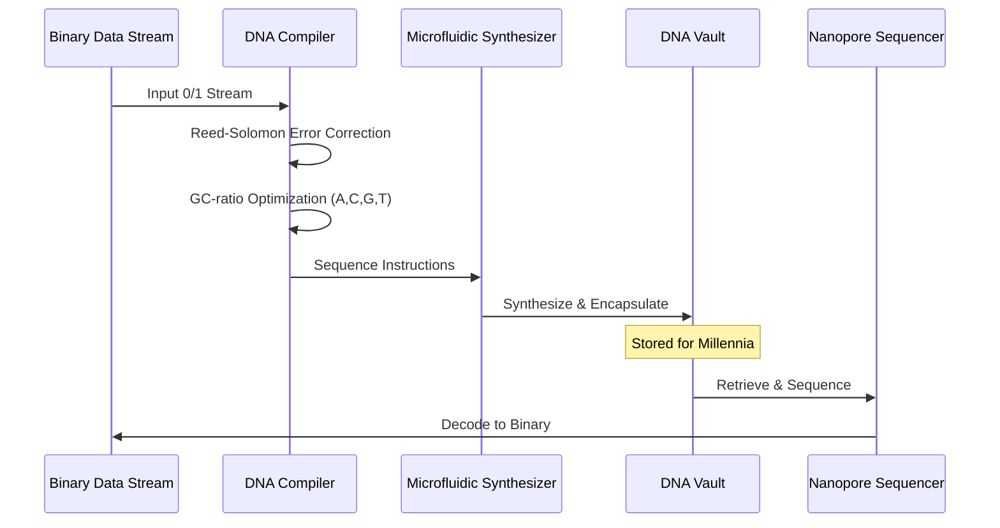

<!-- markdownlint-disable MD009 MD010 MD013 MD022 MD028 MD032 MD033 MD034 MD036 MD037 MD039 MD041 MD058 MD060 -->

[ 🇫🇷 Version Française ](./README.fr.md)

# DNA Vault Encoder

> **Executive Summary:** A bioinformatics compiler that translates binary data into DNA sequences with advanced error correction, orchestrating microfluidic synthesis for ultra-dense, millennia-lasting cold storage.

---

## 1. Visual Overview & Wow Effect

```mermaid
graph TD
    %% Problem vs Solution or Architecture Diagram
    subgraph Traditional_Cold_Storage ["Traditional Cold Storage (LTO/HDD)"]
        A[Massive Data] --> B[Data Centers]
        B --> C[High Energy & Space Cost]
        C --> D[Data Degradation 10-30 years]
        D --> E[Constant Costly Migration]
    end
    subgraph DNA_Vault_Encoder ["DNA Vault Encoder"]
        F[Massive Data] --> G[Binary to DNA Compiler]
        G --> H[Microfluidic DNA Synthesis]
        H --> I[Polymer Encapsulation]
        I --> J[Millennia Lifespan, Zero Energy Cost]
    end
```

## 2. Contrarian Thesis (Peter Thiel Style)

**Popular Belief:** To manage the explosive growth of long-term archive data, we need to build increasingly massive hyperscale data centers using slightly denser magnetic tapes or glass storage.

**Hidden Truth:** The ultimate storage medium already exists in nature. By translating binary into biology, we can store the world's data in the volume of a shoebox, requiring zero electricity for maintenance, and lasting for thousands of years without degradation.

## 3. Problem & Target Market

**Business Model:** B2B

**Target Audience:** Cloud providers (AWS, Azure, Google), national archives, financial institutions, and the film industry (archiving 8K masters).

**Urgent Pain Point:** The global data explosion is causing a crisis for "cold" storage. Current magnetic tapes (LTO) or hard drives have a limited lifespan (10-30 years), require constant migration, occupy gigantic warehouses, and consume massive amounts of electricity. The ecological footprint and deep archiving costs are becoming unsustainable.

## 4. Technical Architecture & Infrastructure

## 5. Business Model & Financial Viability

| Metric                 | Value                                                       |
| :--------------------- | :---------------------------------------------------------- |
| Pricing Structure      | Tiered Pricing per Petabyte Stored + Encoding/Decoding Fees |
| 12-Month Target        | 2 major enterprise or institutional archive clients         |
| Revenue Formula        | 2 clients \* €50,000 deep archive contract = €100k ARR      |
| Estimated Gross Margin | 60% (improving as DNA synthesis costs drop)                 |

## 6. Distribution Engine & Moat

**Acquisition Strategy:** Strategic partnerships with hyperscale cloud providers looking to offer an "Ultra-Cold Storage" tier, and direct sales to institutions with legal obligations for infinite data retention (national archives).

**Moat (Defensibility):** Encoding data into DNA is not simple file compression; it is a complex interface between information theory (math) and synthetic biology (chemistry). The encoding algorithms must avoid biochemical constraints (like long repeats of 'A' or sub-optimal GC ratios for thermodynamic stability), something standard compression algorithms completely ignore.

## 7. Detailed Evaluation Grid

| Criterion                   | VC Score (/100) | Market Score (/100) |
| :-------------------------- | :-------------- | :------------------ |
| Thesis & Monopoly / Urgency | -- / 25         | -- / 25             |
| Moat / LLM Immunity         | -- / 25         | -- / 25             |
| Scalability / UX Friction   | -- / 25         | -- / 25             |
| Unit Economics / ROI        | -- / 25         | -- / 25             |
| **TOTAL**                   | **-- / 100**    | **-- / 100**        |

> **VC Verdict:** Pending evaluation.
> **Market Verdict:** Pending evaluation.
