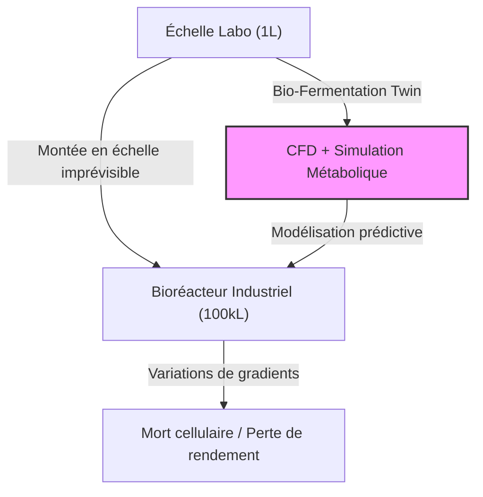
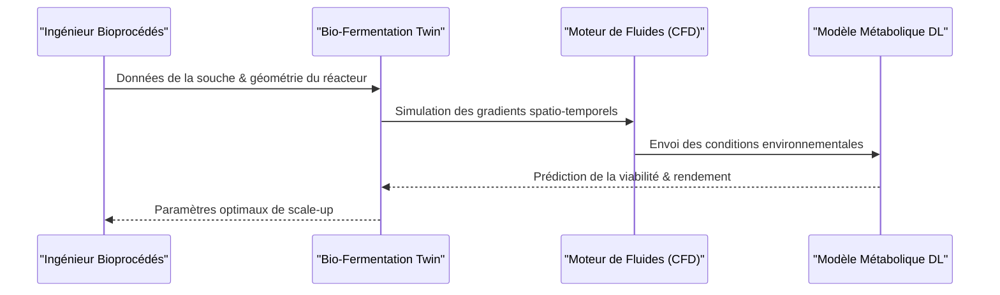

<!-- markdownlint-disable MD009 MD010 MD013 MD022 MD028 MD032 MD033 MD034 MD036 MD037 MD039 MD041 MD058 MD060 -->

[ 🇬🇧 English Version ](./README.md)

# Bio-Fermentation Twin

> **Résumé exécutif :** Une plateforme de jumeau numérique utilisant la dynamique des fluides et des modèles métaboliques (Deep Learning) pour prédire le comportement cellulaire dans des bioréacteurs massifs, résolvant l'imprévisibilité du passage à l'échelle en biotechnologie.

---

## 1. Aperçu visuel & Effet Wahou

## 2. La thèse contrariante (Peter Thiel Style)

**La croyance populaire :** Le passage à l'échelle en biotechnologie est purement empirique, nécessitant des essais physiques itératifs et des capitaux massifs pour construire des usines pilotes.
**La vérité cachée :** Le comportement biologique à grande échelle est une fonction déterministe de la dynamique des fluides et de la réponse métabolique, qui peut être entièrement simulée informatiquement avant toute construction.

## 3. Le problème & La cible

**Modèle économique :** B2B
**Cible précise :** Les industriels de la biotechnologie (fabricants de protéines alternatives, bioplastiques, pharma) détenant les budgets de R&D et de production.
**La douleur urgente :** Le passage de 1L à 100 000L échoue souvent à cause de variations microscopiques (température, pH, oxygène), causant des mois de retard et des millions de dollars de pertes.

## 4. Architecture technique & Plomberie

## 5. Modèle économique & Viabilité financière

| Métrique                        | Valeur                                         |
| :------------------------------ | :--------------------------------------------- |
| **Structure de prix**           | Licence annuelle par souche/modèle de réacteur |
| **Objectif 12 mois**            | 2 à 3 contrats entreprises                     |
| **Calcul du CA (Target 100k€)** | 3 contrats \* 40k€/an = 120k€ ARR              |
| **Marge brute estimée**         | 80% (Coûts de calcul élevés pour la CFD)       |

## 6. Moteur de distribution & Fossé défensif (Moat)

**Stratégie d'acquisition :** Ventes B2B directes aux Directeurs Scientifiques (CSO) et VP Bioprocédés, appuyées par des cas d'étude démontrant les économies réalisées.
**Moat (Barrière à l'entrée) :** Nécessite une intégration propriétaire de la mécanique des fluides et de la bio-informatique complexe ; un LLM générique ne peut pas simuler la physique des fluides ou la biologie cellulaire.

## 7. Grille d'évaluation détaillée

| Critère                               | Score VC (/100) | Score Terrain (/100) |
| :------------------------------------ | :-------------- | :------------------- |
| **Thèse & Monopole / Urgence**        | -- / 25         | 20 / 25              |
| **Moat / Résistance aux LLM natifs**  | -- / 25         | 24 / 25              |
| **Scalabilité / Friction d'adoption** | -- / 25         | 15 / 25              |
| **Unit Economics / ROI direct**       | -- / 25         | 22 / 25              |
| **TOTAL**                             | **-- / 100**    | **81 / 100**         |

> **Verdict VC :** La thèse est solide, car elle résout un problème critique de CAPEX dans la mise à l'échelle en biotechnologie. La défendabilité est exceptionnelle grâce à la complexité d'intégration entre la dynamique des fluides et les modèles métaboliques. Les unit economics sont très attractifs pour des clients B2B.

> **Verdict Terrain :** Bio-fermentation-twin cible précisément la difficulté de mise à l'échelle de la production biologique, offrant des gains de temps et de coûts mesurables. Son intégration profonde avec le matériel des bioréacteurs crée un fossé solide contre les LLM natifs. La monétisation est claire grâce aux économies matérielles directes, bien que la friction initiale d'installation reste élevée.
