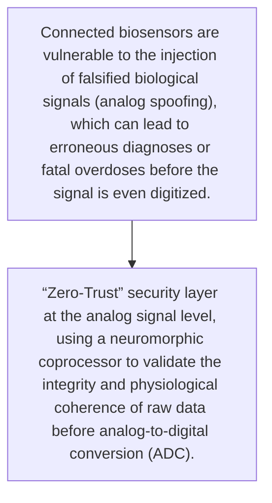
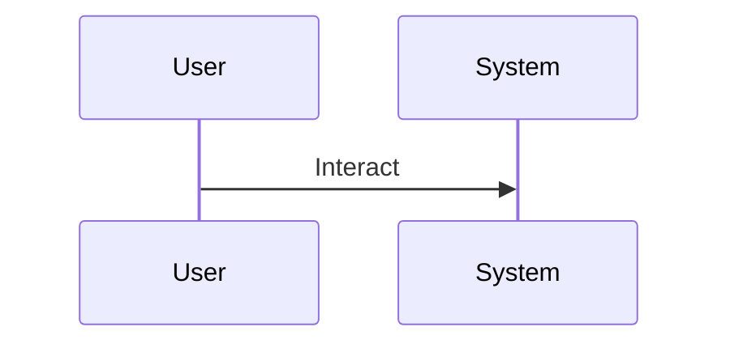

<!-- markdownlint-disable MD009 MD010 MD013 MD022 MD028 MD032 MD033 MD034 MD036 MD037 MD039 MD041 MD060 -->

[ 🇫🇷 Version Française ](./README.fr.md)

# Analog Bio-Shield

> **Executive Summary:** “Zero-Trust” security layer at the analog signal level, using a neuromorphic coprocessor to validate the integrity and physiological coherence of raw data before analog-to-digital conversion (ADC).

---

## 1. Visual Overview & Wow Effect

## 2. Contrarian Thesis (Peter Thiel Style)

- **Popular Belief:** Traditional software firewalls and security APIs operate post-scan and are completely blind to physical attacks on the sensor itself.
- **Hidden Truth:** “Zero-Trust” security layer at the analog signal level, using a neuromorphic coprocessor to validate the integrity and physiological coherence of raw data before analog-to-digital conversion (ADC).

## 3. Problem & Target Market

- **Business Model:** B2B
- **Target Audience:** Hospitals, medical analysis laboratories and manufacturers of implantable medical devices (pacemakers, insulin pumps)
- **Urgent Pain Point:** Connected biosensors are vulnerable to the injection of falsified biological signals (analog spoofing), which can lead to erroneous diagnoses or fatal overdoses before the signal is even digitized.

## 4. Technical Architecture & Infrastructure

## 5. Business Model & Financial Viability

| Metric                 | Value                                     |
| ---------------------- | ----------------------------------------- |
| Pricing Structure      | [Price / Subscription Model / Commission] |
| 12-Month Target        | [Exact volume required for 100k ARR]      |
| Revenue Formula        | [Mathematical calculation]                |
| Estimated Gross Margin | [Margin %]                                |

## 6. Distribution Engine & Moat

- **Acquisition Strategy:** [Virality, network effect, direct sales, developer adoption]
- **Moat (Defensibility):** Latency introduced by hardware filtering (critical for implants), need for long and costly medical FDA/CE certification.

## 7. Detailed Evaluation Grid

| Criterion                   | VC Score (/100) | Market Score (/100) |
| --------------------------- | --------------- | ------------------- |
| Thesis & Monopoly / Urgency | -- / 25         | -- / 25             |
| Moat / LLM Immunity         | -- / 25         | -- / 25             |
| Scalability / UX Friction   | -- / 25         | -- / 25             |
| Unit Economics / ROI        | -- / 25         | -- / 25             |
| TOTAL                       | -- / 100        | -- / 100            |

> **VC Verdict:** Pending evaluation.
> **Market Verdict:** Pending evaluation.
