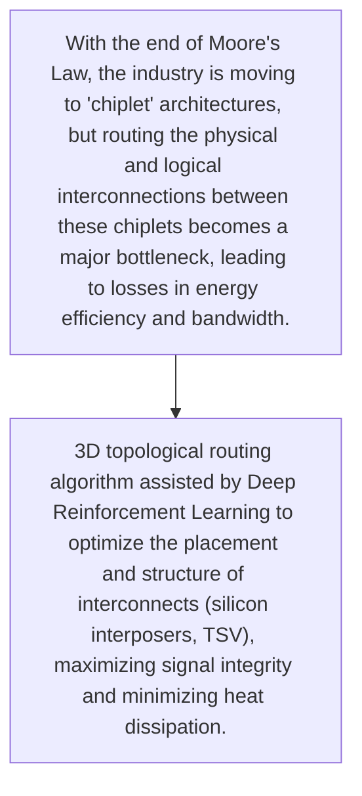
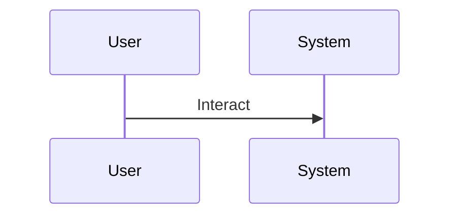

<!-- markdownlint-disable MD009 MD010 MD013 MD022 MD028 MD032 MD033 MD034 MD036 MD037 MD039 MD041 MD060 -->

[ 🇫🇷 Version Française ](./README.fr.md)

# Die-to-Die Fabric

> **Executive Summary:** 3D topological routing algorithm assisted by Deep Reinforcement Learning to optimize the placement and structure of interconnects (silicon interposers, TSV), maximizing signal integrity and minimizing heat dissipation.

---

## 1. Visual Overview & Wow Effect

## 2. Contrarian Thesis (Peter Thiel Style)

- **Popular Belief:** Requires deep integration with aging EDA (Electronic Design Automation) tools, handling very large and protected IP design files, and managing the physical constraints of quantum/nanoscale manufacturing.
- **Hidden Truth:** 3D topological routing algorithm assisted by Deep Reinforcement Learning to optimize the placement and structure of interconnects (silicon interposers, TSV), maximizing signal integrity and minimizing heat dissipation.

## 3. Problem & Target Market

- **Business Model:** B2B
- **Target Audience:** Founders (TSMC, Intel), chip designers (Nvidia, AMD, AI accelerator startups)
- **Urgent Pain Point:** With the end of Moore's Law, the industry is moving to 'chiplet' architectures, but routing the physical and logical interconnections between these chiplets becomes a major bottleneck, leading to losses in energy efficiency and bandwidth.

## 4. Technical Architecture & Infrastructure

## 5. Business Model & Financial Viability

| Metric                 | Value                                     |
| ---------------------- | ----------------------------------------- |
| Pricing Structure      | [Price / Subscription Model / Commission] |
| 12-Month Target        | [Exact volume required for 100k ARR]      |
| Revenue Formula        | [Mathematical calculation]                |
| Estimated Gross Margin | [Margin %]                                |

## 6. Distribution Engine & Moat

- **Acquisition Strategy:** [Virality, network effect, direct sales, developer adoption]
- **Moat (Defensibility):** Monopoly of EDA giants (Synopsys, Cadence) difficult to dislodge, sales cycle of several years, extreme requirement for precision (zero room for error).

## 7. Detailed Evaluation Grid

| Criterion                   | VC Score (/100) | Market Score (/100) |
| --------------------------- | --------------- | ------------------- |
| Thesis & Monopoly / Urgency | -- / 25         | -- / 25             |
| Moat / LLM Immunity         | -- / 25         | -- / 25             |
| Scalability / UX Friction   | -- / 25         | -- / 25             |
| Unit Economics / ROI        | -- / 25         | -- / 25             |
| TOTAL                       | -- / 100        | -- / 100            |

> **VC Verdict:** Pending evaluation.
> **Market Verdict:** Pending evaluation.
