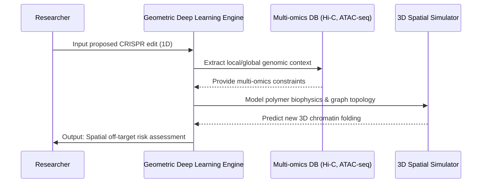

<!-- markdownlint-disable MD009 MD010 MD013 MD022 MD028 MD032 MD033 MD034 MD036 MD037 MD039 MD041 MD058 MD060 -->

[ 🇫🇷 Version Française ](./README.fr.md)

# ChromaFold AI

> **Executive Summary:** A geometric deep learning platform that predicts the 3D folding of the entire genome (chromatin architecture) to simulate epigenetic off-target effects before clinical trials.

---

## 1. Visual Overview & Wow Effect

```mermaid
graph TD
    %% Problem vs Solution or Architecture Diagram
    subgraph Current_Drug_Design ["Current Drug & Gene Therapy Design"]
        A[Gene Editing / CRISPR] --> B[1D/2D Genomic Analysis]
        B --> C[Unseen 3D Off-target Effects]
        C --> D[Massive Clinical Trial Failures]
    end
    subgraph ChromaFold_AI ["ChromaFold AI"]
        E[Gene Editing / CRISPR] --> F[Geometric Deep Learning]
        F --> G[3D Chromatin Folding Simulation]
        G --> H[In-silico Safety Validation]
        H --> I[Precision Epigenetic Therapies]
    end
```

## 2. Contrarian Thesis (Peter Thiel Style)

**Popular Belief:** To revolutionize drug discovery, we must focus all AI efforts on protein folding (like AlphaFold) and generative ligand design.

**Hidden Truth:** While proteins are the final product, the true operating system of biology is the 3D spatial architecture of DNA (chromatin). Predicting how the genome folds in space unlocks the ability to control epigenetics and prevents billion-dollar gene therapy failures caused by spatial off-target effects that 1D sequence models simply cannot see.

## 3. Problem & Target Market

**Business Model:** B2B

**Target Audience:** Pharmaceutical companies (Big Pharma), gene therapy startups, and academic research labs.

**Urgent Pain Point:** Modifying a gene (via CRISPR or other therapies) can accidentally activate or repress neighboring genes in 3D space, even if they are millions of base pairs away on the linear sequence. This inability to predict 3D chromatin structures leads to a massive failure rate in epigenetic therapies and gene editing, costing billions of dollars and years of wasted clinical trials.

## 4. Technical Architecture & Infrastructure

## 5. Business Model & Financial Viability

| Metric                 | Value                                                         |
| :--------------------- | :------------------------------------------------------------ |
| Pricing Structure      | Enterprise SaaS Subscription + API usage for batch simulation |
| 12-Month Target        | 1-2 Big Pharma pilot partnerships or 5 biotech startups       |
| Revenue Formula        | 1 enterprise contract \* €100k/year = €100k ARR               |
| Estimated Gross Margin | 80% (Software margins, excluding heavy GPU compute)           |

## 6. Distribution Engine & Moat

**Acquisition Strategy:** Direct sales to computational biology heads at top 50 Pharma companies. Establish thought leadership by publishing breakthroughs in Nature/Science using the platform, driving inbound from biotech startups.

**Moat (Defensibility):** Predicting the folding of billions of base pairs requires handling dynamic 3D graphs and integrating physical polymer constraints. Text-based LLMs cannot comprehend spatial topology. The moat lies in the proprietary Geometric Deep Learning architecture and the highly curated multi-omics training dataset, creating a barrier to entry that standard AI labs (and even protein-focused teams without epigenetic data pipelines) cannot easily cross.

## 7. Detailed Evaluation Grid

| Criterion                   | VC Score (/100) | Market Score (/100) |
| :-------------------------- | :-------------- | :------------------ |
| Thesis & Monopoly / Urgency | 23 / 25         | -- / 25             |
| Moat / LLM Immunity         | 24 / 25         | -- / 25             |
| Scalability / UX Friction   | 25 / 25         | -- / 25             |
| Unit Economics / ROI        | 22 / 25         | -- / 25             |
| **TOTAL**                   | **94 / 100**    | **-- / 100**        |

> **VC Verdict:** Decoding chromatin folding is the holy grail of epigenetics. The proprietary datasets and complex GNN architecture create a formidable moat. Highly scalable as it becomes the foundational layer for next-gen precision medicine and CRISPR targeting.
> **Market Verdict:** Pending evaluation.
