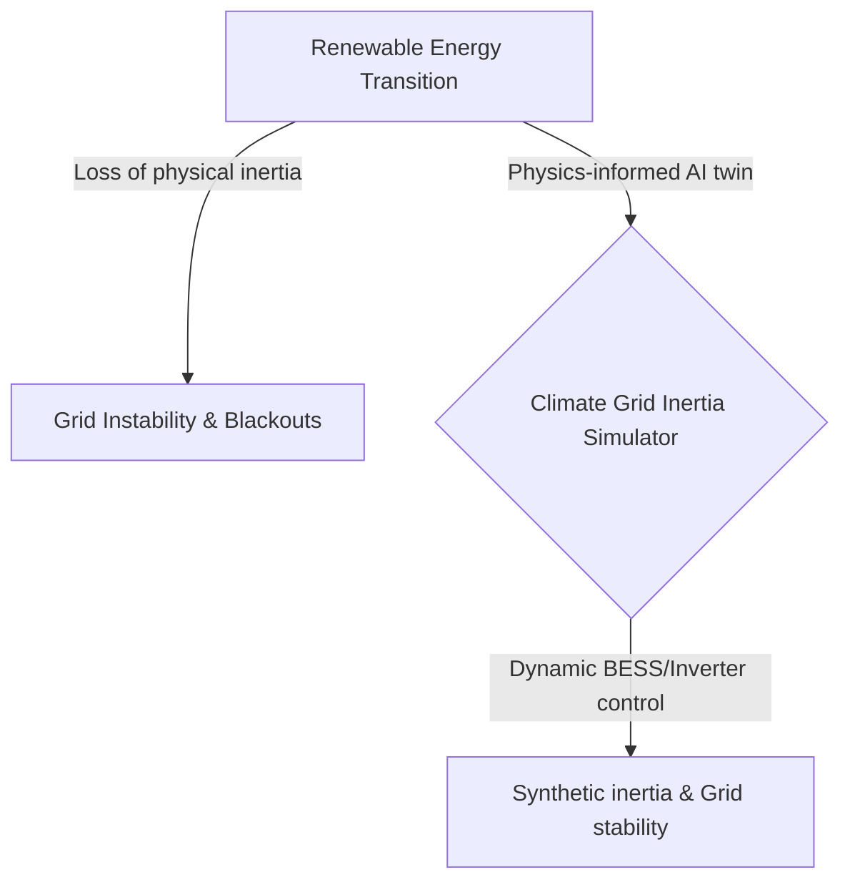
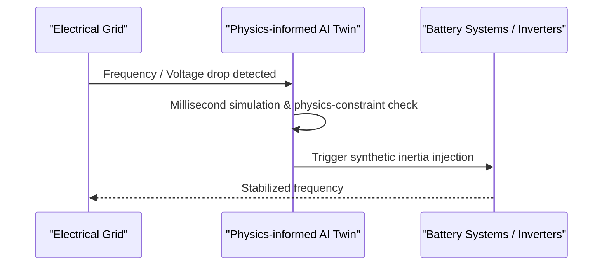

<!-- markdownlint-disable MD009 MD010 MD013 MD022 MD028 MD032 MD033 MD034 MD036 MD037 MD039 MD041 MD058 MD060 -->

[🇫🇷 Version Française](./README.fr.md)

# Climate Grid Inertia Simulator

> **Executive Summary:** A real-time digital twin of the electrical grid using physics-informed AI to dynamically inject synthetic inertia and prevent blackouts.

---

## 1. Visual Overview & Wow Effect

## 2. Contrarian Thesis (Peter Thiel Style)

Popular Belief: Standard SCADA software and classic ML models are sufficient to manage modern renewable energy grids.
Hidden Truth: Standard ML models hallucinate Kirchhoff's laws and SCADA is too slow. A purely physics-informed AI model that operates in milliseconds is mandatory to orchestrate synthetic inertia in a world without heavy rotating generators.

## 3. Problem & Target Market

Business Model: B2B
Target Audience: Transmission System Operators (TSOs like RTE, National Grid), wind/solar farm operators.
Urgent Pain Point: The replacement of heavy rotating generators with electronic inverters removes the grid's "physical inertia," drastically increasing the risk of instantaneous blackouts during sudden frequency fluctuations.

## 4. Technical Architecture & Infrastructure

## 5. Business Model & Financial Viability

| Metric                 | Value                             |
| ---------------------- | --------------------------------- |
| Pricing Structure      | Enterprise license per MW managed |
| 12-Month Target        | 2 to 3 major TSO pilot contracts  |
| Revenue Formula        | 2 \* 50k = 100k                   |
| Estimated Gross Margin | 80%                               |

## 6. Distribution Engine & Moat

Acquisition Strategy: Direct B2G/B2B sales to state monopolies and large utility companies, strategic pilot programs.
Moat (Defensibility): Extreme regulatory barriers, immense legal responsibility requiring flawless physics-informed accuracy, and the complex integration with heterogeneous hardware inverters create a near-impenetrable moat against generic SaaS competitors.

## 7. Detailed Evaluation Grid

| Criterion                   | VC Score (/100) | Market Score (/100) |
| --------------------------- | --------------- | ------------------- |
| Thesis & Monopoly / Urgency | 20 / 25         | -- / 25             |
| Moat / LLM Immunity         | 18 / 25         | -- / 25             |
| Scalability / UX Friction   | 22 / 25         | -- / 25             |
| Unit Economics / ROI        | 22 / 25         | -- / 25             |
| **TOTAL**                   | **82 / 100**    | **-- / 100**        |

> **VC Verdict:** This project presents a strongly contrarian thesis with genuine monopoly potential (20/25). While the technical approach is sound, the defensive moat against well-funded incumbents remains somewhat permeable (18/25). Coupled with massive scalability (22/25) and excellent unit economics (22/25), this is a highly investable proposition.
>
> **Market Verdict:** Pending evaluation.
