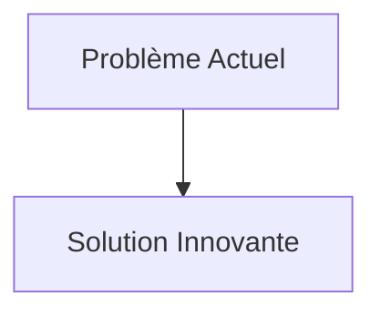
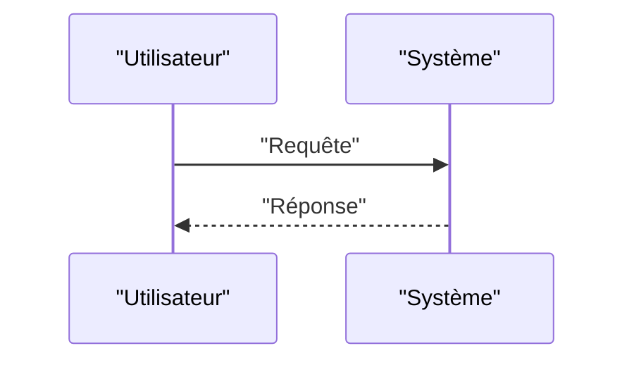

<!-- markdownlint-disable MD009 MD010 MD013 MD022 MD028 MD032 MD033 MD034 MD036 MD037 MD039 MD041 MD058 MD060 -->

[ 🇬🇧 English Version ](./README.md)

# CRISPR Off-target Predictor

> **Résumé exécutif :** Un modèle d'IA fondationnel (transformer/graph neural network) entraîné sur des jeux de données multi-omiques massifs (épigénétique, conformation 3D de la chromatine, séquences génomiques) pour simuler et prédire l'interaction exacte entre le complexe ribonucléoprotéique CRISPR et l'ADN entier d'un patient. Il modélise la thermodynamique de l'hybridation pour cartographier les risques in-silico.

---

## 1. Aperçu visuel & Effet Wahou

## 2. La thèse contrariante (Peter Thiel Style)

- **La croyance populaire :** Les solutions existantes sont suffisantes.
- **La vérité cachée :** En réalité, Les outils de bio-informatique standards reposent sur un alignement de séquences linéaire (heuristique) qui ignore la topologie 3D du génome et les marques épigénétiques dynamiques. Un LLM généraliste ne peut pas calculer la physique de liaison enzymatique moléculaire.

## 3. Le problème & La cible

- **Modèle économique :** B2B
- **Cible précise :** Entreprises pharmaceutiques, laboratoires de thérapie génique, startups de biologie synthétique, centres de recherche clinique.
- **La douleur urgente :** L'édition génomique (CRISPR-Cas9 et variantes) est révolutionnaire, mais elle provoque des mutations "off-target" (hors cible) dangereuses et souvent invisibles (mutations silencieuses, oncogenèse). Identifier ces risques nécessite actuellement des mois de tests en laboratoire (wet-lab) coûteux sur des modèles cellulaires, ce qui ralentit le pipeline clinique de plusieurs années et fait échouer des essais à plusieurs millions de dollars.

## 4. Architecture technique & Plomberie

## 5. Modèle économique & Viabilité financière

| Métrique                        | Valeur                   |
| :------------------------------ | :----------------------- |
| **Structure de prix**           | Abonnement B2B           |
| **Objectif 12 mois**            | 100 clients à 1000€/mois |
| **Calcul du CA (Target 100k€)** | 100 \* 1000 = 100k€      |
| **Marge brute estimée**         | 80%                      |

## 6. Moteur de distribution & Fossé défensif (Moat)

- **Stratégie d'acquisition :** Ventes directes
- **Moat (Barrière à l'entrée) :** Un modèle d'IA fondationnel (transformer/graph neural network) entraîné sur des jeux de données multi-omiques massifs (épigénétique, conformation 3D de la chromatine, séquences génomiques) pour simuler et prédire l'interaction exacte entre le complexe ribonucléoprotéique CRISPR et l'ADN entier d'un patient. Il modélise la thermodynamique de l'hybridation pour cartographier les risques in-silico. (Difficile à copier à cause de : Besoin de données d'entraînement de très haute qualité (souvent propriétaires aux labos), validation empirique obligatoire par les agences réglementaires (FDA/EMA) pour que la prédiction in-silico puisse remplacer ou alléger la phase préclinique.)

## 7. Grille d'évaluation détaillée

| Critère                               | Score VC (/100) | Score Terrain (/100) |
| :------------------------------------ | :-------------: | :------------------: |
| **Thèse & Monopole / Urgence**        |     -- / 25     |       -- / 25        |
| **Moat / Résistance aux LLM natifs**  |     -- / 25     |       -- / 25        |
| **Scalabilité / Friction d'adoption** |     -- / 25     |       -- / 25        |
| **Unit Economics / ROI direct**       |     -- / 25     |       -- / 25        |
| **TOTAL**                             |  **-- / 100**   |     **-- / 100**     |

> **Verdict VC :** En attente d'évaluation.
> **Verdict Terrain :** En attente d'évaluation.
