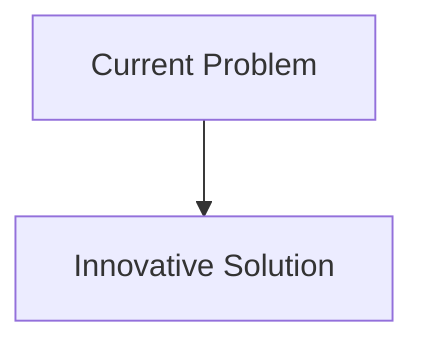
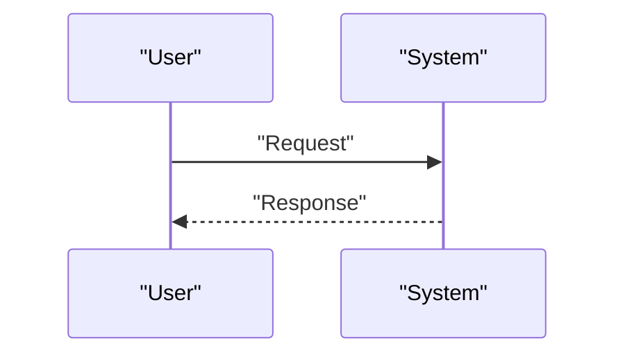

<!-- markdownlint-disable MD009 MD010 MD013 MD022 MD028 MD032 MD033 MD034 MD036 MD037 MD039 MD041 MD058 MD060 -->

[ 🇫🇷 Version Française ](./README.fr.md)

# CRISPR Off-target Predictor

> **Executive Summary:** A foundational AI model (transformer/graph neural network) trained on massive multi-omics datasets (epigenetics, 3D chromatin conformation, genomic sequences) to simulate and predict the exact interaction between the CRISPR ribonucleoprotein complex and a patient's entire DNA. It models the thermodynamics of hybridization to map risks in-silico.

---

## 1. Visual Overview & Wow Effect

## 2. Contrarian Thesis (Peter Thiel Style)

- **Popular Belief:** Existing solutions are sufficient.
- **Hidden Truth:** In reality, standard bioinformatics tools rely on linear sequence alignment (heuristic) that ignores the 3D topology of the genome and dynamic epigenetic marks. A general LLM cannot calculate molecular enzyme binding physics.

## 3. Problem & Target Market

- **Business Model:** B2B
- **Target Audience:** Pharmaceutical companies, gene therapy laboratories, synthetic biology startups, clinical research centers.
- **Urgent Pain Point:** Genome editing (CRISPR-Cas9 and variants) is revolutionary, but it causes dangerous and often invisible “off-target” mutations (silent mutations, oncogenesis). Identifying these risks currently requires months of costly wet-lab testing in cellular models, slowing the clinical pipeline by years and failing multimillion-dollar trials.

## 4. Technical Architecture & Infrastructure

## 5. Business Model & Financial Viability

| Metric                     | Value                        |
| :------------------------- | :--------------------------- |
| **Pricing Structure**      | B2B Subscription             |
| **12-Month Target**        | 100 customers at 1000€/month |
| **Revenue Formula**        | 100 \* 1000 = 100k€          |
| **Estimated Gross Margin** | 80%                          |

## 6. Distribution Engine & Moat

- **Acquisition Strategy:** Direct Sales
- **Moat (Defensibility):** A foundational AI model (transformer/graph neural network) trained on massive multi-omics datasets (epigenetics, 3D chromatin conformation, genomic sequences) to simulate and predict the exact interaction between the CRISPR ribonucleoprotein complex and a patient's entire DNA. It models the thermodynamics of hybridization to map risks in-silico.(Difficult to copy because of: Need for very high quality training data (often proprietary to the labs), mandatory empirical validation by regulatory agencies (FDA/EMA) so that in-silico prediction can replace or alleviate the preclinical phase.)

## 7. Detailed Evaluation Grid

| Criterion                       | VC Score (/100) | Market Score (/100) |
| :------------------------------ | :-------------: | :-----------------: |
| **Thesis & Monopoly / Urgency** |     -- / 25     |       -- / 25       |
| **Moat / LLM Immunity**         |     -- / 25     |       -- / 25       |
| **Scalability / UX Friction**   |     -- / 25     |       -- / 25       |
| **Unit Economics / ROI**        |     -- / 25     |       -- / 25       |
| **TOTAL**                       |  **-- / 100**   |    **-- / 100**     |

> **VC Verdict:** Pending evaluation.
> **Market Verdict:** Pending evaluation.
