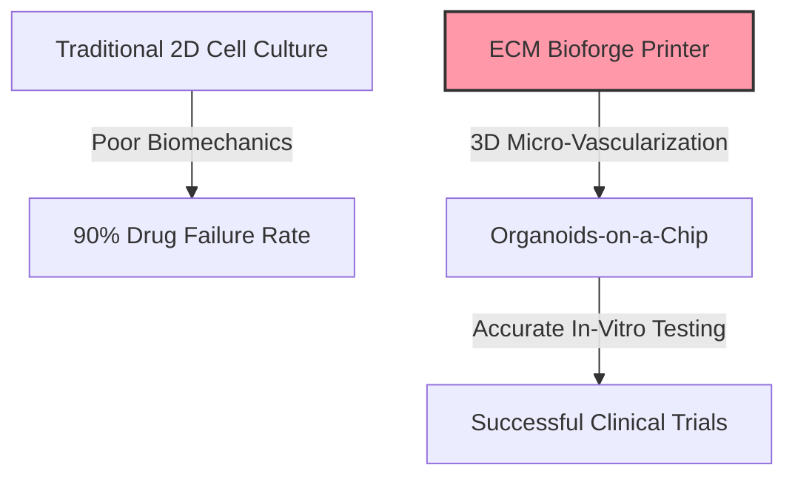
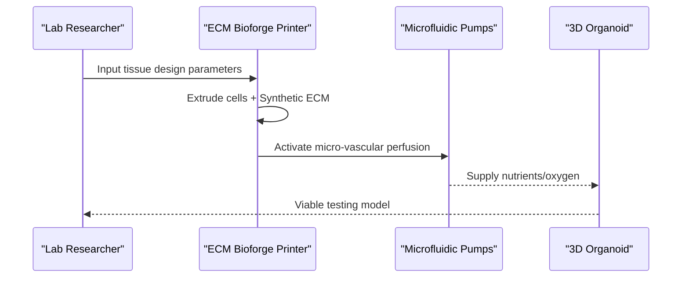

<!-- markdownlint-disable MD009 MD010 MD013 MD022 MD028 MD032 MD033 MD034 MD036 MD037 MD039 MD041 MD058 MD060 -->

[ 🇫🇷 Version Française ](./README.fr.md)

# ECM Bioforge Printer

> **Executive Summary:** A biophysical 3D printer that extrudes living cells and synthetic extracellular matrix (ECM) to create micro-vascularized "organoids-on-a-chip", revolutionizing in-vitro drug testing.

---

## 1. Visual Overview & Wow Effect

## 2. Contrarian Thesis (Peter Thiel Style)

**Popular Belief:** The key to better drug discovery is simply more data and better AI algorithms trained on existing flat (2D) petri dish results.
**Hidden Truth:** Flat 2D cell cultures fundamentally alter cell behavior. Without replicating the 3D biomechanics and micro-vascularization of human organs, AI will only learn from flawed biological data.

## 3. Problem & Target Market

**Business Model:** B2B
**Target Audience:** Pharmaceutical research labs, the cosmetics industry, and regenerative medicine centers.
**Urgent Pain Point:** 90% of drugs fail during human clinical trials because preliminary in-vitro tests on 2D plastic surfaces fail to reflect the 3D complexity of human organs, wasting billions of dollars.

## 4. Technical Architecture & Infrastructure

## 5. Business Model & Financial Viability

| Metric                     | Value                                       |
| :------------------------- | :------------------------------------------ |
| **Pricing Structure**      | Hardware lease + Consumables (ECM ink)      |
| **12-Month Target**        | 2 research lab contracts                    |
| **Revenue Formula**        | 2 contracts \* €50k = €100k ARR             |
| **Estimated Gross Margin** | 70% (Recurring revenue on proprietary inks) |

## 6. Distribution Engine & Moat

**Acquisition Strategy:** Direct B2B sales targeting principal investigators and R&D directors in Big Pharma, supported by peer-reviewed validation of the organoids.
**Moat (Defensibility):** Deep integration of tissue engineering and precision mechatronics. Software alone cannot fabricate micro-vascularized collagen scaffolds or manage microfluidic pumps for in-vitro tissue survival.

## 7. Detailed Evaluation Grid

| Criterion                       | VC Score (/100) | Market Score (/100) |
| :------------------------------ | :-------------- | :------------------ |
| **Thesis & Monopoly / Urgency** | -- / 25         | -- / 25             |
| **Moat / LLM Immunity**         | -- / 25         | -- / 25             |
| **Scalability / UX Friction**   | -- / 25         | -- / 25             |
| **Unit Economics / ROI**        | -- / 25         | -- / 25             |
| **TOTAL**                       | **-- / 100**    | **-- / 100**        |

> **VC Verdict:** Pending evaluation.

> **Market Verdict:** Pending evaluation.
