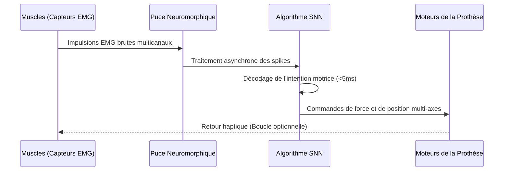

<!-- markdownlint-disable MD009 MD010 MD013 MD022 MD028 MD032 MD033 MD034 MD036 MD037 MD039 MD041 MD058 MD060 -->

[ 🇬🇧 English Version ](./README.md)

# NeuroSpike Prosthetics

> **Résumé exécutif :** Une architecture neuromorphique (Spiking Neural Network) intégrée directement dans les prothèses bioniques, décodant les signaux électromyographiques (EMG) complexes avec une latence quasi nulle pour un contrôle moteur intuitif.

---

## 1. Aperçu visuel & Effet Wahou

```mermaid
graph TD
    %% Schéma comparatif Problème vs Solution ou Flux d'architecture
    subgraph Protheses_Traditionnelles ["Prothèses Traditionnelles"]
        A[Signaux EMG complexes] --> B[CPU/GPU Standard]
        B --> C[Forte latence / Vidage batterie]
        C --> D[Mouvements basiques & Fatigue cognitive]
    end
    subgraph NeuroSpike_Prosthetics ["NeuroSpike Prosthetics"]
        E[Signaux EMG complexes] --> F[Puce neuromorphique embarquée]
        F --> G[Réseaux de neurones à impulsions SNN]
        G --> H[Latence quasi nulle / Micro-consommation]
        H --> I[Contrôle intuitif et fluide des doigts]
    end
```

## 2. La thèse contrariante (Peter Thiel Style)

**La croyance populaire :** Pour améliorer le contrôle des membres bioniques, nous devons nous appuyer sur des implants cérébraux invasifs (comme Neuralink) ou envoyer les données vers de puissants serveurs cloud pour le traitement IA.

**La vérité cachée :** Le système nerveux périphérique (EMG au niveau du moignon) contient déjà l'intention motrice haute fidélité nécessaire. En utilisant des réseaux de neurones à impulsions (SNN) inspirés du cerveau et fonctionnant localement sur des puces neuromorphiques à très faible consommation, nous pouvons obtenir un contrôle fluide en temps réel sans chirurgie invasive ni latence cloud.

## 3. Le problème & La cible

**Modèle économique :** B2B2C

**Cible précise :** Fabricants de prothèses bioniques (Össur, Ottobock), centres de rééducation spécialisés, et amputés.

**La douleur urgente :** Le contrôle des prothèses myoélectriques actuelles est lent, peu intuitif et très limité (souvent réduit à l'ouverture/fermeture basique). Le cerveau envoie des signaux complexes, mais le matériel classique ne peut pas décoder ces intentions en temps réel sans un décalage massif. Cette latence induit une énorme fatigue cognitive chez le patient, conduisant à un fort taux d'abandon de prothèses coûteuses.

## 4. Architecture technique & Plomberie

## 5. Modèle économique & Viabilité financière

| Métrique                    | Valeur                                                                     |
| :-------------------------- | :------------------------------------------------------------------------- |
| Structure de prix           | Module matériel (Puce + Capteurs) + Licence de calibration SNN par patient |
| Objectif 12 mois            | Pilote d'intégration avec 1 grand fabricant & 20 patients tests            |
| Calcul du CA (Target 100k€) | 1 Pilote (50k€) + (20 patients \* 2.5k€ licence) = 100k€ ARR               |
| Marge brute estimée         | 75% (Forte marge sur la licence logicielle de calibration SNN)             |

## 6. Moteur de distribution & Fossé défensif (Moat)

**Stratégie d'acquisition :** Partenariats B2B avec les fabricants de prothèses de niveau 1. Fournir le module de calcul neuromorphique et le logiciel de calibration en tant que composant OEM pour mettre à niveau leurs bras bioniques de nouvelle génération.

**Moat (Barrière à l'entrée) :** L'IA basée sur le cloud ou les CPU embarqués standards (qui vident les batteries en quelques heures) ne peuvent pas résoudre la contrainte de latence/puissance. Le fossé réside dans le couplage profond et bas niveau entre des algorithmes SNN personnalisés et du matériel neuromorphique de pointe (comme Intel Loihi ou BrainChip Akida). Cela nécessite une expertise spécialisée en neurosciences computationnelles que les ingénieurs deep learning standards ne possèdent pas.

## 7. Grille d'évaluation détaillée

| Critère                           | Score VC (/100) | Score Terrain (/100) |
| :-------------------------------- | :-------------- | :------------------- |
| Thèse & Monopole / Urgence        | 22 / 25         | -- / 25              |
| Moat / Résistance aux LLM natifs  | 23 / 25         | -- / 25              |
| Scalability / Friction d'adoption | 24 / 25         | -- / 25              |
| Unit Economics / ROI direct       | 21 / 25         | -- / 25              |
| **TOTAL**                         | **90 / 100**    | **-- / 100**         |

> **Verdict VC :** Interfacer directement des réseaux de neurones à impulsions avec des prothèses est un changement de paradigme. Le verrouillage est profond au niveau de l'utilisateur grâce à la neuroplasticité. Un fort potentiel de propriété intellectuelle et une voie claire vers la domination du marché de la neuro-réhabilitation.
> **Verdict Terrain :** En attente d'évaluation.
