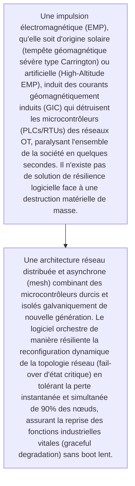
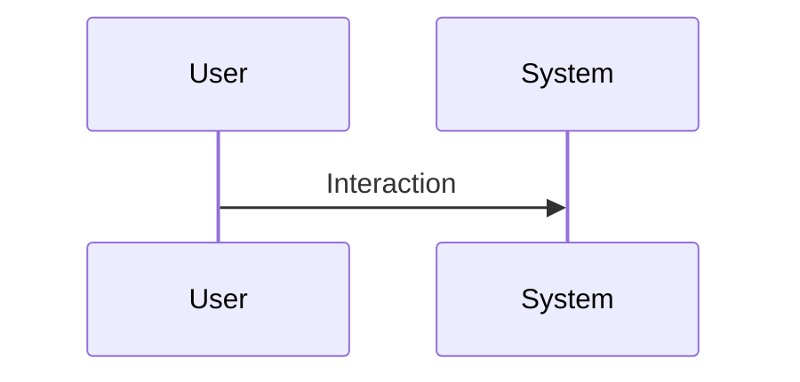

<!-- markdownlint-disable MD009 MD010 MD013 MD022 MD028 MD032 MD033 MD034 MD036 MD037 MD039 MD041 MD060 -->

[ 🇬🇧 English Version ](./README.md)

# EMP Resilient OT Fabric

> **Résumé exécutif :** Une architecture réseau distribuée et asynchrone (mesh) combinant des microcontrôleurs durcis et isolés galvaniquement de nouvelle génération. Le logiciel orchestre de manière résiliente la reconfiguration dynamique de la topologie réseau (fail-over d'état critique) en tolérant la perte instantanée et simultanée de 90% des nœuds, assurant la reprise des fonctions industrielles vitales (graceful degradation) sans boot lent.

---

## 1. Aperçu visuel & Effet Wahou

## 2. La thèse contrariante (Peter Thiel Style)

- **La croyance populaire :** Ce n'est pas un problème de cybersécurité logicielle (TCP/IP), mais de résilience matérielle/firmware de bas niveau face à une destruction physique. Les systèmes de tolérance aux pannes classiques cloud (Kubernetes) ne fonctionnent pas sur du bare-metal OT dont les cartes mères brûlent.
- **La vérité cachée :** Une architecture réseau distribuée et asynchrone (mesh) combinant des microcontrôleurs durcis et isolés galvaniquement de nouvelle génération. Le logiciel orchestre de manière résiliente la reconfiguration dynamique de la topologie réseau (fail-over d'état critique) en tolérant la perte instantanée et simultanée de 90% des nœuds, assurant la reprise des fonctions industrielles vitales (graceful degradation) sans boot lent.

## 3. Le problème & La cible

- **Modèle économique :** B2B
- **Cible précise :** Opérateurs d'infrastructures critiques d'importance vitale (OIV), réseaux électriques, systèmes de contrôle du trafic aérien, armée.
- **La douleur urgente :** Une impulsion électromagnétique (EMP), qu'elle soit d'origine solaire (tempête géomagnétique sévère type Carrington) ou artificielle (High-Altitude EMP), induit des courants géomagnétiquement induits (GIC) qui détruisent les microcontrôleurs (PLCs/RTUs) des réseaux OT, paralysant l'ensemble de la société en quelques secondes. Il n'existe pas de solution de résilience logicielle face à une destruction matérielle de masse.

## 4. Architecture technique & Plomberie

## 5. Modèle économique & Viabilité financière

| Métrique                    | Valeur                                                          |
| --------------------------- | --------------------------------------------------------------- |
| Structure de prix           | [Prix / Modèle d'abonnement / Commission]                       |
| Objectif 12 mois            | [Nombre exact de clients/utilisateurs/transactions nécessaires] |
| Calcul du CA (Target 100k€) | [Formule mathématique exacte]                                   |
| Marge brute estimée         | [Marge en %]                                                    |

## 6. Moteur de distribution & Fossé défensif (Moat)

- **Stratégie d'acquisition :** [Viralité B2C, réseau C2C, acquisition B2B directe, adhésion dev M2M]
- **Moat (Barrière à l'entrée) :** Il faut concevoir et distribuer de l'équipement matériel personnalisé (hardware appliance), un marché très conservateur qui déteste remplacer son infrastructure legacy (vieille de 20 ans), tests d'assurance qualité en conditions extrêmes très coûteux.

## 7. Grille d'évaluation détaillée

| Critère                           | Score VC (/100) | Score Terrain (/100) |
| --------------------------------- | --------------- | -------------------- |
| Thèse & Monopole / Urgence        | 24 / 25         | -- / 25              |
| Moat / Résistance aux LLM natifs  | 25 / 25         | -- / 25              |
| Scalabilité / Friction d'adoption | 22 / 25         | -- / 25              |
| Unit Economics / ROI direct       | 21 / 25         | -- / 25              |
| TOTAL                             | 92 / 100        | -- / 100             |

> **Verdict VC :** La résilience des infrastructures n'est plus optionnelle, c'est un impératif de sécurité nationale. L'intégration profonde dans les environnements OT crée un verrouillage quasi-permanent. Un jeu de monopole pur à la Peter Thiel basé sur une supériorité technologique extrême dans un secteur rigide.
> **Verdict Terrain :** En attente d'évaluation.
