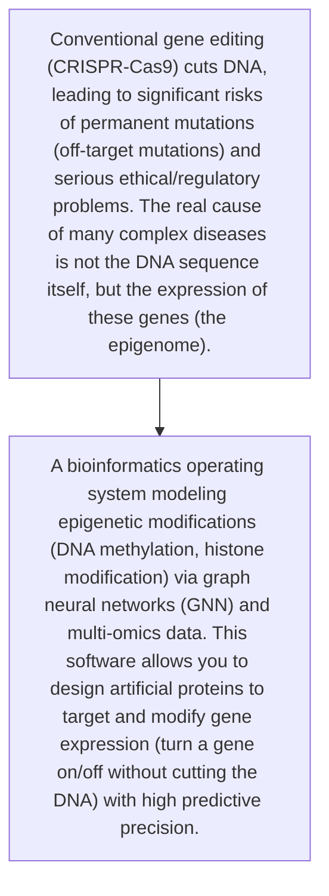
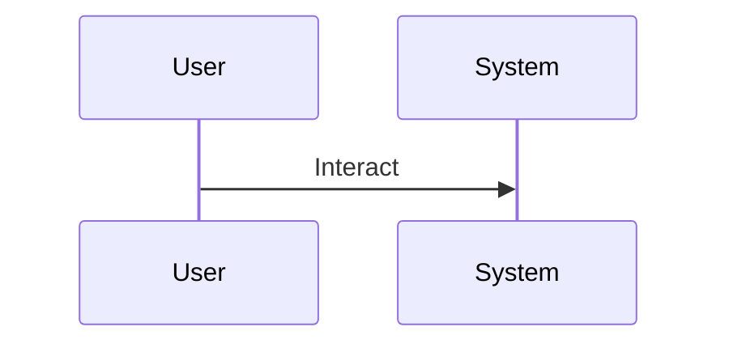

<!-- markdownlint-disable MD009 MD010 MD013 MD022 MD028 MD032 MD033 MD034 MD036 MD037 MD039 MD041 MD060 -->

[ 🇫🇷 Version Française ](./README.fr.md)

# Epigenome Editing OS

> **Executive Summary:** A bioinformatics operating system modeling epigenetic modifications (DNA methylation, histone modification) via graph neural networks (GNN) and multi-omics data. This software allows you to design artificial proteins to target and modify gene expression (turn a gene on/off without cutting the DNA) with high predictive precision.

---

## 1. Visual Overview & Wow Effect

## 2. Contrarian Thesis (Peter Thiel Style)

- **Popular Belief:** The combinatorial complexity of 3D chromatin folding and epigenetic interactions requires biological physics simulation models and huge proprietary multi-omics databases. Generic textual AI is useless in the face of three-dimensional epigenetic code.
- **Hidden Truth:** A bioinformatics operating system modeling epigenetic modifications (DNA methylation, histone modification) via graph neural networks (GNN) and multi-omics data. This software allows you to design artificial proteins to target and modify gene expression (turn a gene on/off without cutting the DNA) with high predictive precision.

## 3. Problem & Target Market

- **Business Model:** B2B
- **Target Audience:** Pharmaceutical laboratories, biotech companies specializing in genomics and cellular aging (longevity), oncology research institutes.
- **Urgent Pain Point:** Conventional gene editing (CRISPR-Cas9) cuts DNA, leading to significant risks of permanent mutations (off-target mutations) and serious ethical/regulatory problems. The real cause of many complex diseases is not the DNA sequence itself, but the expression of these genes (the epigenome).

## 4. Technical Architecture & Infrastructure

## 5. Business Model & Financial Viability

| Metric                 | Value                                     |
| ---------------------- | ----------------------------------------- |
| Pricing Structure      | [Price / Subscription Model / Commission] |
| 12-Month Target        | [Exact volume required for 100k ARR]      |
| Revenue Formula        | [Mathematical calculation]                |
| Estimated Gross Margin | [Margin %]                                |

## 6. Distribution Engine & Moat

- **Acquisition Strategy:** [Virality, network effect, direct sales, developer adoption]
- **Moat (Defensibility):** Massive complexity of clinical trials (wet-lab validation), long time for FDA approval, fierce competition from traditional cell therapies, need for expensive partnerships to obtain high-quality biological data.

## 7. Detailed Evaluation Grid

| Criterion                   | VC Score (/100) | Market Score (/100) |
| --------------------------- | --------------- | ------------------- |
| Thesis & Monopoly / Urgency | 24 / 25         | -- / 25             |
| Moat / LLM Immunity         | 24 / 25         | -- / 25             |
| Scalability / UX Friction   | 25 / 25         | -- / 25             |
| Unit Economics / ROI        | 23 / 25         | -- / 25             |
| TOTAL                       | 96 / 100        | -- / 100            |

> **VC Verdict:** Going beyond DNA editing to the epigenome is the next frontier of synbio. The platform approach creates a de facto standard for researchers. Massive TAM, extreme technical moat, and highly scalable via licensing.
> **Market Verdict:** Pending evaluation.
