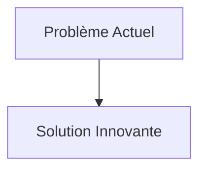
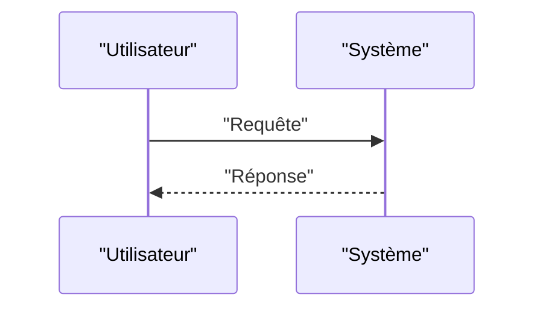

<!-- markdownlint-disable MD009 MD010 MD013 MD022 MD028 MD032 MD033 MD034 MD036 MD037 MD039 MD041 MD058 MD060 -->

[ 🇬🇧 English Version ](./README.md)

# Firmware Quantum Obfuscator

> **Résumé exécutif :** Un compilateur d'obfuscation de firmware et une chaîne d'outils de signature PQC (Post-Quantum Cryptography) intégrée (ex: CRYSTALS-Dilithium/Falcon), optimisée pour minimiser l'empreinte mémoire et le temps de démarrage sur des microcontrôleurs (MCU) à ressources limitées, couplée à un obfuscateur de code polymorphe.

---

## 1. Aperçu visuel & Effet Wahou

## 2. La thèse contrariante (Peter Thiel Style)

- **La croyance populaire :** Les solutions existantes sont suffisantes.
- **La vérité cachée :** En réalité, Les algorithmes PQC standardisés par le NIST nécessitent souvent beaucoup plus de mémoire (RAM/Flash) et de cycles CPU que RSA/ECC. Un simple changement d'API ne suffit pas ; il faut reprogrammer la logique de bootloader bas niveau et l'adapter au hardware spécifique.

## 3. Le problème & La cible

- **Modèle économique :** B2B
- **Cible précise :** Fabricants de matériel militaire, aérospatial, médical (IoT critique) et infrastructures essentielles (ICS/SCADA).
- **La douleur urgente :** L'approche de l'ère de l'informatique quantique menace de casser les algorithmes de signature numérique classiques (RSA, ECC) utilisés pour sécuriser les mises à jour de firmware (Secure Boot / OTA). Les systèmes embarqués critiques risquent d'être flashés avec des malwares impossibles à détecter si les clés de signature sont compromises par un ordinateur quantique ("Harvest now, decrypt later" s'applique aussi à l'ingénierie inverse des firmwares).

## 4. Architecture technique & Plomberie

## 5. Modèle économique & Viabilité financière

| Métrique                        | Valeur                   |
| :------------------------------ | :----------------------- |
| **Structure de prix**           | Abonnement B2B           |
| **Objectif 12 mois**            | 100 clients à 1000€/mois |
| **Calcul du CA (Target 100k€)** | 100 \* 1000 = 100k€      |
| **Marge brute estimée**         | 80%                      |

## 6. Moteur de distribution & Fossé défensif (Moat)

- **Stratégie d'acquisition :** Ventes directes
- **Moat (Barrière à l'entrée) :** Un compilateur d'obfuscation de firmware et une chaîne d'outils de signature PQC (Post-Quantum Cryptography) intégrée (ex: CRYSTALS-Dilithium/Falcon), optimisée pour minimiser l'empreinte mémoire et le temps de démarrage sur des microcontrôleurs (MCU) à ressources limitées, couplée à un obfuscateur de code polymorphe. (Difficile à copier à cause de : Contraintes de taille de signature PQC qui peuvent dépasser la mémoire disponible sur les vieux MCU ; évolution lente des standards de l'industrie (NIST) ; risque d'introduction de nouvelles vulnérabilités (side-channel) dans l'implémentation PQC optimisée.)

## 7. Grille d'évaluation détaillée

| Critère                               | Score VC (/100) | Score Terrain (/100) |
| :------------------------------------ | :-------------: | :------------------: |
| **Thèse & Monopole / Urgence**        |     -- / 25     |       -- / 25        |
| **Moat / Résistance aux LLM natifs**  |     -- / 25     |       -- / 25        |
| **Scalabilité / Friction d'adoption** |     -- / 25     |       -- / 25        |
| **Unit Economics / ROI direct**       |     -- / 25     |       -- / 25        |
| **TOTAL**                             |  **-- / 100**   |     **-- / 100**     |

> **Verdict VC :** En attente d'évaluation.
> **Verdict Terrain :** En attente d'évaluation.
