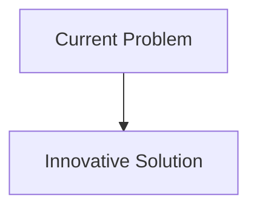
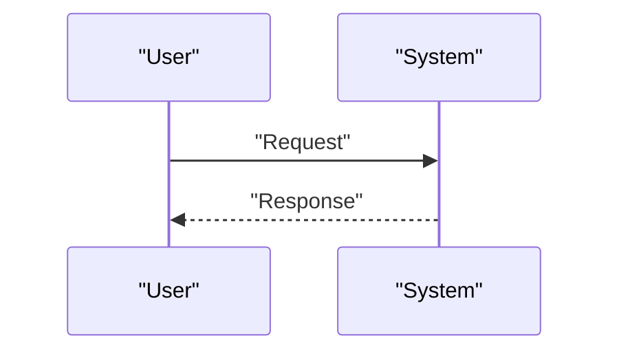

<!-- markdownlint-disable MD009 MD010 MD013 MD022 MD028 MD032 MD033 MD034 MD036 MD037 MD039 MD041 MD058 MD060 -->

[ 🇫🇷 Version Française ](./README.fr.md)

# Firmware Quantum Obfuscator

> **Executive Summary:** A firmware obfuscation compiler and integrated Post-Quantum Cryptography (PQC) signature toolchain (e. g.: CRYSTALS-Dilithium/Falcon), optimized to minimize memory footprint and startup time on resource-constrained microcontrollers (MCUs), coupled with a polymorphic code obfuscator.

---

## 1. Visual Overview & Wow Effect

## 2. Contrarian Thesis (Peter Thiel Style)

- **Popular Belief:** Existing solutions are sufficient.
- **Hidden Truth:** In reality, PQC algorithms standardized by NIST often require significantly more memory (RAM/Flash) and CPU cycles than RSA/ECC. A simple API change is not enough;it is necessary to reprogram the low-level bootloader logic and adapt it to the specific hardware.

## 3. Problem & Target Market

- **Business Model:** B2B
- **Target Audience:** Manufacturers of military, aerospace, medical equipment (critical IoT) and critical infrastructure (ICS/SCADA).
- **Urgent Pain Point:** The approach of the quantum computing era threatens to break classical digital signature algorithms (RSA, ECC) used to secure firmware updates (Secure Boot / OTA). Critical embedded systems risk being flashed with undetectable malware if signing keys are compromised by a quantum computer ("Harvest now, decrypt later" also applies to reverse engineering firmware).

## 4. Technical Architecture & Infrastructure

## 5. Business Model & Financial Viability

| Metric                     | Value                        |
| :------------------------- | :--------------------------- |
| **Pricing Structure**      | B2B Subscription             |
| **12-Month Target**        | 100 customers at 1000€/month |
| **Revenue Formula**        | 100 \* 1000 = 100k€          |
| **Estimated Gross Margin** | 80%                          |

## 6. Distribution Engine & Moat

- **Acquisition Strategy:** Direct Sales
- **Moat (Defensibility):** A firmware obfuscation compiler and integrated Post-Quantum Cryptography (PQC) signature toolchain (e. g.: CRYSTALS-Dilithium/Falcon), optimized to minimize memory footprint and startup time on resource-constrained microcontrollers (MCUs), coupled with a polymorphic code obfuscator.(Difficult to copy due to: PQC signature size constraints which may exceed available memory on old MCUs; slow evolution of industry standards (NIST); risk of introducing new vulnerabilities (side-channel) in the optimized PQC implementation.)

## 7. Detailed Evaluation Grid

| Criterion                       | VC Score (/100) | Market Score (/100) |
| :------------------------------ | :-------------: | :-----------------: |
| **Thesis & Monopoly / Urgency** |     -- / 25     |       -- / 25       |
| **Moat / LLM Immunity**         |     -- / 25     |       -- / 25       |
| **Scalability / UX Friction**   |     -- / 25     |       -- / 25       |
| **Unit Economics / ROI**        |     -- / 25     |       -- / 25       |
| **TOTAL**                       |  **-- / 100**   |    **-- / 100**     |

> **VC Verdict:** Pending evaluation.
> **Market Verdict:** Pending evaluation.
