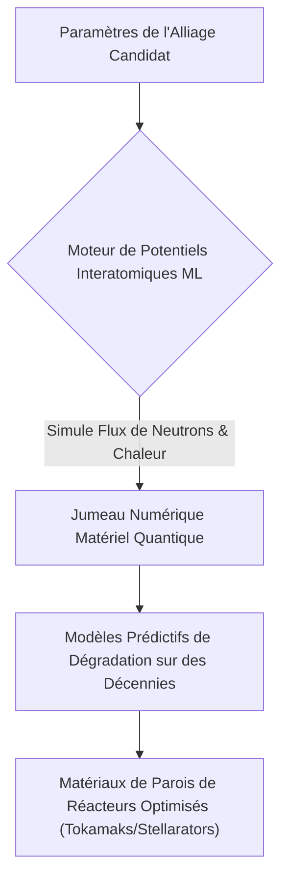
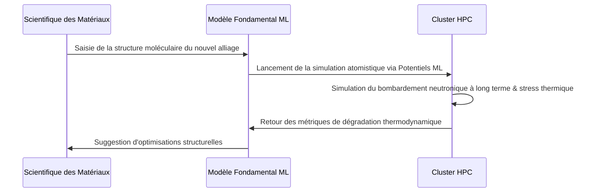

<!-- markdownlint-disable MD009 MD010 MD013 MD022 MD028 MD032 MD033 MD034 MD036 MD037 MD039 MD041 MD058 MD060 -->

[ 🇬🇧 English Version ](./README.md)

# Fusion Material Twin

> **Résumé exécutif :** Un jumeau numérique atomistique basé sur l'IA qui simule les interactions plasma-matériaux à l'échelle quantique pour découvrir et valider rapidement des alliages durables pour les réacteurs à fusion nucléaire.

---

## 1. Aperçu visuel & Effet Wahou

## 2. La thèse contrariante (Peter Thiel Style)

**La croyance populaire :** La commercialisation de l'énergie de fusion nécessite des décennies de tests physiques d'essais-erreurs de matériaux dans des réacteurs de test extrêmement coûteux.
**La vérité cachée :** Le goulot d'étranglement des tests physiques peut être entièrement contourné ; des modèles de potentiels d'apprentissage automatique formés sur des données quantiques peuvent simuler les dommages radiatifs atomistiques sur des échelles de temps macroscopiques, identifiant des matériaux viables purement in silico avant même la construction d'un prototype physique.

## 3. Le problème & La cible

**Modèle économique :** B2B
**Cible précise :** Startups de fusion nucléaire, laboratoires de recherche gouvernementaux (ITER, laboratoires nationaux) et industriels de l'aérospatiale avancée.
**La douleur urgente :** Les plasmas de fusion (des millions de degrés) et les flux intenses de neutrons détruisent les parois des réacteurs. Tester physiquement de nouveaux alliages prend des années et coûte des dizaines de millions d'euros par itération, représentant le plus grand obstacle technique à la commercialisation de l'énergie de fusion.

## 4. Architecture technique & Plomberie

## 5. Modèle économique & Viabilité financière

| Métrique                    | Valeur                                                                                            |
| --------------------------- | ------------------------------------------------------------------------------------------------- |
| Structure de prix           | SaaS Entreprise à niveaux (API Haute Performance + partage de PI sur les matériaux propriétaires) |
| Objectif 12 mois            | 2 contrats R&D commerciaux avec des startups majeures de la fusion (à 50 000€/contrat)            |
| Calcul du CA (Target 100k€) | 2 \* 50 000€ = 100 000€ de revenus annuels récurrents                                             |
| Marge brute estimée         | 60% (Coûts de calcul élevés pour l'entraînement/inférence)                                        |

## 6. Moteur de distribution & Fossé défensif (Moat)

**Stratégie d'acquisition :** Ventes B2B directes et accords de recherche conjointe au sein de l'écosystème très concentré et bien financé de la fusion nucléaire.
**Moat (Barrière à l'entrée) :** L'accès à des données d'entraînement quantiques de haute qualité et l'expertise approfondie en physique requise pour construire des Potentiels Interatomiques ML stables. Les entreprises tech standard manquent de connaissances spécialisées en physique, tandis que les simulateurs physiques traditionnels (DFT) ne peuvent pas passer à l'échelle sans cette architecture ML spécifique.

## 7. Grille d'évaluation détaillée

| Critère                           | Score VC (/100) | Score Terrain (/100) |
| --------------------------------- | --------------- | -------------------- |
| Thèse & Monopole / Urgence        | 24 / 25         | -- / 25              |
| Moat / Résistance aux LLM natifs  | 25 / 25         | -- / 25              |
| Scalabilité / Friction d'adoption | 19 / 25         | -- / 25              |
| Unit Economics / ROI direct       | 20 / 25         | -- / 25              |
| **TOTAL**                         | **88 / 100**    | **-- / 100**         |

> **Verdict VC :** Fusion Material Twin accélère la viabilité commerciale de la fusion nucléaire en numérisant le processus de test des matériaux, extrêmement complexe et coûteux. La modélisation physique des dommages causés par le bombardement neutronique crée un rempart insurmontable contre les outils d'IA standards. Des contrats B2G et d'entreprise de grande valeur garantissent des revenus à long terme dans cette transition énergétique cruciale.
> **Verdict Terrain :** En attente d'évaluation.
