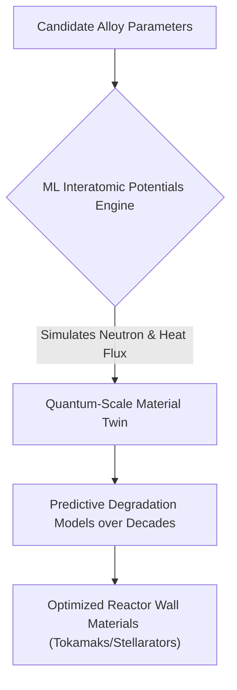
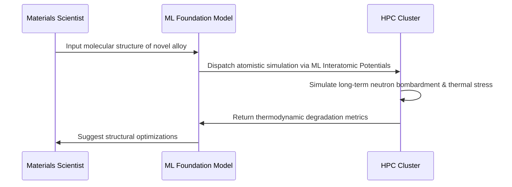

<!-- markdownlint-disable MD009 MD010 MD013 MD022 MD028 MD032 MD033 MD034 MD036 MD037 MD039 MD041 MD058 MD060 -->

[ 🇫🇷 Version Française ](./README.fr.md)

# Fusion Material Twin

> **Executive Summary:** An AI-driven atomistic digital twin that simulates quantum-scale plasma-material interactions to rapidly discover and validate durable alloys for nuclear fusion reactors.

---

## 1. Visual Overview & Wow Effect

## 2. Contrarian Thesis (Peter Thiel Style)

**Popular Belief:** The path to commercial fusion energy requires decades of physical trial-and-error testing of materials inside extremely expensive test reactors.
**Hidden Truth:** The physical testing bottleneck can be bypassed entirely; machine learning potentials trained on quantum data can simulate atomistic radiation damage over macro-timescales, identifying viable reactor materials purely in silico before a single physical prototype is built.

## 3. Problem & Target Market

**Business Model:** B2B
**Target Audience:** Nuclear fusion startups, government research labs (ITER, national labs), and advanced aerospace material manufacturers.
**Urgent Pain Point:** Fusion plasmas (millions of degrees) and intense neutron fluxes obliterate reactor walls. Physically testing new alloys takes years and costs tens of millions of euros per iteration, representing the single largest engineering bottleneck to commercializing fusion energy.

## 4. Technical Architecture & Infrastructure

## 5. Business Model & Financial Viability

| Metric                 | Value                                                                       |
| ---------------------- | --------------------------------------------------------------------------- |
| Pricing Structure      | Tiered Enterprise SaaS (High-Compute API + proprietary material IP sharing) |
| 12-Month Target        | 2 commercial R&D contracts with major fusion startups (at 50,000€/contract) |
| Revenue Formula        | 2 \* 50,000€ = 100,000€ ARR                                                 |
| Estimated Gross Margin | 60% (High compute costs for training/inference)                             |

## 6. Distribution Engine & Moat

**Acquisition Strategy:** Direct B2B sales and joint research agreements within the highly concentrated, well-funded nuclear fusion ecosystem.
**Moat (Defensibility):** Access to high-quality quantum training data and the deep physics expertise required to build stable Machine Learning Interatomic Potentials. Standard tech companies lack the specialized physics knowledge, while traditional physics simulators (DFT) cannot scale without this specific ML architecture.

## 7. Detailed Evaluation Grid

| Criterion                   | VC Score (/100) | Market Score (/100) |
| --------------------------- | --------------- | ------------------- |
| Thesis & Monopoly / Urgency | 24 / 25         | -- / 25             |
| Moat / LLM Immunity         | 25 / 25         | -- / 25             |
| Scalability / UX Friction   | 19 / 25         | -- / 25             |
| Unit Economics / ROI        | 20 / 25         | -- / 25             |
| **TOTAL**                   | **88 / 100**    | **-- / 100**        |

> **VC Verdict:** Fusion Material Twin accelerates the commercial viability of nuclear fusion by digitizing the immensely complex and expensive material testing process. The physical modeling of neutron bombardment damage creates an insurmountable moat against standard AI tools. High-value B2G and enterprise contracts secure long-term revenue in this critical energy transition.
> **Market Verdict:** Pending evaluation.
