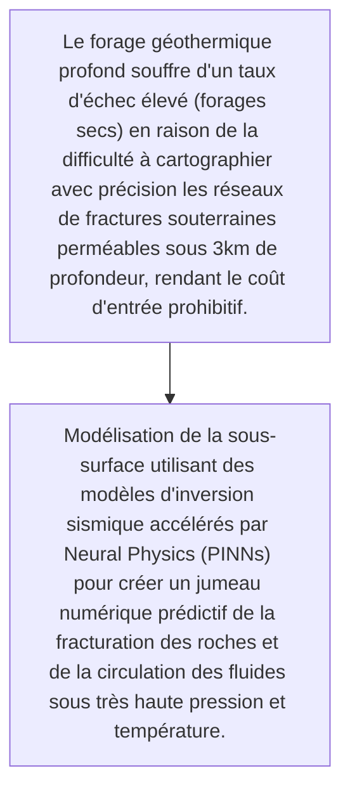
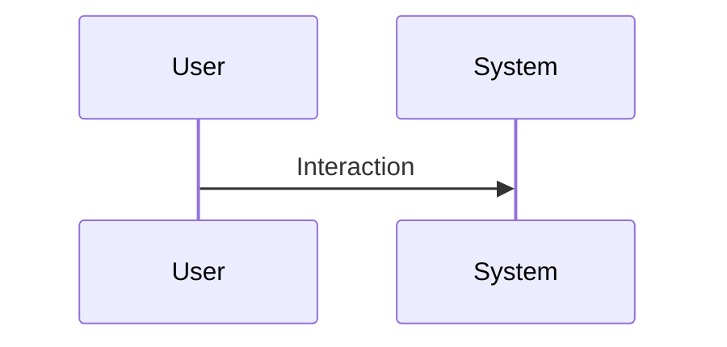

<!-- markdownlint-disable MD009 MD010 MD013 MD022 MD028 MD032 MD033 MD034 MD036 MD037 MD039 MD041 MD060 -->

[ 🇬🇧 English Version ](./README.md)

# Magma Twin Engine

> **Résumé exécutif :** Modélisation de la sous-surface utilisant des modèles d'inversion sismique accélérés par Neural Physics (PINNs) pour créer un jumeau numérique prédictif de la fracturation des roches et de la circulation des fluides sous très haute pression et température.

---

## 1. Aperçu visuel & Effet Wahou

## 2. La thèse contrariante (Peter Thiel Style)

- **La croyance populaire :** Exige l'ingestion massive de données sismiques brutes multi-térabytes et la résolution d'équations différentielles non linéaires (thermo-hydro-mécaniques), très éloigné d'un logiciel SaaS B2B standard.
- **La vérité cachée :** Modélisation de la sous-surface utilisant des modèles d'inversion sismique accélérés par Neural Physics (PINNs) pour créer un jumeau numérique prédictif de la fracturation des roches et de la circulation des fluides sous très haute pression et température.

## 3. Le problème & La cible

- **Modèle économique :** B2B
- **Cible précise :** Exploitants d'énergie géothermique profonde, entreprises de forage et compagnies pétrolières en transition
- **La douleur urgente :** Le forage géothermique profond souffre d'un taux d'échec élevé (forages secs) en raison de la difficulté à cartographier avec précision les réseaux de fractures souterraines perméables sous 3km de profondeur, rendant le coût d'entrée prohibitif.

## 4. Architecture technique & Plomberie

## 5. Modèle économique & Viabilité financière

| Métrique                    | Valeur                                                          |
| --------------------------- | --------------------------------------------------------------- |
| Structure de prix           | [Prix / Modèle d'abonnement / Commission]                       |
| Objectif 12 mois            | [Nombre exact de clients/utilisateurs/transactions nécessaires] |
| Calcul du CA (Target 100k€) | [Formule mathématique exacte]                                   |
| Marge brute estimée         | [Marge en %]                                                    |

## 6. Moteur de distribution & Fossé défensif (Moat)

- **Stratégie d'acquisition :** [Viralité B2C, réseau C2C, acquisition B2B directe, adhésion dev M2M]
- **Moat (Barrière à l'entrée) :** Qualité et rareté des données sismiques haute résolution, coûts de calcul massifs, forte incertitude géologique résiduelle inhérente.

## 7. Grille d'évaluation détaillée

| Critère                           | Score VC (/100) | Score Terrain (/100) |
| --------------------------------- | --------------- | -------------------- |
| Thèse & Monopole / Urgence        | 23 / 25         | -- / 25              |
| Moat / Résistance aux LLM natifs  | 22 / 25         | -- / 25              |
| Scalabilité / Friction d'adoption | 24 / 25         | -- / 25              |
| Unit Economics / ROI direct       | 23 / 25         | -- / 25              |
| TOTAL                             | 92 / 100        | -- / 100             |

> **Verdict VC :** Résoudre le goulot d'étranglement critique de la géothermie profonde crée une niche hautement défendable. Les modèles prédictifs propriétaires gagnent en précision avec l'usage, excluant la concurrence. Des unit economics solides en dérisquant des forages à plusieurs millions de dollars.
> **Verdict Terrain :** En attente d'évaluation.
