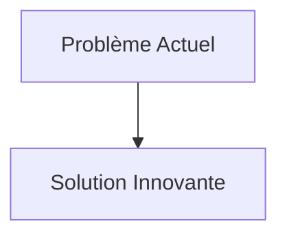
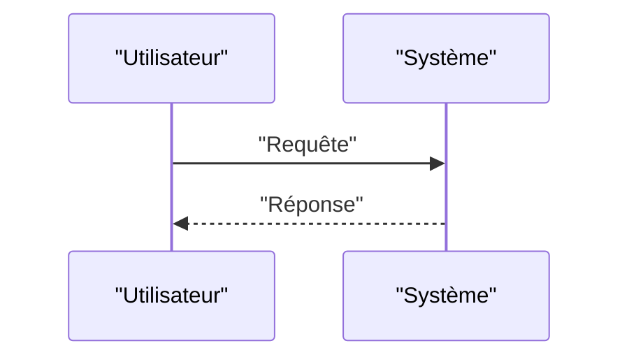

<!-- markdownlint-disable MD009 MD010 MD013 MD022 MD028 MD032 MD033 MD034 MD036 MD037 MD039 MD041 MD058 MD060 -->

[ 🇬🇧 English Version ](./README.md)

# Geothermal Fracture Twin

> **Résumé exécutif :** Un jumeau numérique géomécanique (World Model du sous-sol) combinant l'inversion de données sismiques en temps réel, la modélisation poromécanique par réseaux de neurones informés par la physique (PINNs), et la simulation de la propagation des fractures pour guider le forage et l'injection d'eau avec une précision sub-métrique.

---

## 1. Aperçu visuel & Effet Wahou

## 2. La thèse contrariante (Peter Thiel Style)

- **La croyance populaire :** Les solutions existantes sont suffisantes.
- **La vérité cachée :** En réalité, L'espace sous-terrain est par nature invisible et incertain. Les solveurs géologiques actuels (Petrel) sont lents et déterministes. Il faut modéliser la physique complexe du couplage thermo-hydro-mécanique (THM) sous haute pression et haute température.

## 3. Le problème & La cible

- **Modèle économique :** B2B
- **Cible précise :** Exploitants de géothermie profonde (EGS - Enhanced Geothermal Systems), compagnies pétrolières en transition énergétique, utilities.
- **La douleur urgente :** La géothermie de nouvelle génération (EGS) nécessite de fracturer la roche en profondeur pour créer des réservoirs perméables là où l'eau ne circule pas naturellement. Un mauvais calcul entraîne des séismes induits coûteux et des puits secs (des millions de dollars perdus), bloquant le déploiement de cette énergie bas-carbone continue.

## 4. Architecture technique & Plomberie

## 5. Modèle économique & Viabilité financière

| Métrique                        | Valeur                   |
| :------------------------------ | :----------------------- |
| **Structure de prix**           | Abonnement B2B           |
| **Objectif 12 mois**            | 100 clients à 1000€/mois |
| **Calcul du CA (Target 100k€)** | 100 \* 1000 = 100k€      |
| **Marge brute estimée**         | 80%                      |

## 6. Moteur de distribution & Fossé défensif (Moat)

- **Stratégie d'acquisition :** Ventes directes
- **Moat (Barrière à l'entrée) :** Un jumeau numérique géomécanique (World Model du sous-sol) combinant l'inversion de données sismiques en temps réel, la modélisation poromécanique par réseaux de neurones informés par la physique (PINNs), et la simulation de la propagation des fractures pour guider le forage et l'injection d'eau avec une précision sub-métrique. (Difficile à copier à cause de : Manque de données d'entraînement open source haute résolution sur la croûte terrestre profonde ; responsabilité juridique en cas de sismicité induite non prévue par le modèle ; intégration avec le matériel de forage (capteurs fond de trou).)

## 7. Grille d'évaluation détaillée

| Critère                               | Score VC (/100) | Score Terrain (/100) |
| :------------------------------------ | :-------------: | :------------------: |
| **Thèse & Monopole / Urgence**        |     -- / 25     |       -- / 25        |
| **Moat / Résistance aux LLM natifs**  |     -- / 25     |       -- / 25        |
| **Scalabilité / Friction d'adoption** |     -- / 25     |       -- / 25        |
| **Unit Economics / ROI direct**       |     -- / 25     |       -- / 25        |
| **TOTAL**                             |  **-- / 100**   |     **-- / 100**     |

> **Verdict VC :** En attente d'évaluation.
> **Verdict Terrain :** En attente d'évaluation.
