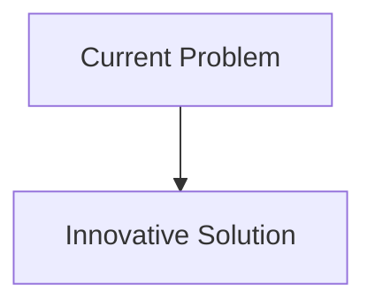
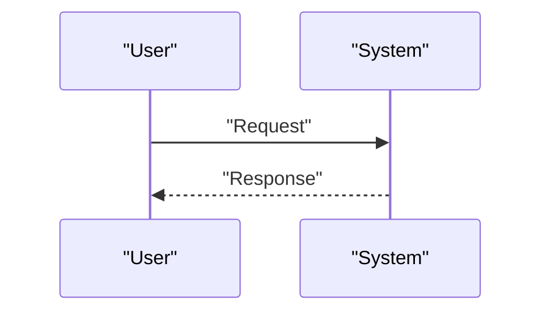

<!-- markdownlint-disable MD009 MD010 MD013 MD022 MD028 MD032 MD033 MD034 MD036 MD037 MD039 MD041 MD058 MD060 -->

[ 🇫🇷 Version Française ](./README.fr.md)

# Geothermal Fracture Twin

> **Executive Summary:** A geomechanical digital twin (Subsurface World Model) combining real-time seismic data inversion, poromechanical modeling using physics-informed neural networks (PINNs), and simulation of fracture propagation to guide drilling and water injection with sub-meter precision.

---

## 1. Visual Overview & Wow Effect

## 2. Contrarian Thesis (Peter Thiel Style)

- **Popular Belief:** Existing solutions are sufficient.
- **Hidden Truth:** In reality, underground space is by nature invisible and uncertain. Current geological solvers (Petrel) are slow and deterministic. It is necessary to model the complex physics of thermo-hydro-mechanical (THM) coupling under high pressure and high temperature.

## 3. Problem & Target Market

- **Business Model:** B2B
- **Target Audience:** Deep geothermal energy operators (EGS - Enhanced Geothermal Systems), oil companies in energy transition, utilities.
- **Urgent Pain Point:** Next-generation geothermal energy (EGS) requires fracturing rock at depth to create permeable reservoirs where water does not naturally circulate. Miscalculation leads to costly induced earthquakes and dry wells (millions of dollars lost), blocking the deployment of this continued low-carbon energy.

## 4. Technical Architecture & Infrastructure

## 5. Business Model & Financial Viability

| Metric                     | Value                        |
| :------------------------- | :--------------------------- |
| **Pricing Structure**      | B2B Subscription             |
| **12-Month Target**        | 100 customers at 1000€/month |
| **Revenue Formula**        | 100 \* 1000 = 100k€          |
| **Estimated Gross Margin** | 80%                          |

## 6. Distribution Engine & Moat

- **Acquisition Strategy:** Direct Sales
- **Moat (Defensibility):** A geomechanical digital twin (Subsurface World Model) combining real-time seismic data inversion, poromechanical modeling using physics-informed neural networks (PINNs), and simulation of fracture propagation to guide drilling and water injection with sub-meter precision.(Difficult to copy due to: Lack of high-resolution open source training data on the deep Earth's crust; legal liability in case of induced seismicity not predicted by the model; integration with drilling equipment (down-hole sensors).)

## 7. Detailed Evaluation Grid

| Criterion                       | VC Score (/100) | Market Score (/100) |
| :------------------------------ | :-------------: | :-----------------: |
| **Thesis & Monopoly / Urgency** |     -- / 25     |       -- / 25       |
| **Moat / LLM Immunity**         |     -- / 25     |       -- / 25       |
| **Scalability / UX Friction**   |     -- / 25     |       -- / 25       |
| **Unit Economics / ROI**        |     -- / 25     |       -- / 25       |
| **TOTAL**                       |  **-- / 100**   |    **-- / 100**     |

> **VC Verdict:** Pending evaluation.
> **Market Verdict:** Pending evaluation.
