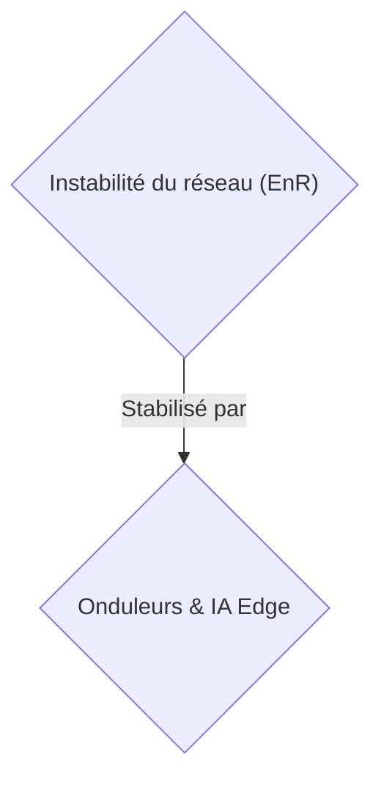
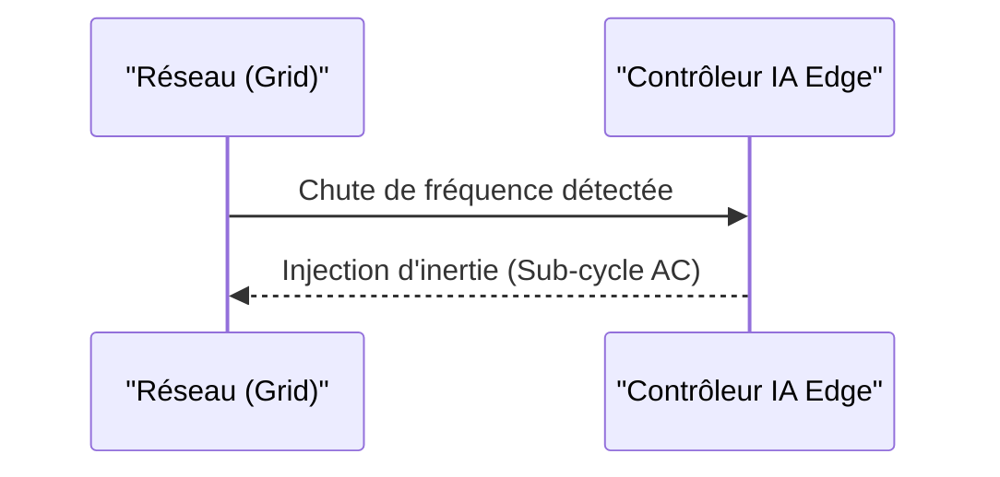

<!-- markdownlint-disable MD009 MD010 MD013 MD022 MD028 MD032 MD033 MD034 MD036 MD037 MD039 MD041 MD058 MD060 -->

[ 🇬🇧 English Version ](./README.md)

# Grid Inertia Synthesizer

> **Résumé exécutif :** Une solution Edge/Hardware B2B ciblant les TSO pour synthétiser l'inertie du réseau et éviter les coupures.

---

## 1. Aperçu visuel & Effet Wahou

## 2. La thèse contrariante (Peter Thiel Style)

- **La croyance populaire :** Les solutions logicielles Cloud sont suffisantes pour gérer l'énergie.
- **La vérité cachée :** Problème cyber-physique critique nécessitant un contrôle bas-niveau ultra-rapide (sub-cycle AC) au niveau du hardware. Un SaaS cloud introduirait une latence fatale entraînant l'effondrement du réseau.

## 3. Le problème & La cible

- **Modèle économique :** B2B
- **Cible précise :** Gestionnaires de réseau de transport (TSO) et producteurs d'EnR (RTE, National Grid, opérateurs de parcs éoliens/solaires).
- **La douleur urgente :** La transition vers les énergies renouvelables supprime "l'inertie tournante" des grosses turbines fossiles, rendant les réseaux électriques de plus en plus instables et sujets aux blackouts lors des fluctuations de fréquence.

## 4. Architecture technique & Plomberie

Un contrôleur matériel/logiciel (edge computing) pour onduleurs massifs (Grid-forming inverters) couplé à une IA de prédiction de micro-instabilités qui synthétise de l'inertie virtuelle en injectant ou absorbant de la puissance en quelques millisecondes via des batteries décentralisées.

## 5. Modèle économique & Viabilité financière

| Métrique                    | Valeur                    |
| --------------------------- | ------------------------- |
| Structure de prix           | Hardware + Abonnement B2B |
| Objectif 12 mois            | 100 installations         |
| Calcul du CA (Target 100k€) | 100 \* 1000€ = 100k€      |
| Marge brute estimée         | 60%                       |

## 6. Moteur de distribution & Fossé défensif (Moat)

- **Stratégie d'acquisition :** Vente directe B2B aux TSO.
- **Moat (Barrière à l'entrée) :** Problème cyber-physique critique nécessitant un contrôle bas-niveau ultra-rapide (sub-cycle AC) au niveau du hardware. Un SaaS cloud introduirait une latence fatale. Exige des capitaux importants et une longue validation réglementaire.

## 7. Grille d'évaluation détaillée

| Critère                           | Score VC (/100) | Score Terrain (/100) |
| --------------------------------- | --------------- | -------------------- |
| Thèse & Monopole / Urgence        | -- / 25         | -- / 25              |
| Moat / Résistance aux LLM natifs  | -- / 25         | -- / 25              |
| Scalability / Friction d'adoption | -- / 25         | -- / 25              |
| Unit Economics / ROI direct       | -- / 25         | -- / 25              |
| TOTAL                             | -- / 100        | -- / 100             |

> **Verdict VC :** En attente d'évaluation.
> **Verdict Terrain :** En attente d'évaluation.
