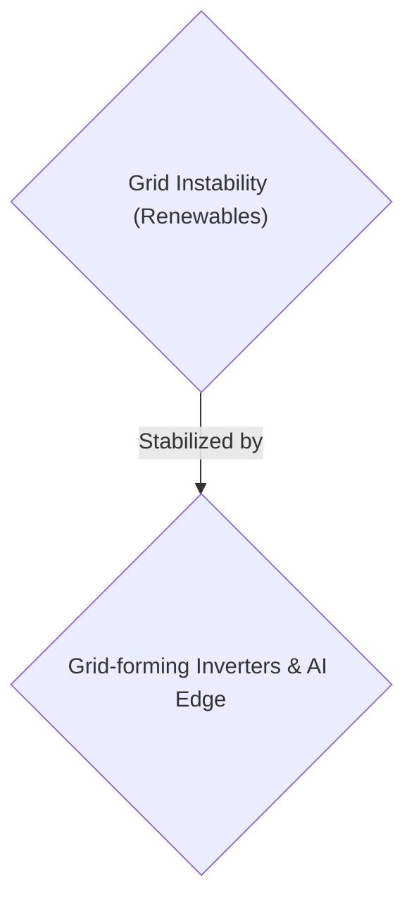
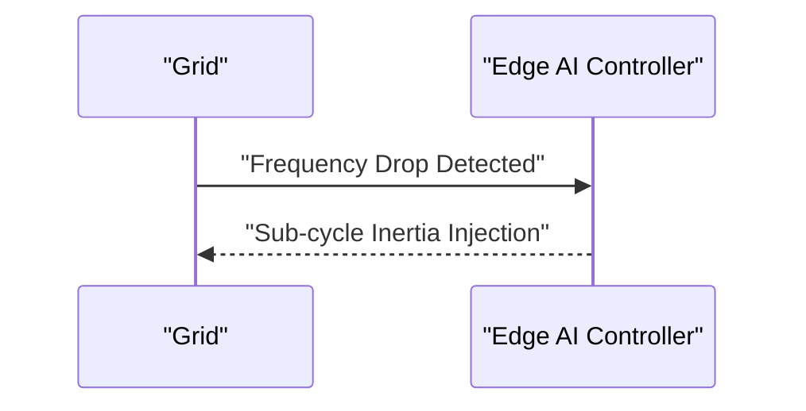

<!-- markdownlint-disable MD009 MD010 MD013 MD022 MD028 MD032 MD033 MD034 MD036 MD037 MD039 MD041 MD058 MD060 -->

[ 🇫🇷 Version Française ](./README.fr.md)

# Grid Inertia Synthesizer

> **Executive Summary:** A B2B edge computing solution targeting Transmission System Operators (TSOs) to dynamically synthesize grid inertia and prevent blackouts.

---

## 1. Visual Overview & Wow Effect

## 2. Contrarian Thesis (Peter Thiel Style)

- **Popular Belief:** Generic cloud SaaS and standard battery dispatch are sufficient to balance the grid.
- **Hidden Truth:** Critical cyber-physical problem requiring ultra-fast low-level control (AC sub-cycle) at the hardware level. A cloud SaaS would introduce a fatal latency resulting in grid collapse.

## 3. Problem & Target Market

- **Business Model:** B2B
- **Target Audience:** Transmission System Operators (TSOs) and renewable energy producers (RTE, National Grid, wind/solar park operators).
- **Urgent Pain Point:** The transition to renewable energy removes the "spinning inertia" of large fossil-fuel turbines, making electrical grids increasingly unstable and prone to blackouts during frequency fluctuations.

## 4. Technical Architecture & Infrastructure

A hardware/software edge computing controller for massive grid-forming inverters, coupled with an AI predicting micro-instabilities to synthesize virtual inertia by injecting or absorbing power within milliseconds via decentralized batteries.

## 5. Business Model & Financial Viability

| Metric                 | Value                            |
| ---------------------- | -------------------------------- |
| Pricing Structure      | B2B Hardware + SaaS Subscription |
| 12-Month Target        | 100 installations                |
| Revenue Formula        | 100 \* 1000€ = 100k€             |
| Estimated Gross Margin | 60%                              |

## 6. Distribution Engine & Moat

- **Acquisition Strategy:** Direct sales to TSOs and energy producers.
- **Moat (Defensibility):** Problème cyber-physique critique nécessitant un contrôle bas-niveau ultra-rapide (sub-cycle AC) au niveau du hardware. Un SaaS cloud introduirait une latence fatale. Requires high capital and deep integration with grid infrastructure.

## 7. Detailed Evaluation Grid

| Criterion                   | VC Score (/100) | Market Score (/100) |
| --------------------------- | --------------- | ------------------- |
| Thesis & Monopoly / Urgency | -- / 25         | -- / 25             |
| Moat / LLM Immunity         | -- / 25         | -- / 25             |
| Scalability / UX Friction   | -- / 25         | -- / 25             |
| Unit Economics / ROI        | -- / 25         | -- / 25             |
| TOTAL                       | -- / 100        | -- / 100            |

> **VC Verdict:** Pending evaluation.
> **Market Verdict:** Pending evaluation.
