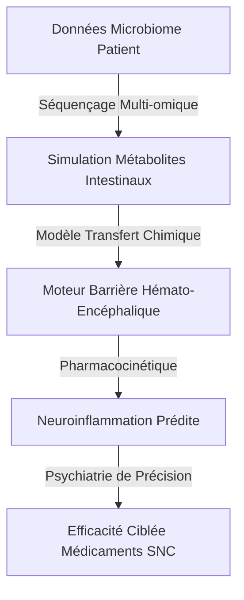
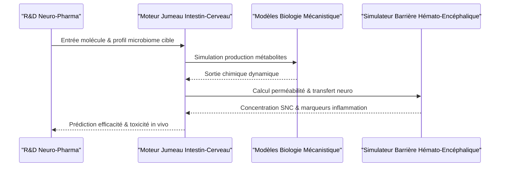

<!-- markdownlint-disable MD009 MD010 MD013 MD022 MD028 MD032 MD033 MD034 MD036 MD037 MD039 MD041 MD060 -->

[ 🇬🇧 English Version ](./README.md)

# Gut-Brain Axis Twin

> **Résumé exécutif :** Un jumeau numérique métabolomique de l'axe intestin-cerveau qui couple des modèles multi-omiques du microbiome avec la simulation de la barrière hémato-encéphalique pour prédire la neuroinflammation et la pharmacocinétique des médicaments du SNC.

---

## 1. Aperçu visuel & Effet Wahou

## 2. La thèse contrariante (Peter Thiel Style)

- **La croyance populaire :** Guérir les maladies neurodégénératives et psychiatriques repose uniquement sur la découverte de la bonne molécule synthétique ciblant des récepteurs cérébraux spécifiques.
- **La vérité cachée :** La neurochimie du cerveau est fondamentalement pilotée par le microbiome intestinal. Sans modéliser le transfert chimique dynamique des métabolites microbiens à travers la barrière hémato-encéphalique, le développement de médicaments pour le SNC (Système Nerveux Central) est essentiellement une devinette aveugle.

## 3. Le problème & La cible

- **Modèle économique :** B2B
- **Cible précise :** Industries pharmaceutiques (neuro-pharma), entreprises agroalimentaires (nutrition spécialisée), cliniques de psychiatrie de précision.
- **La douleur urgente :** Le développement de traitements pour les maladies neurodégénératives (Parkinson, Alzheimer) et psychiatriques est dans une impasse, avec des taux d'échec cliniques très élevés. Le rôle du microbiome est crucial mais sa dynamique chimique in vivo est impossible à modéliser in vitro ou avec de simples modèles animaux.

## 4. Architecture technique & Plomberie

## 5. Modèle économique & Viabilité financière

| Métrique                        | Valeur                                                               |
| ------------------------------- | -------------------------------------------------------------------- |
| **Structure de prix**           | Licence SaaS Annuelle R&D + Royalties sur les médicaments découverts |
| **Objectif 12 mois**            | 2 abonnements R&D de moyennes/grandes pharmas                        |
| **Calcul du CA (Target 100k€)** | 2 licences \* 50k€/an                                                |
| **Marge brute estimée**         | ~80%                                                                 |

## 6. Moteur de distribution & Fossé défensif (Moat)

- **Stratégie d'acquisition :** Ventes directes B2B ciblant les directeurs de bio-informatique et pharmacologie des grandes entreprises neuro-pharma, appuyées par des études de validation évaluées par des pairs.
- **Moat (Barrière à l'entrée) :** C'est de la biologie systémique de pointe. Un simple modèle de machine learning prédictif sur des biomarqueurs manque de causalité mécanistique. Simuler le transfert d'informations chimiques sur plusieurs organes requiert un ensemble massif de données longitudinales multi-omiques humaines que les concurrents ne peuvent pas scraper sur internet.

## 7. Grille d'évaluation détaillée

| Critère                           | Score VC (/100) | Score Terrain (/100) |
| --------------------------------- | --------------- | -------------------- |
| Thèse & Monopole / Urgence        | -- / 25         | -- / 25              |
| Moat / Résistance aux LLM natifs  | -- / 25         | -- / 25              |
| Scalabilité / Friction d'adoption | -- / 25         | -- / 25              |
| Unit Economics / ROI direct       | -- / 25         | -- / 25              |
| **TOTAL**                         | **-- / 100**    | **-- / 100**         |

> **Verdict VC :** En attente d'évaluation.

> **Verdict Terrain :** En attente d'évaluation.
