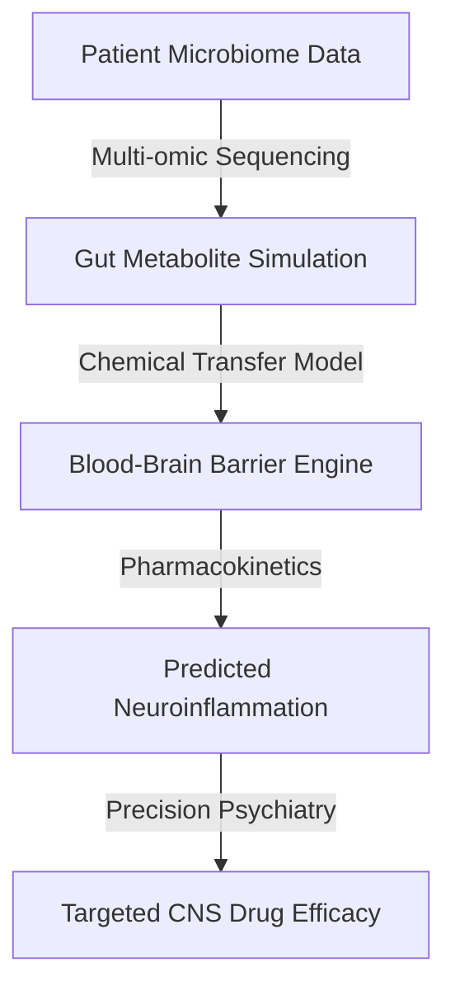
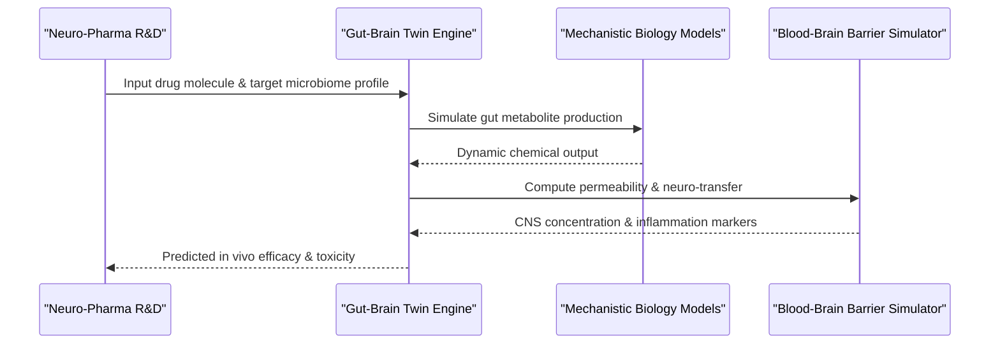

<!-- markdownlint-disable MD009 MD010 MD013 MD022 MD028 MD032 MD033 MD034 MD036 MD037 MD039 MD041 MD060 -->

[ 🇫🇷 Version Française ](./README.fr.md)

# Gut-Brain Axis Twin

> **Executive Summary:** A metabolomic digital twin of the gut-brain axis that couples multi-omic microbiome models with blood-brain barrier simulations to predict neuroinflammation and CNS drug pharmacokinetics.

---

## 1. Visual Overview & Wow Effect

## 2. Contrarian Thesis (Peter Thiel Style)

- **Popular Belief:** Curing neurodegenerative and psychiatric diseases relies solely on finding the right synthetic molecule to target specific brain receptors.
- **Hidden Truth:** The brain's neurochemistry is fundamentally driven by the gut microbiome. Without modeling the dynamic chemical transfer of microbial metabolites across the blood-brain barrier, CNS drug development is essentially blind guesswork.

## 3. Problem & Target Market

- **Business Model:** B2B
- **Target Audience:** Pharmaceutical industries (neuro-pharma), agri-food companies (specialized nutrition), and precision psychiatry clinics.
- **Urgent Pain Point:** The development of treatments for neurodegenerative diseases (Parkinson's, Alzheimer's) and psychiatric disorders has hit a wall with extremely high clinical failure rates because in vivo chemical dynamics cannot be modeled in vitro or with simple animal models.

## 4. Technical Architecture & Infrastructure

## 5. Business Model & Financial Viability

| Metric                     | Value                                                                 |
| -------------------------- | --------------------------------------------------------------------- |
| **Pricing Structure**      | Annual SaaS License for R&D + Milestone royalties on discovered drugs |
| **12-Month Target**        | 2 mid-to-large pharma R&D subscriptions                               |
| **Revenue Formula**        | 2 licenses \* 50k€/year                                               |
| **Estimated Gross Margin** | ~80%                                                                  |

## 6. Distribution Engine & Moat

- **Acquisition Strategy:** Direct enterprise sales to bioinformatics and pharmacology leads at top neuro-pharma companies, backed by peer-reviewed validation studies.
- **Moat (Defensibility):** This is cutting-edge systems biology. A standard predictive machine learning model on biomarkers lacks mechanistic causality. Simulating dynamic chemical information transfer across multiple organs requires a massive proprietary dataset of longitudinal human multi-omics that competitors cannot scrape from the web.

## 7. Detailed Evaluation Grid

| Criterion                   | VC Score (/100) | Market Score (/100) |
| --------------------------- | --------------- | ------------------- |
| Thesis & Monopoly / Urgency | -- / 25         | -- / 25             |
| Moat / LLM Immunity         | -- / 25         | -- / 25             |
| Scalability / UX Friction   | -- / 25         | -- / 25             |
| Unit Economics / ROI        | -- / 25         | -- / 25             |
| **TOTAL**                   | **-- / 100**    | **-- / 100**        |

> **VC Verdict:** Pending evaluation.

> **Market Verdict:** Pending evaluation.
