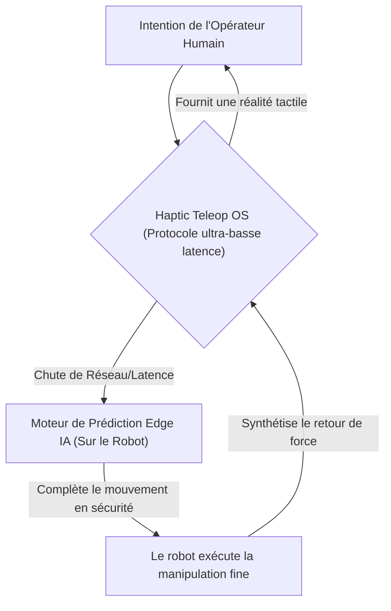
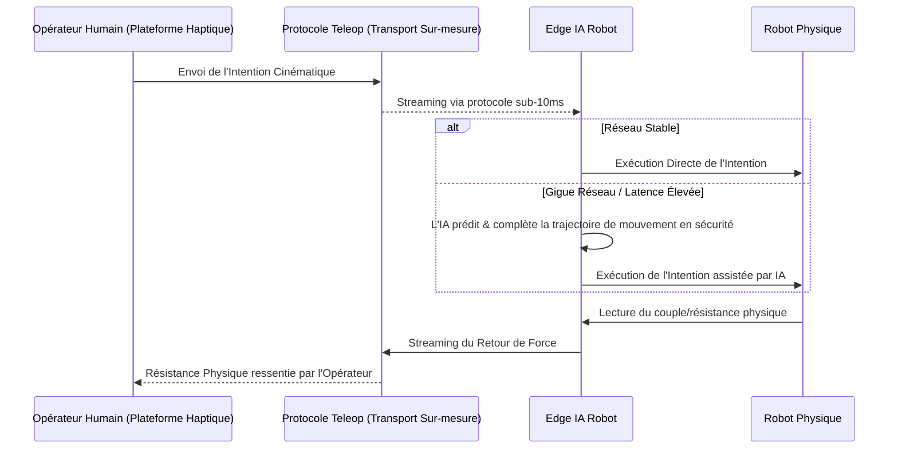

<!-- markdownlint-disable MD009 MD010 MD013 MD022 MD028 MD032 MD033 MD034 MD036 MD037 MD039 MD041 MD058 MD060 -->

[ 🇬🇧 English Version ](./README.md)

# Haptic Teleop OS

> **Résumé exécutif :** Un système d'exploitation et une IA de prédiction à ultra-basse latence pour la téléopération robotique, offrant un retour de force synthétisé et la complétion des mouvements en temps réel pour manipuler des objets en toute sécurité dans des environnements hostiles malgré des connexions instables.

---

## 1. Aperçu visuel & Effet Wahou

## 2. La thèse contrariante (Peter Thiel Style)

**La croyance populaire :** La téléopération dans des environnements dangereux nécessite simplement de meilleures connexions 5G à large bande et un streaming vidéo haute définition standard.
**La vérité cachée :** Les réseaux connaîtront toujours de la gigue (jitter) dans des environnements hostiles ou isolés ; une téléopération robotique sûre nécessite une Edge IA locale pour "combler les vides" de l'intention humaine de manière dynamique lors des coupures réseau, et des protocoles spécialisés (non TCP/IP) pour transmettre instantanément le retour de force tactile.

## 3. Le problème & La cible

**Modèle économique :** B2B (PaaS Robotique)
**Cible précise :** Industries dangereuses (nucléaire, pétrole/gaz offshore), chirurgie à distance, et logistique spatiale nécessitant une manipulation fine.
**La douleur urgente :** La téléopération de robots dans des environnements hostiles souffre d'un manque de retour tactile et d'une latence réseau élevée. Cela rend la manipulation d'objets délicats ou inconnus extrêmement lente, maladroite et très sujette à des accidents catastrophiques et coûteux. Les opérateurs manquent de proprioception robotique intuitive.

## 4. Architecture technique & Plomberie

## 5. Modèle économique & Viabilité financière

| Métrique                    | Valeur                                                                   |
| --------------------------- | ------------------------------------------------------------------------ |
| Structure de prix           | Frais de licence OS par robot + abonnement PaaS basé sur l'utilisation   |
| Objectif 12 mois            | 10 robots industriels de grande valeur sous licence (à 10 000€/robot/an) |
| Calcul du CA (Target 100k€) | 10 \* 10 000€ = 100 000€ de revenus annuels récurrents                   |
| Marge brute estimée         | 85% (Couche logicielle sur matériel existant)                            |

## 6. Moteur de distribution & Fossé défensif (Moat)

**Stratégie d'acquisition :** Partenariats B2B avec de grands fabricants de robotique industrielle et des entreprises sous-traitantes spécialisées dans les secteurs nucléaire/offshore.
**Moat (Barrière à l'entrée) :** L'encodage vidéo standard (H.264) et TCP/IP n'ont pas été conçus pour le streaming synchronisé de données kinesthésiques. Construire un protocole de transport personnalisé à ultra-basse latence, intégré intimement à un matériel très fragmenté (capteurs de couple, effecteurs), crée une barrière technologique profonde que les entreprises de logiciels génériques ne peuvent pas facilement reproduire.

## 7. Grille d'évaluation détaillée

| Critère                           | Score VC (/100) | Score Terrain (/100) |
| --------------------------------- | --------------- | -------------------- |
| Thèse & Monopole / Urgence        | -- / 25         | -- / 25              |
| Moat / Résistance aux LLM natifs  | -- / 25         | -- / 25              |
| Scalabilité / Friction d'adoption | -- / 25         | -- / 25              |
| Unit Economics / ROI direct       | -- / 25         | -- / 25              |
| **TOTAL**                         | **-- / 100**    | **-- / 100**         |

> **Verdict VC :** En attente d'évaluation.
> **Verdict Terrain :** En attente d'évaluation.
