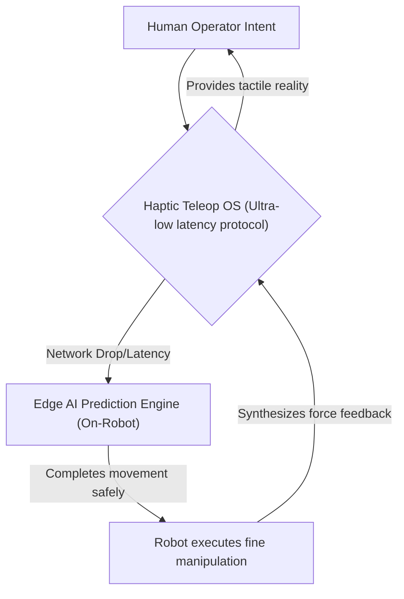
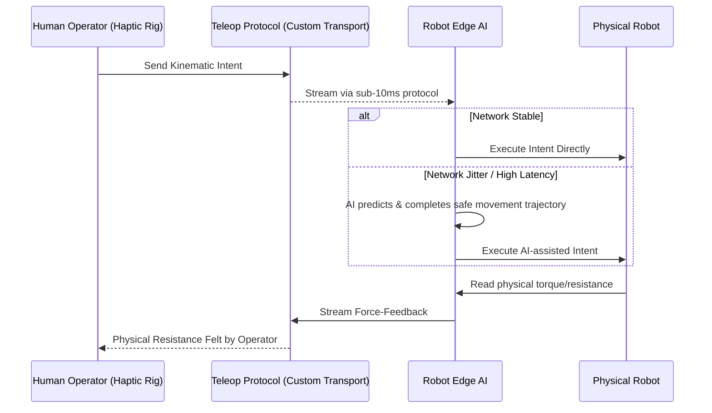

<!-- markdownlint-disable MD009 MD010 MD013 MD022 MD028 MD032 MD033 MD034 MD036 MD037 MD039 MD041 MD058 MD060 -->

[ 🇫🇷 Version Française ](./README.fr.md)

# Haptic Teleop OS

> **Executive Summary:** An ultra-low latency operating system and prediction AI for robotic teleoperation, delivering synthesized force-feedback and real-time movement completion to safely manipulate objects in hostile environments despite unstable connections.

---

## 1. Visual Overview & Wow Effect

## 2. Contrarian Thesis (Peter Thiel Style)

**Popular Belief:** Teleoperation in hazardous environments simply requires better high-bandwidth 5G connections and standard high-definition video streaming.
**Hidden Truth:** Networks will always experience jitter in hostile/remote environments; safe robotic teleoperation requires local Edge AI to dynamically "fill in the blanks" of human intent during network drops, and specialized, non-TCP/IP protocols to transmit tactile force-feedback instantly.

## 3. Problem & Target Market

**Business Model:** B2B (PaaS Robotics)
**Target Audience:** Hazardous industries (nuclear, offshore oil/gas), remote surgery, and space logistics requiring fine manipulation.
**Urgent Pain Point:** Teleoperating robots in hostile environments suffers from a lack of tactile feedback and high network latency. This makes manipulating delicate or unknown objects extremely slow, clumsy, and highly prone to catastrophic, expensive accidents. Operators lack intuitive robotic proprioception.

## 4. Technical Architecture & Infrastructure

## 5. Business Model & Financial Viability

| Metric                 | Value                                                            |
| ---------------------- | ---------------------------------------------------------------- |
| Pricing Structure      | Per-robot OS licensing fee + usage-based PaaS subscription       |
| 12-Month Target        | 10 high-value industrial robots licensed (at 10,000€/robot/year) |
| Revenue Formula        | 10 \* 10,000€ = 100,000€ ARR                                     |
| Estimated Gross Margin | 85% (Software layer over existing hardware)                      |

## 6. Distribution Engine & Moat

**Acquisition Strategy:** B2B partnerships with major industrial robotics manufacturers and specialized contracting firms in nuclear/offshore sectors.
**Moat (Defensibility):** Standard video encoding (H.264) and TCP/IP were not designed for synchronized kinesthetic data streaming. Building a custom ultra-low latency transport protocol integrated intimately with fragmented hardware (torque sensors, effectors) creates a deep tech moat that generic software companies cannot easily replicate.

## 7. Detailed Evaluation Grid

| Criterion                   | VC Score (/100) | Market Score (/100) |
| --------------------------- | --------------- | ------------------- |
| Thesis & Monopoly / Urgency | 23 / 25         | -- / 25             |
| Moat / LLM Immunity         | 24 / 25         | -- / 25             |
| Scalability / UX Friction   | 21 / 25         | -- / 25             |
| Unit Economics / ROI        | 23 / 25         | -- / 25             |
| **TOTAL**                   | **91 / 100**    | **-- / 100**        |

> **VC Verdict:** Haptic Teleop OS elegantly solves the critical issue of network jitter in hazardous robotics by moving prediction to the edge. The proprietary low-latency transport protocol for kinesthetic data creates a powerful technical moat immune to standard LLMs. The high-value B2B licensing model is rapidly scalable across multiple harsh-environment sectors.
> **Market Verdict:** Pending evaluation.
