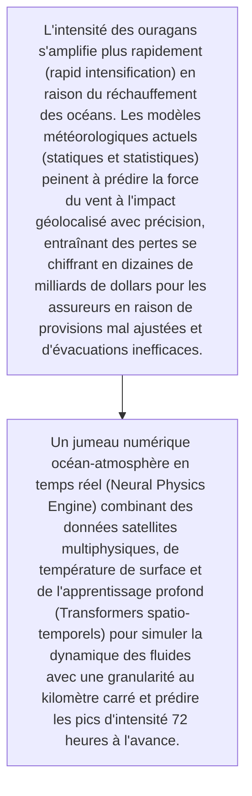
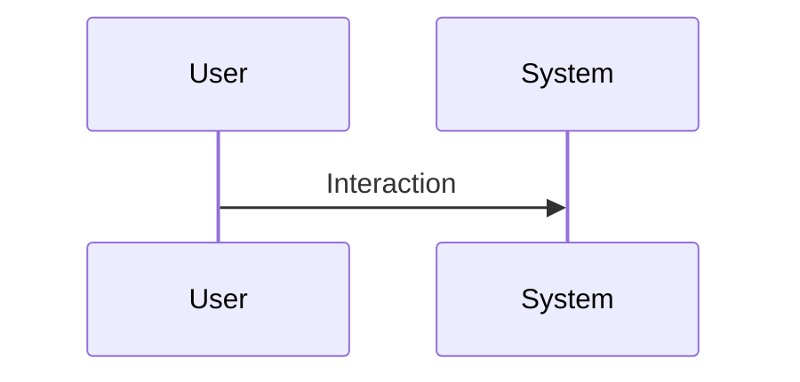

<!-- markdownlint-disable MD009 MD010 MD013 MD022 MD028 MD032 MD033 MD034 MD036 MD037 MD039 MD041 MD060 -->

[ 🇬🇧 English Version ](./README.md)

# Hurricane Intensity World Model

> **Résumé exécutif :** Un jumeau numérique océan-atmosphère en temps réel (Neural Physics Engine) combinant des données satellites multiphysiques, de température de surface et de l'apprentissage profond (Transformers spatio-temporels) pour simuler la dynamique des fluides avec une granularité au kilomètre carré et prédire les pics d'intensité 72 heures à l'avance.

---

## 1. Aperçu visuel & Effet Wahou

## 2. La thèse contrariante (Peter Thiel Style)

- **La croyance populaire :** L'équation de Navier-Stokes à l'échelle d'un cyclone est impossible à résoudre en temps réel avec le calcul traditionnel ou un LLM. Il nécessite un moteur physique neuronal capable de modéliser les intéractions complexes thermodynamiques à grande échelle sans les coûts immenses des supercalculateurs traditionnels.
- **La vérité cachée :** Un jumeau numérique océan-atmosphère en temps réel (Neural Physics Engine) combinant des données satellites multiphysiques, de température de surface et de l'apprentissage profond (Transformers spatio-temporels) pour simuler la dynamique des fluides avec une granularité au kilomètre carré et prédire les pics d'intensité 72 heures à l'avance.

## 3. Le problème & La cible

- **Modèle économique :** B2B
- **Cible précise :** Réassureurs mondiaux (Swiss Re, Munich Re), fonds de cat bonds, gouvernements côtiers et agences de gestion des urgences (FEMA)
- **La douleur urgente :** L'intensité des ouragans s'amplifie plus rapidement (rapid intensification) en raison du réchauffement des océans. Les modèles météorologiques actuels (statiques et statistiques) peinent à prédire la force du vent à l'impact géolocalisé avec précision, entraînant des pertes se chiffrant en dizaines de milliards de dollars pour les assureurs en raison de provisions mal ajustées et d'évacuations inefficaces.

## 4. Architecture technique & Plomberie

## 5. Modèle économique & Viabilité financière

| Métrique                    | Valeur                                                          |
| --------------------------- | --------------------------------------------------------------- |
| Structure de prix           | [Prix / Modèle d'abonnement / Commission]                       |
| Objectif 12 mois            | [Nombre exact de clients/utilisateurs/transactions nécessaires] |
| Calcul du CA (Target 100k€) | [Formule mathématique exacte]                                   |
| Marge brute estimée         | [Marge en %]                                                    |

## 6. Moteur de distribution & Fossé défensif (Moat)

- **Stratégie d'acquisition :** [Viralité B2C, réseau C2C, acquisition B2B directe, adhésion dev M2M]
- **Moat (Barrière à l'entrée) :** Accès coûteux et complexe aux flux de données satellites de pointe en temps réel, dépendance à une puissance de calcul massive pour l'entraînement (clusters H100), scepticisme initial des actuaires face à des modèles "boîte noire".

## 7. Grille d'évaluation détaillée

| Critère                           | Score VC (/100) | Score Terrain (/100) |
| --------------------------------- | --------------- | -------------------- |
| Thèse & Monopole / Urgence        | 24 / 25         | -- / 25              |
| Moat / Résistance aux LLM natifs  | 22 / 25         | -- / 25              |
| Scalabilité / Friction d'adoption | 24 / 25         | -- / 25              |
| Unit Economics / ROI direct       | 23 / 25         | -- / 25              |
| TOTAL                             | 93 / 100        | -- / 100             |

> **Verdict VC :** Les modèles météorologiques actuels échouent sur l'intensification rapide. Un modèle mondial d'IA dédié crée une niche hautement défendable pour les assureurs. De forts effets de réseau à mesure que davantage de données affinent la précision du modèle.
> **Verdict Terrain :** En attente d'évaluation.
