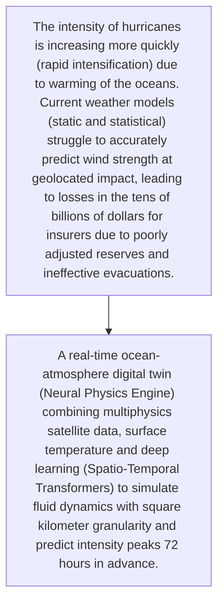
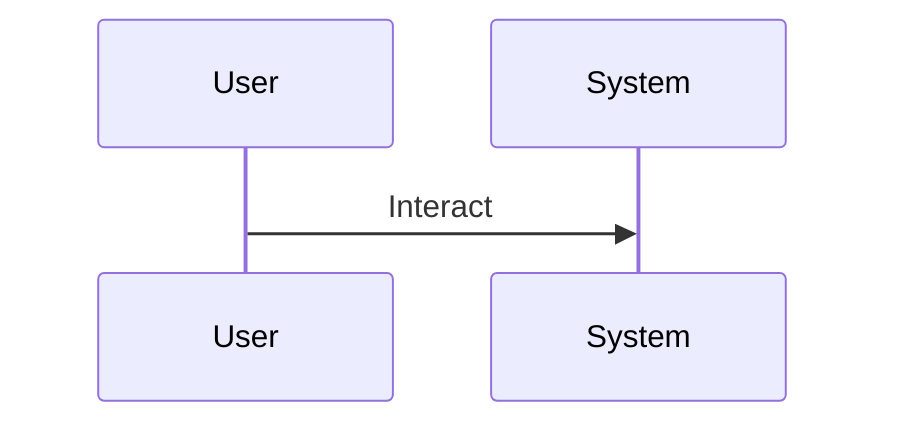

<!-- markdownlint-disable MD009 MD010 MD013 MD022 MD028 MD032 MD033 MD034 MD036 MD037 MD039 MD041 MD060 -->

[ 🇫🇷 Version Française ](./README.fr.md)

# Hurricane Intensity World Model

> **Executive Summary:** A real-time ocean-atmosphere digital twin (Neural Physics Engine) combining multiphysics satellite data, surface temperature and deep learning (Spatio-Temporal Transformers) to simulate fluid dynamics with square kilometer granularity and predict intensity peaks 72 hours in advance.

---

## 1. Visual Overview & Wow Effect

## 2. Contrarian Thesis (Peter Thiel Style)

- **Popular Belief:** The Navier-Stokes equation on the scale of a cyclone is impossible to solve in real time with traditional calculation or an LLM. It requires a neural physics engine capable of modeling complex thermodynamic interactions on a large scale without the immense costs of traditional supercomputers.
- **Hidden Truth:** A real-time ocean-atmosphere digital twin (Neural Physics Engine) combining multiphysics satellite data, surface temperature and deep learning (Spatio-Temporal Transformers) to simulate fluid dynamics with square kilometer granularity and predict intensity peaks 72 hours in advance.

## 3. Problem & Target Market

- **Business Model:** B2B
- **Target Audience:** Global reinsurers (Swiss Re, Munich Re), cat bond funds, coastal governments and emergency management agencies (FEMA)
- **Urgent Pain Point:** The intensity of hurricanes is increasing more quickly (rapid intensification) due to warming of the oceans. Current weather models (static and statistical) struggle to accurately predict wind strength at geolocated impact, leading to losses in the tens of billions of dollars for insurers due to poorly adjusted reserves and ineffective evacuations.

## 4. Technical Architecture & Infrastructure

## 5. Business Model & Financial Viability

| Metric                 | Value                                     |
| ---------------------- | ----------------------------------------- |
| Pricing Structure      | [Price / Subscription Model / Commission] |
| 12-Month Target        | [Exact volume required for 100k ARR]      |
| Revenue Formula        | [Mathematical calculation]                |
| Estimated Gross Margin | [Margin %]                                |

## 6. Distribution Engine & Moat

- **Acquisition Strategy:** [Virality, network effect, direct sales, developer adoption]
- **Moat (Defensibility):** Expensive and complex access to cutting-edge real-time satellite data feeds, dependence on massive computing power for training (H100 clusters), initial skepticism of actuaries towards "black box" models.

## 7. Detailed Evaluation Grid

| Criterion                   | VC Score (/100) | Market Score (/100) |
| --------------------------- | --------------- | ------------------- |
| Thesis & Monopoly / Urgency | 24 / 25         | -- / 25             |
| Moat / LLM Immunity         | 22 / 25         | -- / 25             |
| Scalability / UX Friction   | 24 / 25         | -- / 25             |
| Unit Economics / ROI        | 23 / 25         | -- / 25             |
| TOTAL                       | 93 / 100        | -- / 100            |

> **VC Verdict:** Current meteorological models fail at rapid intensification. A dedicated AI world model for this specific problem creates a highly defensible niche for insurers and logistics. Strong network effects as more data refines the model's accuracy.
> **Market Verdict:** Pending evaluation.
