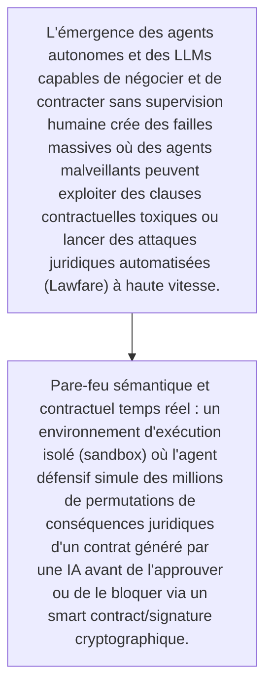
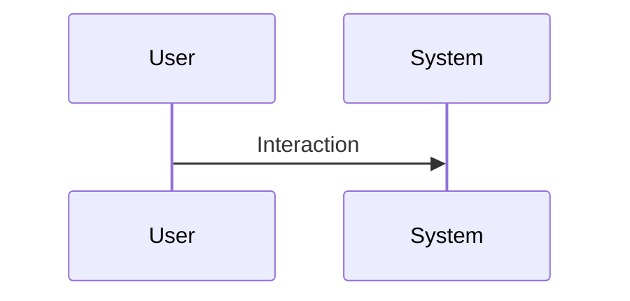

<!-- markdownlint-disable MD009 MD010 MD013 MD022 MD028 MD032 MD033 MD034 MD036 MD037 MD039 MD041 MD060 -->

[ 🇬🇧 English Version ](./README.md)

# Aegis Legal Autonomous

> **Résumé exécutif :** Pare-feu sémantique et contractuel temps réel : un environnement d'exécution isolé (sandbox) où l'agent défensif simule des millions de permutations de conséquences juridiques d'un contrat généré par une IA avant de l'approuver ou de le bloquer via un smart contract/signature cryptographique.

---

## 1. Aperçu visuel & Effet Wahou

## 2. La thèse contrariante (Peter Thiel Style)

- **La croyance populaire :** Il s'agit d'une bataille d'agents (M2M) nécessitant une compréhension sémantique de très haut niveau combinée à des exécutions ultra-rapides, hors de portée des bases de données documentaires classiques ou des chatbots juridiques.
- **La vérité cachée :** Pare-feu sémantique et contractuel temps réel : un environnement d'exécution isolé (sandbox) où l'agent défensif simule des millions de permutations de conséquences juridiques d'un contrat généré par une IA avant de l'approuver ou de le bloquer via un smart contract/signature cryptographique.

## 3. Le problème & La cible

- **Modèle économique :** B2B
- **Cible précise :** Départements juridiques d'entreprises tech, cabinets d'avocats internationaux, institutions gouvernementales
- **La douleur urgente :** L'émergence des agents autonomes et des LLMs capables de négocier et de contracter sans supervision humaine crée des failles massives où des agents malveillants peuvent exploiter des clauses contractuelles toxiques ou lancer des attaques juridiques automatisées (Lawfare) à haute vitesse.

## 4. Architecture technique & Plomberie

## 5. Modèle économique & Viabilité financière

| Métrique                    | Valeur                                                          |
| --------------------------- | --------------------------------------------------------------- |
| Structure de prix           | [Prix / Modèle d'abonnement / Commission]                       |
| Objectif 12 mois            | [Nombre exact de clients/utilisateurs/transactions nécessaires] |
| Calcul du CA (Target 100k€) | [Formule mathématique exacte]                                   |
| Marge brute estimée         | [Marge en %]                                                    |

## 6. Moteur de distribution & Fossé défensif (Moat)

- **Stratégie d'acquisition :** [Viralité B2C, réseau C2C, acquisition B2B directe, adhésion dev M2M]
- **Moat (Barrière à l'entrée) :** Flou réglementaire sur la responsabilité juridique des agents autonomes, complexité de modélisation de l'intentionnalité, risque de paralysie contractuelle par faux positifs.

## 7. Grille d'évaluation détaillée

| Critère                           | Score VC (/100) | Score Terrain (/100) |
| --------------------------------- | --------------- | -------------------- |
| Thèse & Monopole / Urgence        | -- / 25         | -- / 25              |
| Moat / Résistance aux LLM natifs  | -- / 25         | -- / 25              |
| Scalabilité / Friction d'adoption | -- / 25         | -- / 25              |
| Unit Economics / ROI direct       | -- / 25         | -- / 25              |
| TOTAL                             | -- / 100        | -- / 100             |

> **Verdict VC :** En attente d'évaluation.
> **Verdict Terrain :** En attente d'évaluation.
