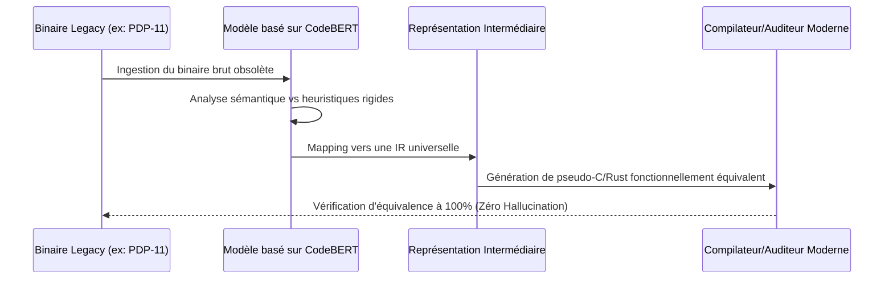

<!-- markdownlint-disable MD009 MD010 MD013 MD022 MD028 MD032 MD033 MD034 MD036 MD037 MD039 MD041 MD058 MD060 -->

[ 🇬🇧 English Version ](./README.md)

# Neural Decompiler Legacy ISA

> **Résumé exécutif :** Un décompilateur neuronal spécialisé qui traduit précisément des architectures binaires mortes et non documentées des années 70/80 en code C/Rust structuré, sécurisant ainsi les infrastructures critiques obsolètes.

---

## 1. Aperçu visuel & Effet Wahou

```mermaid
graph TD
    %% Schéma comparatif Problème vs Solution ou Flux d'architecture
    subgraph Decompilateurs_Traditionnels ["Décompilateurs classiques (Ghidra/IDA)"]
        A[Binaire Legacy / ISA morte] --> B[Règles heuristiques rigides]
        B --> C[Échec sur l'obfuscation/optimisation]
        C --> D[Vulnérabilités critiques non patchables]
    end
    subgraph Neural_Decompiler ["Neural Decompiler"]
        E[Binaire Legacy / ISA morte] --> F[IA CodeBERT Spécialisée]
        F --> G[Pattern matching sémantique vers IR]
        G --> H[Code source C/Rust structuré exact]
        H --> I[Audits modernes & Patchs de sécurité]
    end
```

## 2. La thèse contrariante (Peter Thiel Style)

**La croyance populaire :** Pour sécuriser les infrastructures critiques mondiales, nous devons réécrire entièrement tous les anciens systèmes à partir de zéro en utilisant des langages et frameworks modernes.

**La vérité cachée :** Réécrire des systèmes vieux de plusieurs décennies et hautement optimisés (comme les mainframes bancaires ou les radars militaires) est pratiquement impossible et d'un coût prohibitif. La voie la plus rapide vers la sécurité n'est pas la réécriture, mais l'utilisation de l'IA pour décompiler avec succès les architectures de jeux d'instructions (ISA) "mortes" afin d'appliquer des patchs de sécurité modernes à la logique d'origine.

## 3. Le problème & La cible

**Modèle économique :** B2B / B2G

**Cible précise :** Secteur bancaire, compagnies aériennes, gouvernements et armées (utilisant des mainframes IBM, systèmes embarqués militaires, ou vieux systèmes de contrôle ferroviaire).

**La douleur urgente :** Des infrastructures critiques mondiales tournent sur du code compilé pour des architectures obsolètes des années 70/80. Les codes sources originaux sont souvent perdus, et les ingénieurs capables de lire ce binaire disparaissent. L'impossibilité de décompiler fidèlement et d'auditer ces binaires legacy empêche l'application de patchs de sécurité modernes, laissant ces systèmes vulnérables à des exploits bas niveau critiques.

## 4. Architecture technique & Plomberie

## 5. Modèle économique & Viabilité financière

| Métrique                    | Valeur                                                       |
| :-------------------------- | :----------------------------------------------------------- |
| Structure de prix           | Licence entreprise par paliers + Consulting par projet/Audit |
| Objectif 12 mois            | 2 contrats gouvernementaux/défense ou banques de niveau 1    |
| Calcul du CA (Target 100k€) | 2 audits pilotes \* 50 000 € = 100k€ ARR                     |
| Marge brute estimée         | 80% (Logiciel + services d'experts ultra-spécialisés)        |

## 6. Moteur de distribution & Fossé défensif (Moat)

**Stratégie d'acquisition :** Ventes directes B2B/B2G à forte valeur. Partenariats avec des cabinets d'audit en cybersécurité de premier plan (ex: Mandiant) et des sous-traitants de la défense pour proposer cette capacité exclusive de sauvetage à leurs clients gérant des infrastructures critiques.

**Moat (Barrière à l'entrée) :** Les décompilateurs standards s'appuient sur des règles formelles rigides qui échouent sur des compilateurs anciens, fortement optimisés ou non standards. Une approche neuronale utilise la correspondance de motifs sémantiques. L'énorme barrière à l'entrée consiste à générer les données d'entraînement synthétiques (paires binaire-source) pour les architectures mortes, et à imposer une contrainte stricte de "zéro hallucination" — car une erreur de 0,01% dans un radar décompilé provoque un crash catastrophique.

## 7. Grille d'évaluation détaillée

| Critère                           | Score VC (/100) | Score Terrain (/100) |
| :-------------------------------- | :-------------- | :------------------- |
| Thèse & Monopole / Urgence        | 25 / 25         | -- / 25              |
| Moat / Résistance aux LLM natifs  | 24 / 25         | -- / 25              |
| Scalability / Friction d'adoption | 23 / 25         | -- / 25              |
| Unit Economics / ROI direct       | 22 / 25         | -- / 25              |
| **TOTAL**                         | **94 / 100**    | **-- / 100**         |

> **Verdict VC :** Maintenir du code hérité critique est une vulnérabilité systémique. La décompilation neurale vers des abstractions modernes est une niche extrêmement contrarienne et de grande valeur. Des coûts de changement massifs pour les secteurs de l'entreprise et de la défense garantissent un monopole.
> **Verdict Terrain :** En attente d'évaluation.
