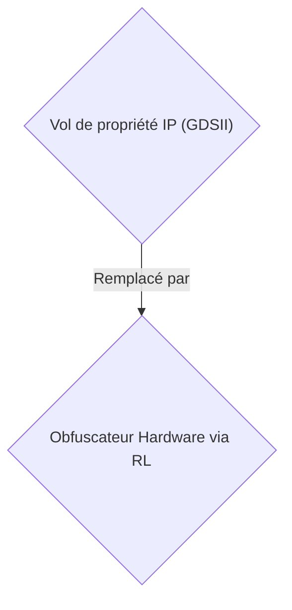
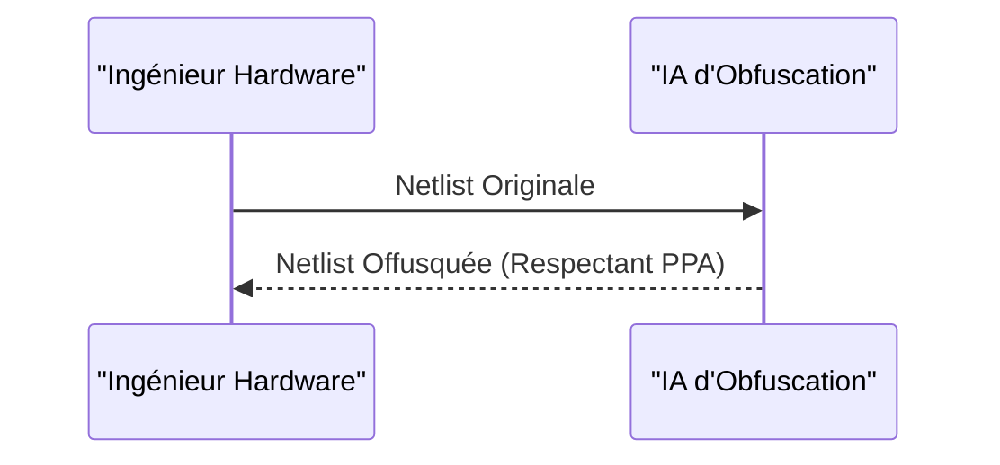

<!-- markdownlint-disable MD009 MD010 MD013 MD022 MD028 MD032 MD033 MD034 MD036 MD037 MD039 MD041 MD058 MD060 -->

[ 🇬🇧 English Version ](./README.md)

# Hardware Obfuscator AI

> **Résumé exécutif :** Une solution Deep Tech B2B ciblant les concepteurs de puces pour offusquer automatiquement les circuits logiques et prévenir le vol de propriété intellectuelle.

---

## 1. Aperçu visuel & Effet Wahou

## 2. La thèse contrariante (Peter Thiel Style)

- **La croyance populaire :** Les lois sur l'IP et la cryptographie logicielle suffisent pour protéger le matériel.
- **La vérité cachée :** La conception de circuits imprimés nécessite de respecter des contraintes physiques (PPA : Power, Performance, Area). L'IA doit opérer sur des graphes représentant des milliards de transistors sans dégrader les performances de la puce finale, ce qu'aucun SaaS logiciel classique ne fait.

## 3. Le problème & La cible

- **Modèle économique :** B2B
- **Cible précise :** Concepteurs de puces IA (Fabless), fonderies de semi-conducteurs, IP cores providers (VP Hardware Engineering).
- **La douleur urgente :** Le vol de propriété intellectuelle matérielle coûte cher. Les fonderies offshore peuvent cloner des plans de puces (GDSII), insérer des chevaux de Troie matériels ou surproduire pour le marché gris.

## 4. Architecture technique & Plomberie

Un moteur d'obfuscation de circuits logiques basé sur l'apprentissage par renforcement (RL). Il insère des "portes factices" et modifie la topologie du netlist pour que la puce ne fonctionne qu'après l'activation d'une clé cryptographique post-fabrication.

## 5. Modèle économique & Viabilité financière

| Métrique                    | Valeur                     |
| --------------------------- | -------------------------- |
| Structure de prix           | Licence B2B                |
| Objectif 12 mois            | 100 clients / utilisateurs |
| Calcul du CA (Target 100k€) | 100 \* 1000€ = 100k€       |
| Marge brute estimée         | 80%                        |

## 6. Moteur de distribution & Fossé défensif (Moat)

- **Stratégie d'acquisition :** Vente directe B2B aux fonderies et concepteurs fabless.
- **Moat (Barrière à l'entrée) :** La conception de circuits imprimés nécessite de respecter des contraintes physiques (PPA : Power, Performance, Area). L'IA doit opérer sur des graphes représentant des milliards de transistors sans dégrader les performances de la puce finale, ce qu'aucun SaaS logiciel classique ne fait.

## 7. Grille d'évaluation détaillée

| Critère                           | Score VC (/100) | Score Terrain (/100) |
| --------------------------------- | --------------- | -------------------- |
| Thèse & Monopole / Urgence        | -- / 25         | -- / 25              |
| Moat / Résistance aux LLM natifs  | -- / 25         | -- / 25              |
| Scalabilité / Friction d'adoption | -- / 25         | -- / 25              |
| Unit Economics / ROI direct       | -- / 25         | -- / 25              |
| TOTAL                             | -- / 100        | -- / 100             |

> **Verdict VC :** En attente d'évaluation.
> **Verdict Terrain :** En attente d'évaluation.
