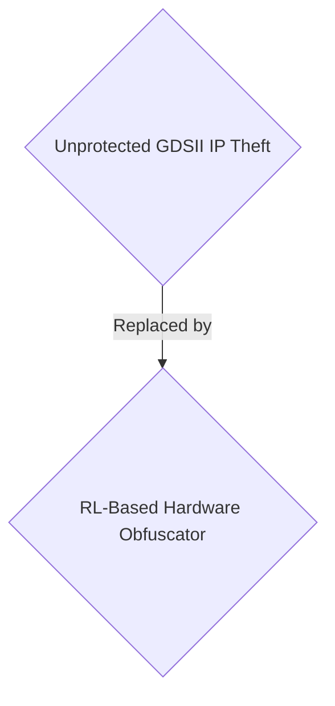
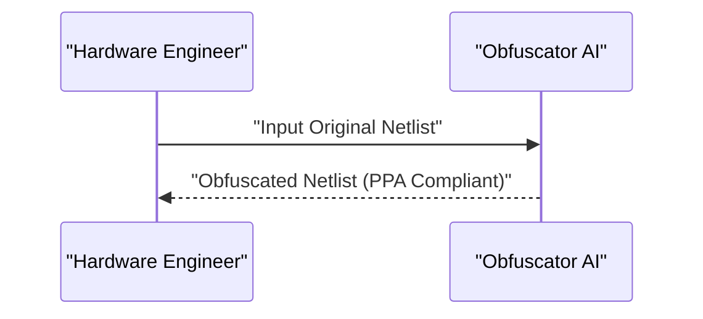

<!-- markdownlint-disable MD009 MD010 MD013 MD022 MD028 MD032 MD033 MD034 MD036 MD037 MD039 MD041 MD058 MD060 -->

[ 🇫🇷 Version Française ](./README.fr.md)

# Hardware Obfuscator AI

> **Executive Summary:** A B2B Deep Tech AI solution for hardware engineering teams to automatically obfuscate logical circuits and prevent intellectual property theft in semiconductor foundries.

---

## 1. Visual Overview & Wow Effect

## 2. Contrarian Thesis (Peter Thiel Style)

- **Popular Belief:** Standard IP laws and basic cryptographic locks are enough to protect chip designs.
- **Hidden Truth:** PCB design must adhere to strict physical constraints (PPA: Power, Performance, Area). The AI must operate on graphs representing billions of transistors without degrading the final chip's performance, which no standard software SaaS can accomplish.

## 3. Problem & Target Market

- **Business Model:** B2B
- **Target Audience:** AI chip designers (Fabless), semiconductor foundries, IP core providers (VP Hardware Engineering).
- **Urgent Pain Point:** Hardware intellectual property theft is expensive. Offshore foundries can clone chip designs (GDSII), insert hardware Trojans, or overproduce for the grey market.

## 4. Technical Architecture & Infrastructure

A logical circuit obfuscation engine based on reinforcement learning (RL). It inserts "dummy gates" and alters the netlist topology so the chip only operates after the activation of a post-manufacturing cryptographic key.

## 5. Business Model & Financial Viability

| Metric                 | Value                  |
| ---------------------- | ---------------------- |
| Pricing Structure      | B2B Enterprise License |
| 12-Month Target        | 100 clients            |
| Revenue Formula        | 100 \* 1000€ = 100k€   |
| Estimated Gross Margin | 80%                    |

## 6. Distribution Engine & Moat

- **Acquisition Strategy:** Direct B2B sales to fabless companies and foundries.
- **Moat (Defensibility):** PCB design must adhere to strict physical constraints (PPA: Power, Performance, Area). The AI must operate on graphs representing billions of transistors without degrading the final chip's performance, which no standard software SaaS can accomplish.

## 7. Detailed Evaluation Grid

| Criterion                   | VC Score (/100) | Market Score (/100) |
| --------------------------- | --------------- | ------------------- |
| Thesis & Monopoly / Urgency | -- / 25         | -- / 25             |
| Moat / LLM Immunity         | -- / 25         | -- / 25             |
| Scalability / UX Friction   | -- / 25         | -- / 25             |
| Unit Economics / ROI        | -- / 25         | -- / 25             |
| TOTAL                       | -- / 100        | -- / 100            |

> **VC Verdict:** Pending evaluation.
> **Market Verdict:** Pending evaluation.
