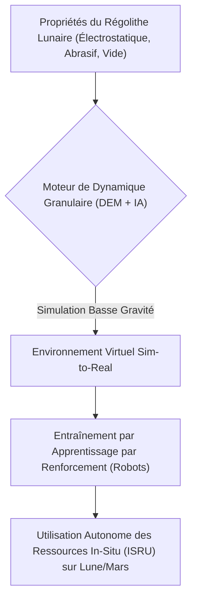
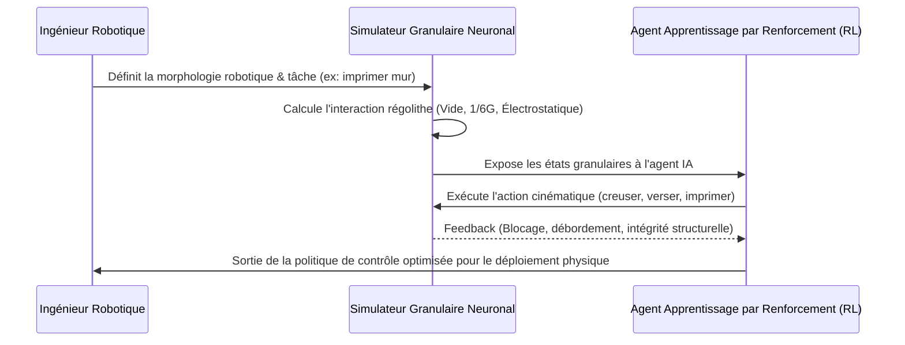

<!-- markdownlint-disable MD009 MD010 MD013 MD022 MD028 MD032 MD033 MD034 MD036 MD037 MD039 MD041 MD058 MD060 -->

[ 🇬🇧 English Version ](./README.md)

# Lunar Regolith Construction Sim

> **Résumé exécutif :** Un environnement de simulation de dynamique granulaire accéléré par IA pour entraîner les robots de construction spatiale à manipuler en toute sécurité le régolithe lunaire, hautement abrasif et électrostatique, en faible gravité.

---

## 1. Aperçu visuel & Effet Wahou

## 2. La thèse contrariante (Peter Thiel Style)

**La croyance populaire :** Construire des habitats lunaires nécessite de lancer des matériaux préfabriqués terrestres ou d'utiliser des robots de construction standards téléopérés depuis la Terre.
**La vérité cachée :** Lancer des matériaux terrestres est économiquement impossible, et les robots standards s'enrayeront instantanément à cause de la nature abrasive et statique de la poussière lunaire sous vide ; les robots autonomes doivent être parfaitement pré-entraînés dans un moteur physique granulaire sim-to-real hautement spécialisé avant même de quitter la Terre.

## 3. Le problème & La cible

**Modèle économique :** B2B / B2G
**Cible précise :** Agences spatiales (Artemis de la NASA, ESA), entreprises de construction extraterrestre, fabricants de robots miniers spatiaux.
**La douleur urgente :** L'utilisation des ressources in-situ (ISRU) via l'impression 3D de régolithe est obligatoire pour l'exploration spatiale durable, mais le comportement granulaire du régolithe provoque systématiquement des blocages physiques et des défaillances catastrophiques dans les prototypes robotiques actuels, coûtant des centaines de millions en conceptions de missions ratées.

## 4. Architecture technique & Plomberie

## 5. Modèle économique & Viabilité financière

| Métrique                    | Valeur                                                                 |
| --------------------------- | ---------------------------------------------------------------------- |
| Structure de prix           | Licence logicielle annuelle à forte valeur + frais de calcul (compute) |
| Objectif 12 mois            | 4 contrats majeurs avec l'aérospatiale/agences (à 25 000€/an)          |
| Calcul du CA (Target 100k€) | 4 \* 25 000€ = 100 000€ de revenus annuels récurrents                  |
| Marge brute estimée         | 85%                                                                    |

## 6. Moteur de distribution & Fossé défensif (Moat)

**Stratégie d'acquisition :** Ventes B2G et B2B directes ciblant les équipes d'ingénierie spatiale deep tech et les programmes ISRU gouvernementaux.
**Moat (Barrière à l'entrée) :** La fusion de la physique des méthodes des éléments discrets (DEM) avec des modèles de substitution neuronaux pour gérer les charges électrostatiques extrêmes et la physique du vide est très spécialisée et complexe. Les outils de CAO et de simulation de construction standards ne peuvent tout simplement pas calculer ces variables non-terrestres.

## 7. Grille d'évaluation détaillée

| Critère                           | Score VC (/100) | Score Terrain (/100) |
| --------------------------------- | --------------- | -------------------- |
| Thèse & Monopole / Urgence        | 22 / 25         | -- / 25              |
| Moat / Résistance aux LLM natifs  | 23 / 25         | -- / 25              |
| Scalabilité / Friction d'adoption | 19 / 25         | -- / 25              |
| Unit Economics / ROI direct       | 21 / 25         | -- / 25              |
| **TOTAL**                         | **85 / 100**    | **-- / 100**         |

> **Verdict VC :** Lunar Regolith Construction Sim cible une niche hautement spécialisée mais hyper-financée : l'infrastructure extra-terrestre. Le moteur physique modélisant avec précision la gravité non terrestre et la cohésion du régolithe présente une barrière à l'entrée redoutable pour les logiciels CAO standards. Sécuriser les premiers contrats avec les agences spatiales garantit des revenus récurrents à mesure que l'économie lunaire se développe.
> **Verdict Terrain :** En attente d'évaluation.
