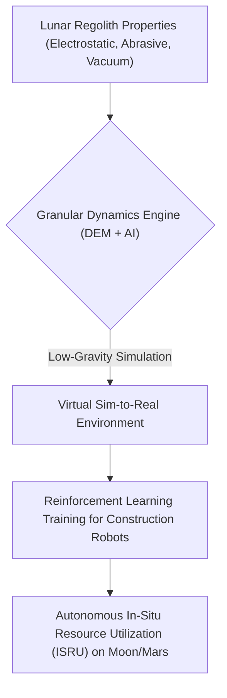
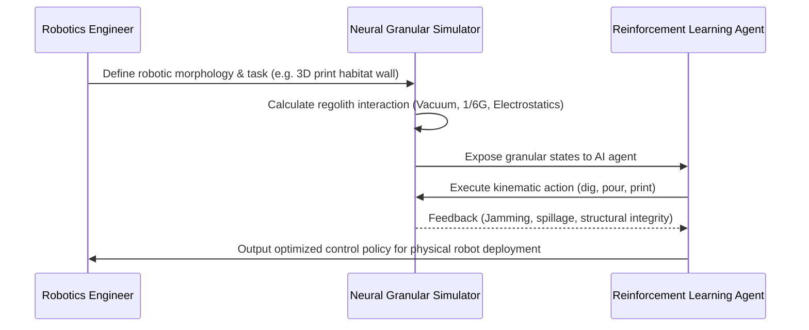

<!-- markdownlint-disable MD009 MD010 MD013 MD022 MD028 MD032 MD033 MD034 MD036 MD037 MD039 MD041 MD058 MD060 -->

[ 🇫🇷 Version Française ](./README.fr.md)

# Lunar Regolith Construction Sim

> **Executive Summary:** An AI-accelerated granular dynamics simulation environment for training off-world construction robots to safely manipulate highly abrasive and electrostatic lunar regolith in low-gravity.

---

## 1. Visual Overview & Wow Effect

## 2. Contrarian Thesis (Peter Thiel Style)

**Popular Belief:** Building lunar habitats requires launching prefabricated terrestrial materials or using standard construction robots remotely operated from Earth.
**Hidden Truth:** Launching terrestrial materials is economically impossible, and standard robots will instantly jam due to the unique abrasive, statically charged nature of lunar dust under vacuum; autonomous robots must be perfectly pre-trained in a highly specialized, AI-driven sim-to-real granular physics engine before ever leaving Earth.

## 3. Problem & Target Market

**Business Model:** B2B / B2G
**Target Audience:** Space agencies (NASA Artemis, ESA), off-world construction companies, space mining robotics manufacturers.
**Urgent Pain Point:** In-Situ Resource Utilization (ISRU) via 3D printing of regolith is mandatory for sustainable space exploration, but the granular behavior of regolith consistently causes physical jams and catastrophic failures in current robotic prototypes, costing hundreds of millions in failed mission designs.

## 4. Technical Architecture & Infrastructure

## 5. Business Model & Financial Viability

| Metric                 | Value                                                     |
| ---------------------- | --------------------------------------------------------- |
| Pricing Structure      | High-value Annual Software License + Compute scaling fees |
| 12-Month Target        | 4 major aerospace/agency contracts (at 25,000€/year)      |
| Revenue Formula        | 4 \* 25,000€ = 100,000€ ARR                               |
| Estimated Gross Margin | 85%                                                       |

## 6. Distribution Engine & Moat

**Acquisition Strategy:** Direct B2G and B2B enterprise sales targeting deep tech space engineering teams and government ISRU programs.
**Moat (Defensibility):** The fusion of Discrete Element Method (DEM) physics with Neural Surrogate Models to handle extreme electrostatic charging and vacuum physics is highly niche and complex. Standard construction CAD and simulation tools (like Unity/Unreal or civil engineering software) simply cannot compute these non-terrestrial variables.

## 7. Detailed Evaluation Grid

| Criterion                   | VC Score (/100) | Market Score (/100) |
| --------------------------- | --------------- | ------------------- |
| Thesis & Monopoly / Urgency | 22 / 25         | -- / 25             |
| Moat / LLM Immunity         | 23 / 25         | -- / 25             |
| Scalability / UX Friction   | 19 / 25         | -- / 25             |
| Unit Economics / ROI        | 21 / 25         | -- / 25             |
| **TOTAL**                   | **85 / 100**    | **-- / 100**        |

> **VC Verdict:** Lunar Regolith Construction Sim targets a highly specialized but hyper-funded niche: off-world infrastructure. The physics engine accurately modeling non-Earth gravity and regolith cohesion presents a formidable barrier to entry for standard CAD software. Securing early contracts with space agencies locks in recurring revenue as the lunar economy expands.
> **Market Verdict:** Pending evaluation.
