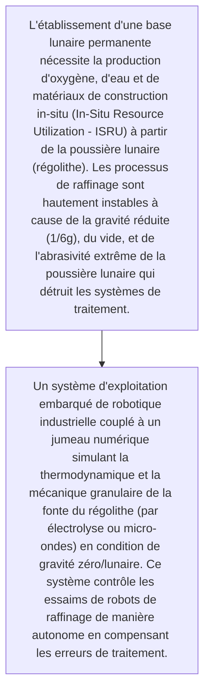
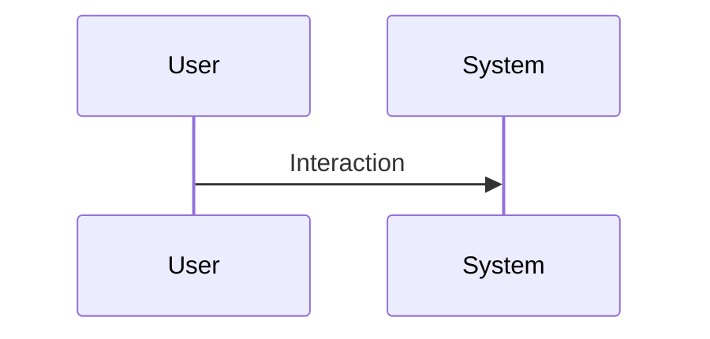

<!-- markdownlint-disable MD009 MD010 MD013 MD022 MD028 MD032 MD033 MD034 MD036 MD037 MD039 MD041 MD060 -->

[ 🇬🇧 English Version ](./README.md)

# Lunar Regolith Refinery OS

> **Résumé exécutif :** Un système d'exploitation embarqué de robotique industrielle couplé à un jumeau numérique simulant la thermodynamique et la mécanique granulaire de la fonte du régolithe (par électrolyse ou micro-ondes) en condition de gravité zéro/lunaire. Ce système contrôle les essaims de robots de raffinage de manière autonome en compensant les erreurs de traitement.

---

## 1. Aperçu visuel & Effet Wahou

## 2. La thèse contrariante (Peter Thiel Style)

- **La croyance populaire :** Il n'existe pas de données terrestres applicables. Les logiciels de contrôle industriel (SCADA) standards supposent une gravité terrestre, une atmosphère, et une intervention humaine en temps réel, ce qui est impossible à cause de la latence de communication Terre-Lune.
- **La vérité cachée :** Un système d'exploitation embarqué de robotique industrielle couplé à un jumeau numérique simulant la thermodynamique et la mécanique granulaire de la fonte du régolithe (par électrolyse ou micro-ondes) en condition de gravité zéro/lunaire. Ce système contrôle les essaims de robots de raffinage de manière autonome en compensant les erreurs de traitement.

## 3. Le problème & La cible

- **Modèle économique :** B2B
- **Cible précise :** Agences spatiales (NASA, ESA), startups du New Space de minage spatial, constructeurs de bases lunaires.
- **La douleur urgente :** L'établissement d'une base lunaire permanente nécessite la production d'oxygène, d'eau et de matériaux de construction in-situ (In-Situ Resource Utilization - ISRU) à partir de la poussière lunaire (régolithe). Les processus de raffinage sont hautement instables à cause de la gravité réduite (1/6g), du vide, et de l'abrasivité extrême de la poussière lunaire qui détruit les systèmes de traitement.

## 4. Architecture technique & Plomberie

## 5. Modèle économique & Viabilité financière

| Métrique                    | Valeur                                                          |
| --------------------------- | --------------------------------------------------------------- |
| Structure de prix           | [Prix / Modèle d'abonnement / Commission]                       |
| Objectif 12 mois            | [Nombre exact de clients/utilisateurs/transactions nécessaires] |
| Calcul du CA (Target 100k€) | [Formule mathématique exacte]                                   |
| Marge brute estimée         | [Marge en %]                                                    |

## 6. Moteur de distribution & Fossé défensif (Moat)

- **Stratégie d'acquisition :** [Viralité B2C, réseau C2C, acquisition B2B directe, adhésion dev M2M]
- **Moat (Barrière à l'entrée) :** Marché ultra-niche à très long terme, risque d'échec des missions d'alunissage nécessaires pour le déploiement matériel, budget de développement prohibitif, barrières réglementaires floues concernant l'exploitation minière spatiale (Traité de l'espace).

## 7. Grille d'évaluation détaillée

| Critère                           | Score VC (/100) | Score Terrain (/100) |
| --------------------------------- | --------------- | -------------------- |
| Thèse & Monopole / Urgence        | 25 / 25         | -- / 25              |
| Moat / Résistance aux LLM natifs  | 21 / 25         | -- / 25              |
| Scalabilité / Friction d'adoption | 22 / 25         | -- / 25              |
| Unit Economics / ROI direct       | 19 / 25         | -- / 25              |
| TOTAL                             | 87 / 100        | -- / 100             |

> **Verdict VC :** Un pari contrarien extrême sur l'industrialisation de l'espace. Le moat est purement technique et basé sur le timing : être le premier OS pour le raffinage hors-monde garantit un monopole. Bien que précoce, le TAM est potentiellement infini et défendable par défaut.
> **Verdict Terrain :** En attente d'évaluation.
