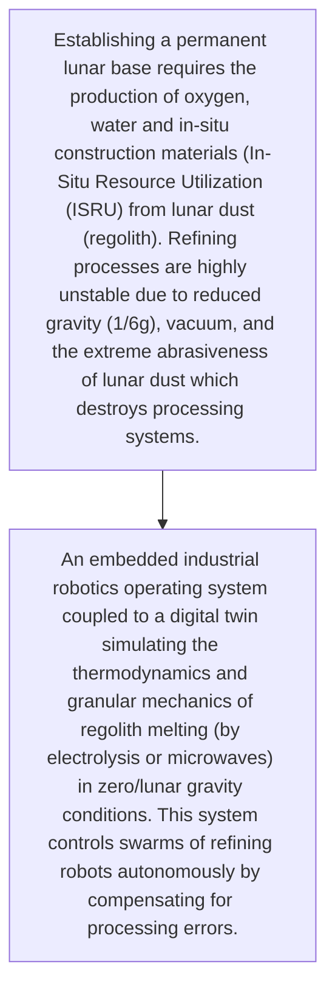
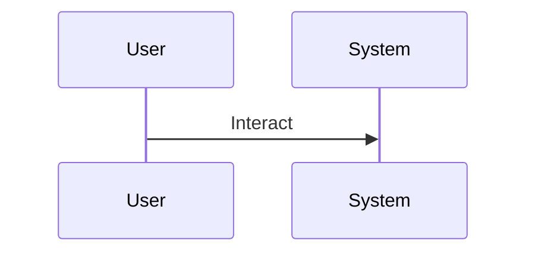

<!-- markdownlint-disable MD009 MD010 MD013 MD022 MD028 MD032 MD033 MD034 MD036 MD037 MD039 MD041 MD060 -->

[ 🇫🇷 Version Française ](./README.fr.md)

# Lunar Regolith Refinery OS

> **Executive Summary:** An embedded industrial robotics operating system coupled to a digital twin simulating the thermodynamics and granular mechanics of regolith melting (by electrolysis or microwaves) in zero/lunar gravity conditions. This system controls swarms of refining robots autonomously by compensating for processing errors.

---

## 1. Visual Overview & Wow Effect

## 2. Contrarian Thesis (Peter Thiel Style)

- **Popular Belief:** There are no applicable terrestrial data. Standard industrial control (SCADA) software assumes real-time Earth gravity, atmosphere, and human intervention, which is impossible due to Earth-Moon communication latency.
- **Hidden Truth:** An embedded industrial robotics operating system coupled to a digital twin simulating the thermodynamics and granular mechanics of regolith melting (by electrolysis or microwaves) in zero/lunar gravity conditions. This system controls swarms of refining robots autonomously by compensating for processing errors.

## 3. Problem & Target Market

- **Business Model:** B2B
- **Target Audience:** Space agencies (NASA, ESA), New Space space mining startups, lunar base builders.
- **Urgent Pain Point:** Establishing a permanent lunar base requires the production of oxygen, water and in-situ construction materials (In-Situ Resource Utilization (ISRU) from lunar dust (regolith). Refining processes are highly unstable due to reduced gravity (1/6g), vacuum, and the extreme abrasiveness of lunar dust which destroys processing systems.

## 4. Technical Architecture & Infrastructure

## 5. Business Model & Financial Viability

| Metric                 | Value                                     |
| ---------------------- | ----------------------------------------- |
| Pricing Structure      | [Price / Subscription Model / Commission] |
| 12-Month Target        | [Exact volume required for 100k ARR]      |
| Revenue Formula        | [Mathematical calculation]                |
| Estimated Gross Margin | [Margin %]                                |

## 6. Distribution Engine & Moat

- **Acquisition Strategy:** [Virality, network effect, direct sales, developer adoption]
- **Moat (Defensibility):** Ultra-niche market in the very long term, risk of failure of the moon landing missions necessary for hardware deployment, prohibitive development budget, unclear regulatory barriers regarding space mining (Space Treaty).

## 7. Detailed Evaluation Grid

| Criterion                   | VC Score (/100) | Market Score (/100) |
| --------------------------- | --------------- | ------------------- |
| Thesis & Monopoly / Urgency | 25 / 25         | -- / 25             |
| Moat / LLM Immunity         | 21 / 25         | -- / 25             |
| Scalability / UX Friction   | 22 / 25         | -- / 25             |
| Unit Economics / ROI        | 19 / 25         | -- / 25             |
| TOTAL                       | 87 / 100        | -- / 100            |

> **VC Verdict:** An extreme contrarian bet on the industrialization of space. The moat is purely technical and timing-based: being the first OS for off-world refining guarantees a monopoly. While early, the TAM is potentially infinite and defensible by default.
> **Market Verdict:** Pending evaluation.
